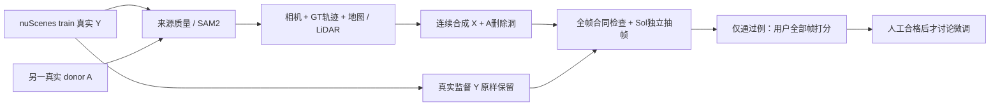

# Target + Protected Actors：GPU造数试产与逐帧审核

`WS-V77-TARGET-PROTECTED-20260929/r1`。实际生成 **49 例 / 11 个receiver scene**，共810帧、196段四列视频。独立抽帧结果为 **{'reject': 7, 'pass': 28, 'uncertain': 14}**；只有28例进入用户逐帧全检，来自8个receiver scene。人工评分全部留空，训练准入0。**尚未形成约50例合格数据，密集多车类别仍缺额。**

## 实际产物与范围

| 分支 | 已渲染case | receiver scenes | 每例帧数 | 独立抽帧结果 |
|---|---:|---:|---|---|
| P / 30帧初始固定世界位移 | 5 | 2 | [30] | {'reject': 2, 'pass': 2, 'uncertain': 1} |
| D / 30帧相机相对轨迹 | 11 | 4 | [30] | {'pass': 5, 'uncertain': 2, 'reject': 4} |
| W / 官方10帧固定窗口 | 33 | 10 | [10] | {'pass': 21, 'uncertain': 11, 'reject': 1} |

所有来源仅为train；旧9例DEV、70例val审计及隔离final不参与。原70例用户CSV已由上一阶段原样归档，见[用户评审记录](DELETE_AUDIT_USER_REVIEW.md)。本轮来源集中少数Boston日志，重复scene/track和短窗均公开，不能把49左右的case数称为49个独立scene或泛化结果。当前通过类型：`{'background': 9, 'single_actor': 19}`。

来源RGB独立检查66段；主SAM2 47段、次要保护车8段，共1650帧。数值通过不能替代实例身份检查：T028把路边白色矩形也分进pickup，已独立拒绝；完整mask保留。所有本轮新独立检查使用gpt-6-sol / xhigh，不启用fast，原先已完成的来源记录不改写。

## 规则变化、反例与缺额

P保留初始30帧固定世界位移控制。随后明确测试camera-relative donor轨迹，并将旧0.65下采样代理下界替换为最终真实alpha至少72×40px；最大放大1.5、视角、形变、地面、全GT避碰继续检查。不是所有分支同一冻结配置，详见[质量协议v2](TARGET_PROTECTED_QUALITY.md)与各分支manifest。

官方本地`DriveEditor/configs/train.yaml`的data.num_frames=10，故W使用固定0:10/10:20/20:30三个窗口，不按渲染好坏选时间。W每例约1秒、10次实际曝光；它不替代30帧或长时序验证。

D003/D004的亮面与建筑阴影明显不相容；D006/D009覆盖了真实自车机盖。它们是数据合成问题，未送入训练。后续W采用底部64px保守禁入带，渲染前拒绝5个候选；不是精确自车分割。弱接触影单独列风险，不要求第一阶段完美投射阴影；明显悬浮、照明冲突或遮挡错仍拒绝/待定。所有原始正反对照保留。

对已经有两个真实实例mask的receiver做有界更密放置搜索仍0个密集合格候选；再仅诊断未审查GT包络影响，仍0个满足两保护车可见比例/遮挡次序的候选。停止在同一来源池扫同类格点。**这说明当前来源配对与2.5D放置的产量不足，不是DriveEditor能力否定。**后续密集素材应先按可投放空间和两个protected的相对几何采样，再提取RGB/分割；不靠降低质量阈值凑数。

## 数据合同与审核方式

远端每case保存`Y/`、`X/`、`alpha/`、`influence/`、`model_hole/`、`protected/`，以及`target.json`、`protected_actors.json`、`sample.json`和完整pair manifest。Y为真实JPEG的确定性解码/缩放无损PNG；网页JPEG/MP4仅供看图，不能充当训练GT。

四列依次是真实Y、合成X、A/B/C轮廓、masked-X条件预览。最后一列洞内归一化0显示为中灰，**不是DriveEditor生成结果**。本轮未运行DriveEditor前向/微调，未改变架构。所有合成影响都在洞内，masked X与masked Y相等；所以donor外观变化不能被夸大为deletion网络已经看到了这些变化。

保护车完整状态只供监督和审核；reference provenance限定X中`protected AND NOT hole`可见区域，未把Y隐藏区作为reference。没有新增其他相机reference/SV3D prior或新网络输入通道。后续需把样本逐字段接入官方loader并做零训练对照，当前不声称已完成训练适配。

正式列表只含工程检查和独立抽帧都pass的case；拒绝/待定留在诊断列表。按每例全部帧逐个打0/1分，支持同步视频、逐帧、放大及JSON导入导出，没有一键全通过。抽帧不认证时序；所有人工分数初始为空。

## 验证、资源与恢复

实际全帧核对Y重新解码一致、X-Y影响域、洞覆盖、protected剩余可见性与隐藏Y扰动不改变condition。196段MP4全部实际解码；3240张预览JPEG检查通过。7项有意义的几何/条件合同测试通过，Python编译与网页脚本检查另存交付证据。浏览器file页面未做交互实测，不能把静态/解码检查当点击播放验证。

模型为冻结SAM2.1 Hiera Large，GPU RTX3090 24GiB；几何和合成为CPU。数据盘本轮末约146GiB空闲，无扩盘需求。没有新建自动化、没有关机。原始模型/数据与所有对照保留。

远端：`/root/autodl-tmp/runs/worldsim_v77/WS-V77-TARGET-PROTECTED-20260929/r1`。本地：[打开逐帧审核页](C:/Users/dengyunlong/Documents/Codex/2026-09-26/xia/outputs/v77-target-protected-synthetic/index.html)。[机器可读证据](../autoresearch/worldsim_v77/target_protected_20260929/gpu/summary.json)。`failure_ledger_refs: [V77-F02]`；`failure_ledger_delta: updated V77-F02`；人工verdict=null。
