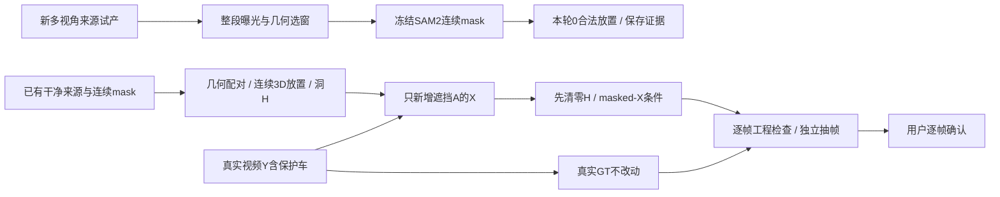

# v77 r3：连续多视角供体与新造遮挡

`WS-V77-TARGET-PROTECTED-20260929/r3`。2026-09-30用户明确开GPU继续造数据；保持真实Y监督、原DriveEditor架构，训练0、DriveEditor前向0。本轮SAM2为同一`sam2.1_hiera_large`，seed42；独立QA沿用单个`gpt-6-sol/xhigh`、未启用fast。

## 实际执行与输入关卡

4张静帧SAM2轮廓独立通过；但直接以该帧居中的固定10曝光窗口只有1/4满足整段约束。原提案与失败逐帧原因保留在`r3/temporal`。同一4个种子改用统一、有界的10种包含种子的窗口，先检查完整曝光/尺寸/边界/潜在前景遮挡，再按最小目标面积选一个；没有按mask输出挑窗口。最终3/4窗口通过，V002仍因整段可用性不足退出。

真实RGB只从原nuScenes train公共分片提取，没有生成视角或复制曝光。3段30帧SAM2从已审核种子mask双向传播；逐帧数值通过3段，独立抽帧通过3段。官方可选CUDA `_C`扩展不可用，日志明确跳过微小孔洞填补后处理；原推理mask保留，未用自定义裁框/最大连通域补救，也不声称运行了该可选步骤。

## 新合成结果

首先仅把本轮3个连续供体加入旧receiver池：相机相对回放与既有固定世界位移两个有界控制均0个可行提案。没有以门槛放宽强行放置，也不据此否定SAM2或补景模型。随后按几何可配对性重新使用此前已审过的干净来源，污染来源黑名单、hole/ego检查和原物理门槛保留；选中32个提案中8个与旧结果完全同一来源/位移/轨迹，排除不重渲染。实际24个新样本中使用本轮新多视角供体为0；不能宣称“多视角让造数效果更好”。这明确暴露“独立挑清晰供体，再找放置”的流程问题：今后先用几何/目标视角匹配receiver，再提取与分割新增来源。

原Y与保护车mask复用。候选先过地图/真实LiDAR支持、米制净距、整段视角、尺度与位置/yaw连续、A在B前的深度次序、真实mask遮挡比例。整段使用一条同实例camera-track，禁止逐帧换图；原同一实例多相机是异步真实观测，不宣称同步多目联合世界，也没有向神经网络添加多视角通道。

新增24例 / 5个receiver scene，类型{'background': 11, 'single_actor': 13}；独立结果{'pass': 24}。人工verdict仍空，训练准入0。现有旧27个技术候选不因本轮新造数而自动训练准入；case和scene分母分别报告，约50个合格且覆盖多类型的目标不能用重复短窗凑数。

## 造数入口修正

已知D006/D009是空间错误。新增可配置的最终hole底部64px禁入门槛，覆盖所有类别，在候选评估与最终渲染入口各查一次；边缘扩张侵入也拒绝。这个保守区域不是精确ego分割，也不能认证全部道路合法性。两个正反控制测试通过，保持旧默认接口供历史实验复现；本轮r3显式启用。

五项训练输入标准沿用：silhouette、尺度/位置、时序、A→B次序、全部synthetic影响被H移除。新的无损Y逐像素等于真实源RGB重新解码；X变化只在记录影响域；清零H后的X与Y一致，隐藏Y扰动不会泄漏进条件。为响应用户减少周额度消耗，本轮新合成抽帧规则在独立QA前固定为每例一张：纯背景用中帧，单保护车用最大遮挡帧；机器仍检查全部帧。这是对旧r1多帧抽样成本的明确修订，独立一帧绝不认证全视频或替代人工逐帧审核。车身RGB外观完全被遮住时不单独拒绝，明显悬浮/错误hole与邻车误遮仍拒绝。

全部新视频解码、资源与逐帧合同结果见[交付验证](../autoresearch/worldsim_v77/target_protected_20260929/r3/delivery_validation.json)。本地HTML保留真实Y／合成X／身份与遮挡标注／实际masked-X四栏；它们是数据审核，不是DriveEditor生成结果。原评分和r2人工进度不覆盖，r3独立评分存储。浏览器交互未实测。

GPU/CPU本轮作业已结束，无训练或后台自动启动控制器；没有创建定时任务或执行电源操作。完整run：`/root/autodl-tmp/runs/worldsim_v77/WS-V77-TARGET-PROTECTED-20260929/r3`。轻量[证据](../autoresearch/worldsim_v77/target_protected_20260929/r3/summary.json)与[HTML入口](../autoresearch/worldsim_v77/target_protected_20260929/r3/review_link.md)。failure_ledger_refs: [V77-F02]；failure_ledger_delta: updated V77-F02。
