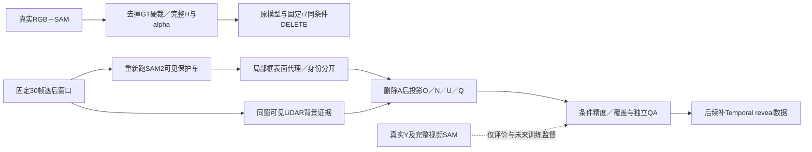

# r21–r22：修复真实入口，检查条件能提供的实际证据

2026-10-02，wm-3090-1001，v77。task `WS-V77-TARGET-PROTECTED-20260929`，runs r21/r22，failure_ledger_refs [V77-F02]。

**A022的固定帧反例在修复入口后消失：原模型和r7都能删除目标。其余关键保护车/残留问题仍在。**这次没有新微调，不能把入口收益记给网络。

## 真实入口与整窗支持

另建8例208帧，不覆盖旧70例。保留完整原SAM，不再以GT包络硬裁；相对于SAM，洞外遗漏及目标alpha非1均为0。GT邻车包络只作保守写回与诊断；真实可见保护mask冲突必须拒绝。全SAM覆盖不是SAM正确性证明，A042首帧立柱旁碎片仍不确定。空SAM帧严格零写回。

8例原模型/r7各跑1窗，共16新窗口；同旧固定10帧、576×1024、seed42、25步，保存native与alpha写回。旧视频原样保留。固定f5观察：A022两权重旧入口都生成车，新入口都没有该车；A013巴士结构、A041边缘车形、A048后车涂抹仍在。A061保留用户所见r7局部正例，未发现新入口明确再改善。所有人类0/1/2留空，单帧不能证明视频稳定。

单次30真实曝光、2.9秒、320×576训练前后向通过，80个时间self-attention张量梯度有限非零，峰值14.185GiB；优化0步。整窗3步推理六次网络调用均含30帧，峰值21.453GiB。3步只证明入口可运行，不是效果评估；没有把短窗拼接冒充长窗。继承r19 FP32初始化修复。

按真实Y、H、遮后X及保护标签逐值去重：旧50训练任务实际46个，旧11合成DEV验证实际10个。所有重复原目录保留；共享旧形状的目录不冒称新独立测试。

## 合法状态条件的最小检查

三个旧DEV长窗L001/L007/L009，固定30帧。重新在已擦除的RGB上运行SAM2，4条保护轨迹120帧。状态构建API不接受Y：可见颜色经光线与GT cuboid表面相交进入actor局部坐标；按身份和深度投影，目标A不参与遮挡。不同身份深度冲突进入U，不平均。背景只取同窗实测近地LiDAR的可见RGB，N不能设成1−O。GT相机、轨迹、框、道路地图与LiDAR是明确的POC几何辅助。

遮后输入边界、无证据为U、跨帧显露、移除A后可见性、身份冲突、正证据N六类合同通过。背景平面也只用窗口内扫描重新拟合；缺失扫描没有用窗外数据代替。完整Y与旧全视频SAM只由独立评价程序读取，后者是质量标签而非像素级真值。

| DEV条件 | 洞内O的同身份标签精度 | 被遮B覆盖 | N覆盖全洞：点／局部片 |
|---|---:|---:|---:|
| L001 | 95.93% | 17.80% | 1.28% / 6.50% |
| L007（未遮B） | 不适用 | 不适用 | 0.033% / 0.019% |
| L009 | 99.26% | 36.90% | 2.89% / 6.99% |

局部片对照只改变背景采样：实测地面三角片内取可见RGB，不跨越1.5m世界边长/32px图像边长，不向无支持区外推，可信度从0.8降为0.4。它增加了一些覆盖，但L007仍几乎无洞内证据，没有各例共同收益，因此保留为诊断、不替代默认点条件，不扫阈值。不能把这些覆盖提升当成DELETE收益。

独立gpt-6-sol xhigh、无fast，检查全部3例固定0/15/29帧：L001/L009 uncertain，L007 pass仅针对可见部分；未见明显串车，但所有洞都没有足够证据支持完整补全。人工分数仍为空。简单条件接口与实际模型增益尚未验证，完整surfel未启动。

## 下一步与交付

r23已冻结最多80个scene各一条真实过程来源；不再要求其拥有旧一秒虚拟锚点。当前61条通过完整长窗几何输入检查，正在CPU按需补603个文件；这是来源准备，不是50个已经AI2的数据case。保持背景和mask来源分隔，先补实际显露和合法条件覆盖，再登记A/B/C同预算微调。

本地HTML：`outputs/v77-target-protected-r21/index.html`（8例、48视频、480帧实际解码）；`outputs/v77-target-protected-r22/index.html`（3例、15视频、450帧实际解码）。页面都有简单组件图、同步播放和逐帧定位。Codex文件浏览策略限制此前已记录，未宣称UI播放已验证。

新知识：**A022存在可被统一入口修复消除的固定帧反例；而合法可见条件的主要限制已可量化为证据覆盖，而非仅看投影精度。**这没有否定条件方案，也没有证明新模型有效。资源约50GB空余，没有清理数据或权重；真实保护车与无车背景的跨场景收益/整段人工验收仍未满足，不触发关机。
