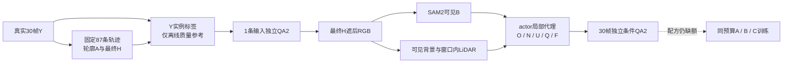

# r28–r30：候选复现、单例合法条件与短窗控制

task WS-V77-TARGET-PROTECTED-20260929，wm-3090-1001，v77，failure_ledger_refs [V77-F02]。

本轮修复两个数据工厂工程错误，得到1条经过输入和条件独立质检的reveal候选。**尚未形成50条配方，A/B/C正式训练0步，不能据此宣称真实DELETE改善。**r21完整目标入口继续保留；r26可见邻车洞裁减仍不推广；未启用surfel。

## 修复与原始证据

旧r23只保存首个拒绝原因计数，不能从“73条unreviewed”还原稳定候选。GT对象通过集合遍历，顺序在进程间变化；固定相同几何、只反转对象顺序，两个来源共5条轨迹改变首因。已排序对象并按场景、车道距离和速度冻结语义清单，检查所有帧的未核验实例。清单实际为87条、30scene：已有72条图像逐像素复用，另外15条来自同一原始轨迹搜索域；位置、速度和质量门槛不变。原73条登记和失败日志保留，修订另记selection_amendment。

另有元数据将“二维投影为空”错误写成“三维位姿不存在”。恢复16例中19条case-instance记录的已知位姿，其中7条车辆轨迹本来是完整的；没有外推真正缺失的GT，也没有重跑图像或SAM。此bug属于新r28工厂，不能追认为旧r7/r14模型失败原因。

213个Y评价实例轨迹中194个新跑、19个复用。所有87×30=2610帧检查通过：A影响区被guard覆盖、guard被最终H覆盖、guard外RGB与Y相同、guard内已擦除、H不进ego底部保护带。工程通过不能替代身份/空间/显露质量。

## 数据质量结果

| 判定 | 数量 |
|---|---:|
| 实例身份或可见性不确定 | 29 |
| 碰到第一阶段外对象，或缺少完整保护几何 | 37 |
| 实际遮挡不足 | 4 |
| 实际轮廓过小 | 3 |
| 保护车深度顺序不成立 | 2 |
| 静态前景深度顺序不成立 | 3 |
| 缺少显露过程 | 4 |
| 其他帧证据不足 | 4 |
| protected reveal技术候选 | 1 |

这些是候选质量门槛的判定，尤其“身份不确定”并非已经证明SAM一定错，更不是模型补景失败。唯一Q060 / N171 / scene-0256经gpt-6-sol xhigh独立检查f0/15/29，输入2分；没有启用fast。Y真实小箱车由轻遮逐步变重遮，矩形H会额外遮去部分可见B和道路，后续必须保留未知。

## r29：合法条件的单例正证据

方法从**最终H完整遮后的RGB**重新跑SAM。完整Y及Y-SAM只在独立评价脚本中读取。相机、车辆轨迹、窗口内LiDAR是明示的POC几何辅助，不能宣称全自动估计。当前为cuboid局部表面代理，不是surfel，也没有给隐藏表面自由可学习embedding。

| 相对完整Y-SAM的参考指标 | Q060 |
|---|---:|
| 遮后可见SAM精度 / 召回 | 99.52% / 97.97% |
| 洞内O精度 | 95.30% |
| O覆盖被遮B | 61.26% |
| 有证据N占洞面积 | 4.85% |
| N落在参考B上的像素 | 0 |
| U占洞面积 | 87.21% |

另一次独立复核覆盖全部30帧条带：仍为同一辆小箱车，未见明显串向大货车/树/道路，投影保留稀疏局部外观和大量未知，条件质量2分。允许这个单例进入后续候选池；**Y-SAM不是人工像素GT，局部框面不能证明完整纹理，条件可用不是扩散模型已经获益**。

## r30：缩短窗口没有解决配方缺额

同87轨迹，只取既有f5–24的20个真实曝光（1.9秒），不新搜位置/速度、不改mask或门槛。30帧默认代码先在Q001/Q002/Q023/Q060做真实数据回归，结果保持一致。20帧技术reveal由1变2（新增Q046，Q060保留），但身份不确定由29变36、无显露过程由4变7；缩窗既可能去掉缺失几何，也会失去观测证据。Q046未独立准入，不把它混入已合格池；不将20帧作为全局修复，保留30帧主配置，停止该有界对照。

评价用的Y标签仍由30帧上下文生成，明确只是离线参考；如果后续使用20帧训练，必须重建仅20帧可用的输入SAM和条件，不能携带额外10帧RGB。

## 交付与限制

本地outputs/v77-target-protected-r28/index.html保留全部87例抽帧、按原因确定性选出的9例三列视频，并补Q060三列条件视频。共30视频/900帧解码、所有文件链接与JS语法通过；没有声称浏览器播放已验证。人工评分留空。输入页不是新DriveEditor推理效果页。

来源仍是nuScenes train域工程train/DEV-val，场景split不交叉；这些来源在旧候选目录出现过，不称最终未曝光留出集。原资产、权重、失败记录全部保留；数据盘约46GB可用，本轮无删除。没有自动训练、没有新定时任务；真实跨场景模型收益关机条件尚未满足。

详细证据：[r28收口](../autoresearch/worldsim_v77/target_protected_20260929/r28/closeout.json)、[r29逐帧评价](../autoresearch/worldsim_v77/target_protected_20260929/r29/condition_evaluation.json)、[r30对照](../autoresearch/worldsim_v77/target_protected_20260929/r30/window_comparison.json)。
