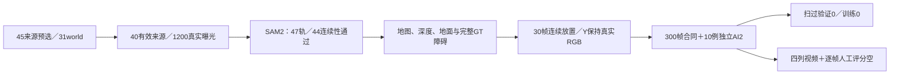

# r16：三秒连续曝光造数与覆盖边界

WS-V77-TARGET-PROTECTED-20260929/r16，wm-3090-1001，failure_ledger_refs [V77-F02]。

从已保存合法路径出发，固定四个锚点、两个端点相对速度拟合和世界静止对照，延长到约三秒实际曝光；没有复制RGB、插帧、降低物理阈值或把生成视频当Y。45来源31world事前固定，实际40来源27world、1200帧；其余五来源因曝光次序或长窗观测不合格保留拒绝。210缺失RGB由pub真实03/07包选择抽取，不需要新增数据。原pub目录误定位的失败日志及修正代码保留。地面检查沿用已登记raw近地支持修复，支持阈值2.5m不变；38/40来源通过，地面返回不是空路证明。

官方SAM2固定输入，47对象轨完成、44技术连续性通过；三条失败保留隔离。没有用GT裁mask或按结果清理。GT尺寸、距离、地面、深度顺序、ego禁区、画面边缘、轨迹与mask连续性门槛全部保持。未知动态对象仍作为障碍，不能把未分割车当背景。

最终10候选来自三个train世界：四个显露过程(scene0708)、四个世界静止A＋运动ego(scene0719)、两个扫过保护车(scene0302)。实际重载检查全部300帧，Y精确等于真实输入、擦除后X条件精确等于擦除后Y、RGB泄漏0、ego洞像素0。独立gpt-6-sol xhigh、无fast逐例看0/15/29帧及相关空间标签，10/10 AI2；人工评分始终空，抽帧不认证整段视频时序。

扫过train仅2例1world，validation扫过0，未达登记8train/3val/2valworld覆盖目标，因此本轮训练0。数据质量合格和过程覆盖不足是两个不同结论；不把零训练归为模型失败，也不无限枚举同一来源。当前模型r18仍使用r14固定旧数据，此包不偷偷混入。

审核页本地 outputs/v77-target-protected-r16/data_review.html，原始Y／合成X／洞H／实际模型可见条件四列，30帧滑条与逐帧评分导出。40 MP4实际解码1200帧、1200图片引用、10张对照图、HTML/manifest一致与JS语法均通过；未声称已在浏览器逐段播放。所有模型和拒绝均保留，真实DELETE收益关机条件false。
