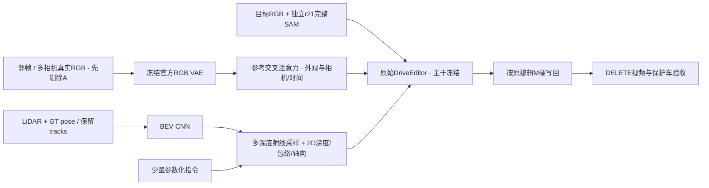

# r47：多时刻RGB与BEV先验进入DriveEditor的条件接口

task `WS-V77-TARGET-PROTECTED-20260929/r47`，parent r46，failure refs `V77-F02`。2026-10-04，wm-3090-1001。当前只完成CPU准备，GPU训练/生成均0。

## 当前证据与基线

用户更新评分并明确：当前真实DELETE中，r21完整SAM修复有收益，微调及r46小Adapter没有建立明确真实任务收益。沿用r46原始官方权重、修复后的查询RGB/H/alpha、seed42、25steps；旧r7/r8/r14及r46Adapter不作为本轮初始化。原权重、旧输入、旧视频均保留。

工作簿4sheet完整导入，最新r46 sheet14行，其中8个真实例全部有人工分：A022=2，其余7例=1。6个合成标签按原文保存，未无依据映射到当前r46的4个合成DEV。空白先验/评分保留null。5张WPS DISPIMG内嵌GPT结果已提取并保留映射、公式和单元格出处；仅是用户提供的静态结果，不是本轮模型生成或时序证据。

| case | 人工分 | RGB足够 | OCC足够 |
|---|---:|---|---|
| A061_w08 | 1 | 未填 | 未填 |
| A013 | 1 | 未填 | 未填 |
| A048 | 1 | 否 | 是 |
| A042 | 1 | 否 | 是 |
| A007 | 1 | 是 | 否 |
| A034 | 1 | 是 | 是 |
| A022 | 2 | 是 | 是 |
| A041_w10 | 1 | 是 | 是 |

原件在run的 `user_review/打分记录.xlsx`、`gpt补景pipeline.md`，完整解析见[人工记录](../autoresearch/worldsim_v77/target_protected_20260929/r47/human_review.json)。前述三类缺口是用户的研究分解，不从未填写栏自动推出逐例原因。

## 接口与架构变更

不是仅整理参考图或后处理：新增公开 `MultiPriorDeletionEngine.get_deletion(DeletionRequest, arm, reference_latents)`。请求携带目标RGB、独立编辑mask与alpha、6张参考/有效范围、camera/时间/保留对象元数据、BEV、2D几何和编译后的参数字段。旧foreground reference、SV3D生成目标和valid_mask不被复用成保留车辆接口，避免条件又要求生成A。

原UNet的9通道保持，新增389,856参数的支路进入input block2/5/8/11：RGB参考先由官方cond_frames冻结VAE编码，再交叉注意力；10通道128×128 BEV由轻量CNN编码，在查询射线4/12/25/40米处取样，和12通道144×256投影图一起提供多尺度残差。新heads零初始化，官方主干与原3D支路冻结。

参考crop保持纵横比，先剔除A再缩小，padding无效，不作为真实外观。camera与时间等13维描述用于区分来源；身份token只用于关联/审核，本轮没有完整学习式身份系统。文字是短的确定性角色/几何说明，4个数字参数进入支路；完整自然语言编码器未实现，也未调用图像生成API。

几何绿区是保留GT框的支持包络，不能当精确车辆silhouette；Q启发式，不是已校准可信度。蓝N只标实测正返回，未铺成稠密墙/道路；灰U不能当空地。BEV高度分层使用相机高度减1.5m作粗参考，不认证地面或道路可行性。来源LiDAR按来源时刻GT框排除动态返回，避免把已离开的车身点当背景。GT pose/tracks/LiDAR均是本轮声明的几何辅助。

## 输入与CPU验证

复用12训练/4合成DEV/8真实DEV，不增加最终测试。查询均为原10帧；真实例bank扩到46–50条候选，来自原26帧及六相机四个关键时刻，选6个参考slot，按保留实体可见支持与来源时间选择，禁止用生成输出选参考。真实时间窗口支持前后观测，属于离线actor编辑，不声称在线因果预测。

公共数据缺191个选定RGB/LiDAR，已在4个有界分片串行提取并解码，实际41,203,561 bytes；没有全库展开或清理旧资产。整个新run约328MB，远端仍约42GB空闲，无需扩盘。

24例240帧实际请求验证通过：修改目标洞内RGB不改变遮后条件；无效参考在编码前擦除；控制mask以float面积缩放，保留每个触及原H的4×4单元；ON/U覆盖、tensor尺寸和有限性通过；写回洞外像素严格相同。初始控制H用uint8平均会丢极细边界，本轮CPU准备中已修正并备份，不影响旧r46，也没有GPU结果被污染。

新支路CPU受控激活检查通过：零初始化/关闭分支等价；RGB和BEV在head打开后有梯度；参考变化能到输出；两路开关独立；洞外直接残差为0；拒绝非有限输入。代码语法通过。**这些不是实际官方模型GPU前后向、训练、显存或补景效果验证。**完整官方模型接入仍待GPU探针。

## 冻结的下一步小实验

先在SAM2环境验证已选额外相机源参考的A剔除，失败slot置无效，不逐例改查询SAM/重选参考。随后在DriveEditor环境检查实际原模型零初始化等价、实际RGB/BEV梯度、主干冻结与显存；失败即停在工程阶段。

通过后只训练新支路320步，AdamW1e-4、seed6201、320×576、原diffusion loss；RGB/几何各25%独立替换未知，前两步保留完整条件作探针。checkpoint固定step320，不看真实badcase选权重。推理576×1024、10帧、seed42/25steps。

5臂为原基线、训练分支全未知、RGB-only（含参考camera/time）、geometry-only、RGB+geometry。这是同一训练支路的输入消融，不是各臂分别训练。共12评测例60窗，原基线12窗明确复用旧r46，其余48窗新生成。GPU结果入口预置 `results.py`，主栏原视频/基线/新完整先验，消融与原生输出展开，人工0/1/2留空。

当前12训练例RGB参考仍只来自原相机；真实DEV的多相机来源、粗包络和未知参考是否带来稳定增量仍待验证。几何在合成例来自原真实场景LiDAR，新增先验的监督/任务分布是否充分匹配不能只凭接口通过宣称解决。没有开始完整world encoder、2DGS或surfel。

主agent查看了8个真实DEV的f09输入、几何/BEV及前三个参考slot。A034/A061有可见保留车外观；A013/A048/A042等仍有大片擦除区域；A007对应洞内的车参考很小，不能声称RGB缺口已被候选扩展解决。此为输入检查，不是新人工评分、源mask准入或视频时序判断。逐例记录见[输入查看](../autoresearch/worldsim_v77/target_protected_20260929/r47/input_visual_review.json)。

成功标准是真实DELETE跨例减少幻觉车、保护后车/邻车，且不破坏A022正例与时序；合成误差改善不替代真实收益。实际条件须有原基线和未知条件的新增任务价值。若只合成改善而真实无稳定收益，本轮不推广，不机械增加seed/训练步数。

## 运行与审核入口

代码 `scripts/worldsim_v77/target_protected/iteration14/`。CPU页 `outputs/v77-priors-r47/index.html`，包含8真实例及16训练/合成DEV的f00/f05/f09、BEV、几何轴向、参考crop、参数化指令，24个旧基线视频明确标注来源。参考源mask验证是GPU下一步，不伪装为已经通过。

GPU顺序：`envs/worldsim-v77-sam2/bin/python iteration14/validate_source_masks.py` → `envs/driveeditor/bin/python iteration14/gpu_experiment.py train` → `evaluate` → `envs/motionproj/bin/python iteration14/results.py`。当前按用户要求停在GPU边界，训练0步、推理0新窗，无自动GPU控制器、无电源操作。

新知识：当前缺口需要更丰富的真实观测与有明确空间关系的生成条件入口；把参考列表/BEV画出来不等于模型已经利用先验。本轮完成了可训练的入口和CPU合同，条件收益尚无证据。failure_ledger_delta: updated V77-F02（人工结果与输入工程证据）；无新失败ID。
