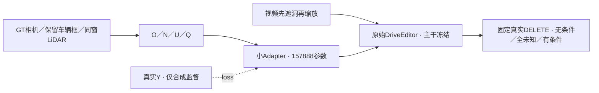

# r45：O/N/U/Q 小分支最小验证

task `WS-V77-TARGET-PROTECTED-20260929/r45`，failure refs `V77-F02`。本次仅完成 CPU 准备；训练 0 步，新推理 0 窗。用户最新要求完成 CPU 后通知开 GPU。



## 本次范围

复用 12 个旧训练例、4 个跨训练场景的合成开发例、8 个固定真实 DELETE 开发例。没有新造遮挡，没有数据工厂搜索，没有新增 SAM/身份系统、encoder、2DGS 或 surfel。两个密集训练例共用一个场景和 A 位姿，但实际 Y/H 不全相等；保留并明示相关性，不虚报独立场景。全部评测例是已曝光 DEV，不是最终泛化测试。

O 是保留车辆 GT 包络的保守内核，Q=0.5；不是由隐藏 Y 推出的精确轮廓。整块框投影的初始检查在 M042 将相邻道路也标成车辆，已保存在 `r45/before_changes/conditions_solid_cuboid`。统一改为离每个实例投影边缘超过短边25%的内核，最小2px；其余边缘为 U，未按 case 调参。此为有噪声的几何先验，不能宣称 O 每像素都是真车。GT 轨迹/相机是明示 POC 辅助。

N 只来自固定窗口内40m范围的实测 LiDAR 背景返回，排除 source H 和所有实体包络（外扩2px），保留每源相机像素最近返回；查询时也排除保留实体。没有实测返回的位置不作 N。它包含道路、护栏、墙等非actor背景，不只限于地面：初始地面拟合筛选使部分有实测背景的例无N，旧图保留在 `r45/before_changes/conditions_ground_only`，因此去掉本任务不需要的地面高度拟合，未填补没有实测依据的区域。Q为启发式可信度，不是校准概率。

14 个缺失的小文件从公共包定向提取，不下载新模型。首轮按RGB线索定位分片有一个LiDAR文件不在04，记录缺项后在已有候选01找到；未重复读取已确认缺失的分片。相机时间没有完整几何支撑时保持未知。条件图不使用 Y 纹理、synthetic actor RGB 或外观特征。

## 训练和判据

只训练四层零初始化残差 Adapter，原始 DriveEditor（包括旧空间/时间注意力）全部冻结。固定160步、AdamW 1e-4、原 diffusion loss、seed6201；320×576，10帧，与既有短窗任务对齐。选择最终160步，不能按真实 DEV 挑 checkpoint。保留40/80/120/160步恢复点。

固定12评测例×3臂=36窗，576×1024、seed42、25steps：关闭 Adapter / 同一 Adapter 输入全未知 / 正常 O/N/U/Q。第二臂是输入消融，并非另训等容量模型。输入、H、alpha 写回和 seed 相同。真实无去车 GT；收益必须看幻觉车是否减少、真实后车与邻车是否保住，训练 loss 或合成洞 MAE 下降不足以认定成功。单帧不能认证时序；后续 HTML 保留同步视频和原生输出。人工 verdict 留空。

A022包含此前r21入口修复已改善的情形，应看是否回退，不能把旧入口收益算到新分支。A042原目标身份仍有输入疑点，保留结果但不能单靠它建立主要成功结论。

CPU 实际240帧条件合同、隐藏 X/Y 替换不变性、零头梯度和 Adapter off 等价检查通过；本次四通道版本尚无真实网络 GPU 前后向检查。首次开卡必须先完成该检查，再执行训练。没有创建定时任务，也没有挂起会自动抢 GPU 的控制器。

## 条件覆盖：测量值，不是收益

| case | split | scene | 洞内O | 洞内N | 洞内U |
|---|---|---|---:|---:|---:|
| M039 | train | scene-0222 | 0.0% | 0.29% | 99.7% |
| M041 | train | scene-0294 | 0.0% | 0.91% | 99.1% |
| M042 | train | scene-0295 | 0.0% | 0.00% | 100.0% |
| M044 | train | scene-0298 | 0.0% | 0.55% | 99.5% |
| M013 | train | scene-0228 | 16.8% | 1.03% | 82.2% |
| M014 | train | scene-0243 | 11.8% | 0.02% | 88.2% |
| M015 | train | scene-0249 | 20.5% | 0.41% | 79.1% |
| M017 | train | scene-0256 | 17.5% | 0.12% | 82.4% |
| M018 | train | scene-0290 | 7.4% | 0.57% | 92.1% |
| M019 | train | scene-0292 | 19.9% | 0.03% | 80.1% |
| M010 | train | scene-0240 | 9.4% | 0.03% | 90.5% |
| M011 | train | scene-0240 | 10.3% | 0.01% | 89.7% |
| M003 | validation | scene-0229 | 9.2% | 0.61% | 90.2% |
| M006 | validation | scene-0239 | 0.0% | 0.00% | 100.0% |
| M007 | validation | scene-0287 | 0.0% | 1.73% | 98.3% |
| M001 | validation | scene-0289 | 12.9% | 0.01% | 87.1% |
| A022 | real_DEV | scene-0770 | 0.0% | 0.13% | 99.9% |
| A041_w10 | real_DEV | scene-0920 | 6.9% | 0.16% | 93.0% |
| A013 | real_DEV | scene-0345 | 18.2% | 0.02% | 81.8% |
| A048 | real_DEV | scene-0003 | 9.3% | 0.00% | 90.7% |
| A007 | real_DEV | scene-0781 | 2.0% | 0.00% | 98.0% |
| A034 | real_DEV | scene-0911 | 8.7% | 0.08% | 91.3% |
| A042 | real_DEV | scene-0904 | 15.1% | 0.05% | 84.9% |
| A061_w08 | real_DEV | scene-0931 | 11.7% | 0.10% | 88.2% |

N 很稀疏或为0的例仍保留，不能把无证据当确定背景，也不能用这些例单独否定“有效背景条件是否有用”。小样本/粗框先验只能验证第一阶段接口与初步任务价值。

本次8例真实DELETE洞内N仅0–0.157%，O为0–18.209%。因此首轮对保护车区域的提示更充分，对整片背景约束明显不足；A022不能作为充分背景条件的否定例。已实看全部8例固定f5的原图／遮洞输入／条件局部对照，确认目标擦除入口与条件是独立层；粗O的外形、隐藏实例身份以及时序效果没有据此认证。保留对应 `r45/real_QA_0.jpg` 与 `real_QA_1.jpg`。

## 入口

远端代码 `scripts/worldsim_v77/target_protected/iteration13/`；run `/root/autodl-tmp/runs/worldsim_v77/WS-V77-TARGET-PROTECTED-20260929/r45`。CPU审核页本地 `outputs/v77-onuq-r45/index.html`。

开 GPU 后运行（本次未执行）：

```bash
/root/autodl-tmp/envs/driveeditor/bin/python scripts/worldsim_v77/target_protected/iteration13/experiment.py train
/root/autodl-tmp/envs/driveeditor/bin/python scripts/worldsim_v77/target_protected/iteration13/experiment.py evaluate
```

工程入口和条件准备完成不计作真实 DELETE 收益。failure_ledger_delta：更新同一 V77-F02 的条件几何误标证据，不新增 failure ID。
