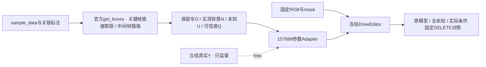

# r46：修复相机关键帧条件时间，再验证小Adapter

task `WS-V77-TARGET-PROTECTED-20260929/r46`，parent r45，failure refs `V77-F02`。

## 工程证据

旧路径只按相机时间查选定轨迹的插值范围，关键帧稍早于第一份sample标注时返回空。
相机sample_data关键帧有自己的关联sample；官方SDK直接取该sample全部标注，非关键帧在当前/前一个sample之间插值并处理新出现的实例。
本轮直接调用安装版本SDK的 `NuScenes.get_boxes()`；只加载所需记录，补齐SDK初始化时会生成的sample→anns反向索引。

旧r45训练已160步，但评测因工程错误停在32/36窗；所有旧条件、权重、原生输出和日志保留。
不再将其条件对照作为完整条件下的负结果。

| case | 相机减标注时间(ms) | 旧/新首帧actor数 | 旧/新LiDAR来源数 | 新首帧洞内O/N/U像素 |
|---|---:|---:|---:|---|
| A022 | -1.142 | 0/28 | 1/2 | 0 / 0 / 51220 |
| A013 | -28.264 | 0/101 | 1/2 | 2596 / 7 / 9101 |
| A007 | -38.030 | 0/35 | 1/2 | 120 / 0 / 4632 |

A022首帧恢复了画面其他区域的背景返回，但其删除洞仍全部U；这是洞内没有可靠返回的证据边界，不是再次丢失关键帧标注。不能为了变蓝而将未知刷成背景。

## 范围与验证

24例240帧按同一SDK规则重建。逐张比较O/N/U/Q：11/12训练例发生变化，10/12评测例发生变化。
因此从原始DriveEditor重训160步，只更新相同Adapter，保持数据case、RGB、H、alpha、相机、seed、优化器与预算。
“训练无全灰帧”只排除了整帧缺失，不能证明训练条件正确，故不复用旧Adapter当修复后权重。

CPU条件排他覆盖、Q未知为0、隐藏X/Y不进入图像条件等240帧合同通过。
三例实际首帧回归恢复关联标注并排除错误全画面U，正向LiDAR来源1→2。
11个已完成原模型关闭分支窗口不依赖条件，也不依赖新Adapter参数；逐项核对输入后复用。
其余25窗重新推理，总对照仍为12例×3臂36窗，seed42/25steps/10帧。所有case是已曝光DEV，人工判定为空。

## 修复后的结果

时间语义 bug 已修复并完成同预算重训、固定三臂评测。4个合成DEV的洞内MAE：原模型0.089463，全未知0.086808，实际条件0.086914；实际条件比原模型小幅降低约2.85%，但没有超过同一分支接全未知。8个真实DELETE DEV的固定f5对照未观察到明确的条件增量，保护车结构损伤、车形块和涂抹仍在；这不是整段视频人工通过率或统计显著性结论。

| 合成case | 原模型洞MAE | 全未知洞MAE | 实际条件洞MAE |
|---|---:|---:|---:|
| M003 | 0.068249 | 0.066507 | 0.066529 |
| M006 | 0.122154 | 0.117793 | 0.117812 |
| M007 | 0.040395 | 0.041859 | 0.041869 |
| M001 | 0.127055 | 0.121072 | 0.121445 |

4个合成case等权均值：`{'adapter_off': 0.08946333191116324, 'all_unknown': 0.08680760363638587, 'conditioned': 0.08691367129754143}`；保护区域仅计2例（M003, M001），case等权均值：`{'adapter_off': 0.1444195467039862, 'all_unknown': 0.13978794729156932, 'conditioned': 0.14030238264256895}`。合成GT指标不能替代真实DELETE人工通过率。

实际条件与全未知的原生输出在12/12例不完全相同，洞内RGB差异MAE范围0.000080–0.001074（0–1）。实际网络零初始化等价、分支梯度与主干冻结检查通过；这些只排除条件通路完全未接或输出完全不变，不能证明模型已充分利用条件。此处差异不是对真实GT的恢复误差。

助手逐例实际查看12例既定f5原生输出，与同帧原RGB/合成真实Y及遮洞输入对照；不由单帧推断视频时序，人工0/1/2 verdict与temporal verdict均留空。A042原有输入疑点仍保留。页面提供全部10帧同步视频及原生输出供用户审核。

| case | 助手观察（非人工verdict） |
|---|---|
| M003 | 三组在被遮住的保护车车头左侧均留下灰白车形涂抹，未恢复原视频中的完整车头；实际条件相对全未知未出现明确的结构修复。 |
| M006 | 纯背景洞内仍有明显的车辆轮廓状模糊补丁，路缘和后方建筑结构没有完整接回。三组主要残留相同，实际条件没有明显额外修复。 |
| M007 | 纯路面洞内仍出现两块偏蓝灰的涂抹，局部道路纹理未恢复；三组残留位置和形状近似，未见实际条件带来清晰结构增量。 |
| M001 | 洞内仍有大块灰色拱形边缘和黑色残块，未恢复原视频的连续车道与周围车辆边界；三组都保留这一主要错误，实际条件没有明显额外修复。 |
| A022 | 固定f5中三组均已移除银色目标车，墙面与路面大体接回，未见该帧重新生成一辆车。原模型已具备这一表现；条件版与全未知、原模型视觉差异很小，不能记为条件分支新增收益。 |
| A041_w10 | 三组洞内右侧仍有深色车形块，地面带模糊拖影，未形成干净的无车背景；实际条件没有明显消除这些残留。单帧不能区分残留与重新生成的完整时序过程。 |
| A013 | 三组均移除前景深色目标车，但被它遮住的大巴前部仍被补成灰白方块/平板状车身，车头结构不完整；修复标注后实际条件未明显改善这一固定帧。 |
| A048 | 前景白色目标车消失，但左侧被遮区域与停车列仍有车形拖影/延展，后方车辆边缘融合；三组这一结构问题近似，实际条件未明显更完整地保住保护车。 |
| A007 | 目标原位的洞内仍有低矮深色车形/树影样块，背景路口结构不清楚；三组形状近似，实际条件未显示明确的去车背景改善。 |
| A034 | 三组都去掉了前景白车，但邻接保留车的车尾仍有鼓包/延展，洞内路缘和车道边界模糊；实际条件与全未知、原模型近似，未见明确的保护车结构提升。 |
| A042 | 洞内停车列仍有明显的灰白车形涂抹，三组主要结构近似，实际条件没有清晰改善。该例沿用旧目标/保护实例输入疑点，未在本轮逐例修改 mask，不能作为干净的模型否定证据。 |
| A061_w08 | 前景灰车被移除，但后方白色保护车的补全部分仍显得扩大、扭曲，左侧带明显模糊拖影；三组结构近似，实际条件没有明显修好保护车身份与车身。 |

新知识：没有全灰训练帧不能证明条件时间正确：SDK统一重建后11/12训练条件也改变，必须重训。修复后当前157888参数、160步的小分支未建立实际条件的新增任务收益。实测N在真实case洞内仅0–0.738%，且O是保守包络内核；这个结果只约束本次粗稀疏条件与预算，不能否定更充分、准确的保护车/背景证据。旧r45含时间工程错误，不作完整条件的科学负结果。

96视频960帧实际解码，保留原生和写回输出。GPU进程退出，按最新要求停下通知；没有追加一轮或自动关机。

代码 `scripts/worldsim_v77/target_protected/iteration13/`；通过 `V77_ONUQ_RUN_ID=r46` 选择本轮路径。旧r45不被覆盖。
本地结果入口 `outputs/v77-onuq-r46/index.html`。failure_ledger_delta: updated V77-F02。
