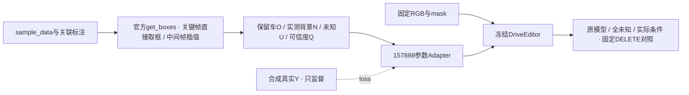

# r46：修复相机关键帧条件时间，再验证小Adapter

task `WS-V77-TARGET-PROTECTED-20260929/r46`，parent r45，failure refs `V77-F02`。

## 工程证据

旧路径只按相机时间查选定轨迹的插值范围，关键帧稍早于第一份sample标注时返回空。
相机sample_data关键帧有自己的关联sample；官方SDK直接取该sample全部标注，非关键帧在当前/前一个sample之间插值并处理新出现的实例。
本轮直接调用安装版本SDK的 `NuScenes.get_boxes()`；只加载所需记录，补齐SDK初始化时会生成的sample→anns反向索引。

旧r45训练已160步，但评测因工程错误停在32/36窗；所有旧条件、权重、原生输出和日志保留。
不再将其条件对照作为完整条件下的负结果。

| case | 相机减标注时间(ms) | 旧/新首帧actor数 | 旧/新LiDAR来源数 | 新首帧洞内O/N/U像素 |
|---|---:|---:|---:|---|
| A022 | -1.142 | 0/28 | 1/2 | 0 / 0 / 51220 |
| A013 | -28.264 | 0/101 | 1/2 | 2596 / 7 / 9101 |
| A007 | -38.030 | 0/35 | 1/2 | 120 / 0 / 4632 |

A022首帧恢复了画面其他区域的背景返回，但其删除洞仍全部U；这是洞内没有可靠返回的证据边界，不是再次丢失关键帧标注。不能为了变蓝而将未知刷成背景。

## 范围与验证

24例240帧按同一SDK规则重建。逐张比较O/N/U/Q：11/12训练例发生变化，10/12评测例发生变化。
因此从原始DriveEditor重训160步，只更新相同Adapter，保持数据case、RGB、H、alpha、相机、seed、优化器与预算。
“训练无全灰帧”只排除了整帧缺失，不能证明训练条件正确，故不复用旧Adapter当修复后权重。

CPU条件排他覆盖、Q未知为0、隐藏X/Y不进入图像条件等240帧合同通过。
三例实际首帧回归恢复关联标注并排除错误全画面U，正向LiDAR来源1→2。
11个已完成原模型关闭分支窗口不依赖条件，也不依赖新Adapter参数；逐项核对输入后复用。
其余25窗重新推理，总对照仍为12例×3臂36窗，seed42/25steps/10帧。所有case是已曝光DEV，人工判定为空。

当前修复与CPU回归完成；修复后的训练/推理尚未完成，模型收益待验证。

代码 `scripts/worldsim_v77/target_protected/iteration13/`；通过 `V77_ONUQ_RUN_ID=r46` 选择本轮路径。旧r45不被覆盖。
本地结果入口 `outputs/v77-onuq-r46/index.html`（实际结果完成后交付）。failure_ledger_delta: updated V77-F02。
