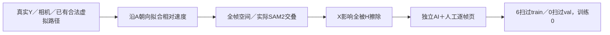

# r15：沿合法虚拟路径制造相对遮挡变化

12个新候选全部达到独立AI2，保留作为下一批数据；覆盖目标未达，训练0。

冻结46来源/32world，每来源最多4旧合法锚点、两端目标±.4拟合、相对速度delta限.25–8m/s；无输出选源或seed网格。原地面2.5m支持、道路、.3m间距、ego禁入、尺寸/截边、深度和85%保护遮挡上限未放宽；新增速度朝向一致性检查。全部46处理完成，12实际新候选：train11（6扫过/4world、5显露）、val1显露/scene0289。目标8扫过train、3扫过val、2隔离valworld未达，不训练这一不足数据。

120帧磁盘Y/X/H重载：Y与真实RGB重解码完全一致，全部X影响在H内，masked-X=masked-Y、ego洞像素0；时序几何与实际掩罩合同通过。只有实际活跃保护车标B/C，速度标注是相对旧路径delta而非绝对世界速度。多种边缘/膨胀示意全擦除，不用车漆假或灰贴片作为拒绝理由。

独立gpt-6-sol xhigh，无fast；逐例0/5/9四栏，疑点另看原尺寸标注，12pass/AI2、0uncertain/0reject。这是输入质量准入而非模型效果、人类通过或视频全时序认证。T009尽管面积近似稳定，遮挡从车身右下转左下；T010扫离、T007显露变化均有三帧视觉支持。

[12例四列全十帧审核](C:/Users/dengyunlong/Documents/Codex/2026-09-26/xia/outputs/v77-target-protected-r15/data_review.html)。48视频实际解码480帧、480图片引用、12三帧联系图、JS语法通过；人工全空。保持原规则和全部拒绝，不无限扩同来源拟合；下一步更长真实曝光窗口补过程和隔离验证覆盖。task WS-V77-TARGET-PROTECTED-20260929/r15，wm-3090-1001，failure_ledger_refs [V77-F02]。
