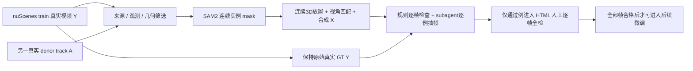

# Target + Protected Actors 数据质量协议 v2

任务：`WS-V77-TARGET-PROTECTED-20260929/r1`。目标约50例小批量数据工厂。初次CPU关卡已完成；2026-09-29用户明确开启GPU并授权继续SAM2与造数据。v2明确记录工程门槛修订及10帧窗口分支；旧v1配置/结果保留，不伪称各轮全部同规则。正式训练尚未启动；素材准入不等同合成准入。failure_ledger_refs: [V77-F02]。

## 任务与数据隔离

- 只从nuScenes官方train采集receiver与donor。已有9例DEV、70例val audit及25个隔离final scene不作为训练来源；receiver和donor均记录scene/实例/曝光时刻，按scene隔离未来训练与验证，不能只对receiver划分。
- 第一批目标配比18例纯背景、20例遮住一个真实actor、12例密集actor。若质量不足，保留缺额及拒绝原因，不放宽条件凑数。类别按最终alpha与真实实例mask交叠确定，box交叠只作CPU提案。
- Y是未做生成或修补的真实视频。X只添加一个待删目标A，受保护的B/C/D保留原身份。原始JPEG与无损解码RGB是监督来源，预览JPEG/MP4不是训练GT。
- 模型architecture不变。protected state先用于来源证据、区域监督、评价；不暗中增加condition通道/多actor分支。训练输入必须逐项映射原DriveEditor已有字段。删除洞内若A被全部遮掉，其外观不构成有效输入信号，需记录实际条件可见性，不能把合成多样性夸大为模型一定看到了这些变化。

## G0：CPU来源与可观测性准入

- 一段使用同一camera的连续约3秒，目标30帧/10Hz；nearest exposure误差≤55ms、曝光唯一且严格递增、最大帧间隔≤180ms。不跨scene，不用跨曝光复制伪造连续帧。独立审核指出12Hz转10Hz可自然出现约167ms间隔；旧审计实际曝光中有20个150–180ms间隔，因此在新采样前全局固定180ms。
- receiver中的protected和donor track在整个片段具有GT轨迹；优先所有采样keyframe visibility=4。曝光时刻的3D位置线性插值、旋转用四元数slerp，标注间隔≤0.6s，不跨缺失track外推。
- 1024×576预览尺度下，donor与主要protected bbox宽≥72px、高≥40px、面积≥0.006画幅、≤0.18画幅，离四边≥8px。极端截边、贴脸大车、十几像素小目标拒绝。
- 首/中/末及最差清晰度帧检查：全局严重失焦、不可辨车体、强灯光溢出、密集栏杆/树干穿过主要actor拒绝。Laplacian方差只做排序和风险提示，不独立认证清晰度。subagent必须逐例看帧后记录结论。
- GT可见性与投影不能认证mask正确。此阶段状态仅为source_pass / source_reject / source_uncertain；没有SAM2结果不写quality_pass。

## G1：轨迹与视角，逐帧硬检查

- synthetic A使用单一donor track，禁止逐帧换实例；放置轨迹在统一世界系定义，尺度来自米制box投影。优先短窗静止/匀速车辆，保留真实相机运动。
- 地面位置需在官方drivable/lane/parking地图或实测地面支持范围，并说明依据；只用ego的z=0或悬浮GT框不能认证接地。
- A与真实3D actor在全部帧无包络相交，并留≥0.3m净距；图像上A在被遮住B/C前面。零碰撞不宣称完整交通合法。地面与遮挡证据不够则拒绝，不靠2D矩形盖住多车冒充合理放置。
- donor相对视角与placement相对视角逐帧yaw差≤12°、俯仰差≤8°；上采样不超过1.5、长宽形变比≤1.12。旧v1另有下采样不小于0.65门槛；v2的D/W分支明确用最终真实alpha宽≥72px、高≥40px及独立看图替代这一代理下界，允许高清donor正常缩小。原门槛控制单独保留，不能当同配置对比。
- visibility=4不等同完整donor：有邻车/杆件遮掉车体时拒绝，不做amodal补车。地图只认证平面位置，不认证高度；真实前景与A的depth order必须正确，无可靠证据时不合成。
- 相邻真实曝光的变化先按实际时间间隔换算到0.1s：位移≤2m、yaw变化≤5°；投影框尺度比按同一时间基准检查0.85–1.18。不要把12Hz转10Hz自然产生的167ms间隔误当成100ms跳变。插值二阶跳变、异常漂移或突然截边拒绝；不靠平滑RGB掩盖错位。

## G2：mask、合成与监督

- SAM2每帧实例mask非空、身份正确、无邻车/栏杆污染；不以GT envelope裁剪后就宣布通过。保存原始mask及修正版本。归一化到actor框后相邻mask IoU<0.8或面积变化>15%记风险并阻止自动准入，允许按真实遮挡证据判拒绝而非强行补mask。
- Type1：A覆盖区域中所有真实actor mask交叠≤1%；Type2：一个明确B在连续≥10帧被遮30–80%，仍有真实可见证据；Type3：至少两个可辨B/C在连续≥10帧分别有20–70%遮挡。第一阶段不造整段完全不可观测隐藏实体。
- receiver的真实Y不改像素。X的差异只限alpha支持域及明确的边缘处理域；GT、protected mask、合成alpha、最终delete/model mask分别保存。
- 边缘策略按case固定、沿时间连续：近硬alpha、窄feather、轻color-match/可选Poisson；不得每帧随机切模式。Poisson先小样验证，不能用来掩盖几何或mask错误。不存在必须采用Poisson的要求。
- donor保留其真实时序模糊，匹配receiver局部清晰度；需要模糊时按轨迹连续变化的方向/幅度并限制增量，禁止全体统一blur。过锐贴纸边或过糊不可辨车体均拒绝。
- 记录每帧的可见protected面积、剩余可见部位与reference provenance。GT隐藏区不得泄漏进模型reference条件。监督可以用Y，模型条件只能用部署时可获得的X/有效外部观测。
- 检查实际模型洞扩大后剩余protected证据，不能只看alpha遮挡比例；矩形吞掉所有B/C证据则退出well-observed组。所有条件逐字段记录provenance，并做“保持X不变，只改Y隐藏区，条件应不变”的探针。
- 记录feather/color/Poisson及可选阴影影响域，X-Y不得超域；加入的影子/反射也必须被删除覆盖。预览固定fps不替代真实曝光时间的轨迹/尺度/mask连续性检查。

## G3：独立检查与人工全检

- 先通过可计算硬检查，再由一个subagent对**每个case**抽首/中/末、最大遮挡及最差质量帧检查，写明确pass/reject/uncertain及证据帧。source review和最终synthetic review分开；uncertain不能自动进入下一阶段。
- 只有合成质量通过例进入人工正式审核页。拒绝例单独保留诊断入口，不删除失败。
- HTML提供真实GT／合成输入／target+protected标注／实际模型输入四列，同步逐帧与放大，按每帧“合格/不合格/未判”记录，支持导出和重新导入。没有一键全通过；人工全部帧通过才记human_complete。用户verdict全部初始为空。
- 抽帧检查不能证明时序通过。逐帧几何/mask统计与人工全检分别负责可计算连续性和最终视觉时序。正式训练需本批质量结论后另设固定零训练对照及训练资源测试。

## CPU停止点

初次CPU阶段在SAM2之前停止，已由用户本次GPU授权解除；该阶段证据仍在CPU报告中保留。没有GPU时不以box mask或自动矩形cutout冒充实例合成结果。磁盘不足或公共RGB缺失会列明需要补的文件。

## v2的明确修订与停止条件

- P为固定世界位移的30帧初始控制；D为30帧camera-relative donor轨迹重放。重放仅在中帧固定深度比例/侧向位移，再经各自真实相机转回世界并贴实测路面；逐帧视角、尺度、yaw、速度、地图、全GT避碰和遮挡检查继续生效，不等同任意2D贴车。
- W从已审查的30帧源固定切出0:10、10:20、20:30，不用生成结果挑时间。官方`DriveEditor/configs/train.yaml`的`data.params.num_frames=10`是这个分支的依据；每个训练候选只有10次真实曝光，约1秒预览。原30帧控制保留，短窗成功不能称3秒时序成功，重复scene/track必须明示。
- D006/D009独立看图发现新增A/删除洞覆盖真实自车机盖。后续候选加底部64px保守禁入带：投影bottom加6px洞支持必须小于512（576px图高）。这是无精确自车mask时的保守过滤，不声称已完整建模自车表面/道路合法性。原D对照不被改写。
- 密集候选因未精确标注的其他GT包络被拦截时，允许只做`--diagnose-unreviewed`定位缺失mask；该诊断不解除准入。带`unverified_actor_envelope_hits`的候选由渲染器硬拒绝，不能作为合成数据或训练样本。
- 光照不匹配、车底悬浮感、实例mask带其他物体，即使数值通过也拒绝或待定。先记录具体缺陷，不为补齐50例降低门槛；单一case的失败不能被扩大为DriveEditor或整个表示路线失败。

## 已执行合成的具体边界

首轮采用单一真实donor视频的2.5D affine cutout，位置与尺度来自真实相机、米制GT轨迹和LiDAR地面约束；没有执行神经重打光或新增三维生成器。三种窄边缘策略在整clip固定；3×3轻模糊仅作用于donor RGB，不凭该操作声称完成运动模糊匹配。实际清晰度、光照和接地仍由独立看图与人工全检把关。

删除洞的候选保守上界覆盖1px插值支持、1px边缘处理和最多4px外扩，共6px；合成后按实际影响域重新核验，不能以候选上界替代最终检查。所有新增像素必须在实际洞内，故masked X与masked Y相等。该合同不等于已完成DriveEditor训练loader/forward。

独立审查从本次用户要求起使用`gpt-6-sol`、`xhigh`，不启用fast；已完成的旧来源记录原样保留。来源→mask→几何候选→实际合成→人工逐帧分别准入。少于50或某一类型空缺时，保留分母、拒绝原因和下一步；不得把素材数或近重复候选当成合格合成数。
