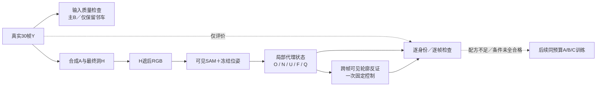

# r31–r36：保护车角色、投影边缘与可见证据控制

task `WS-V77-TARGET-PROTECTED-20260929`，wm-3090-1001，v77；failure：V77-F02。

本轮修复一项数据准入语义错误和审核图显示错误。增加一例输入QA2的Q046，但其条件仍QA1，不能把技术通过当训练通过。Q060条件保持QA2。**没有新DriveEditor推理或正式A/B/C训练，没有真实DELETE新收益，surfel未启动。**

## r31/r32：主显露对象不能与轻触邻车混为一谈

同87条候选中39条有足够的主车遮挡量、24条同时有遮挡变化；另有身份与第一阶段非车对象问题，不是排序一改就都能用。旧门槛要求每辆被H触及的B都至少30%遮挡且发生显露，误拦轻触邻车。修正为至少一个主B满足原显露条件，所有受影响B继续接受身份、深度及其他帧证据检查。

位置、30帧、所有像素与H不改；旧默认回归Q035/Q046/Q060五组主要结果完全一致，新角色规则在12个过身份/空间门的例上检查，Q066/Q067/Q068仍因其他B缺证据拒绝。87例技术候选1→3：旧Q060保留；新增Q035由独立QA判0（实际主B约57×38像素，模糊，不能借邻白车代替证据）；Q046输入2分，进入合法条件检查。其余29身份不确定、37非车或几何缺失、5无显露、3尺度、2深度、3静态前景、5证据不足。

## r33/r35：静止A求解不能靠放宽空间约束救活

r33围绕原指定清楚B，在f0/15/29左右边各一次反解A深度和遮挡边缘；静止A世界位姿固定，最多六个解/B，不增加速度网格。372个尝试仅1条P001技术通过，仍在Q046同scene。独立输入QA0：两个主B中一个只在早期看到部分车身，f8后全遮；58.1%框面格支持不能证明隐藏纹理真的见过。另一个清楚B不能补足第一个B的证据。停止本次位置求解，不据此否定模型。

保存P001审核图时因新增主B不在旧curated列表触发StopIteration；已使用完整保留实例框查找，备份错误脚本与日志后断点续跑，没有重复已完成source。

r35只诊断原150条size/border/ego拒绝，同位置不重新搜索。134条触ego底部、133条尺度/面积不合适、72条接近/穿越相机平面、98条可见比例不足，原因重叠。**只有水平截边失败的0条**，因此放宽入画/出画要求不能解决这批位置，原空间要求保留。

## r34：来源正确，显示图错误；条件边缘确有风险

Q046从最终H遮后RGB重新SAM，再用固定GT相机/轨迹与窗口内LiDAR构建cuboid代理。全Y只离线评价。主B在30帧保持同一身份，洞内同实例精度95.30%、隐藏部分覆盖54.67%；两辆轻触邻车却只有26.54%／57.75%边缘精度，联合90.83%掩盖了问题。地面正证据不足，N保持0，洞内U94.06%，未把未知填成背景。

旧审核条带将多车宽crop强行拉正方形，独立QA一度疑似源错配。核验30帧H外X与Y逐像素相等、H内127；旧Y格与对应正确source裁剪仅JPEG误差（MAE1.06–1.28）。已保存旧条带/初始QA，修为保比例逐actor条带及全景定位；条件与指标未改变。独立重审条件1分：主身份正确，但邻车末段有边缘过投影，不能计入2分训练条件。

## r36：一次合法轮廓反证控制，有收益也有代价

针对框面代理误投，借鉴[Space Carving一手论文](https://homes.cs.washington.edu/~seitz/papers/kutu-ijcv00.pdf)的可见观测一致性思路：将已有actor局部点投向30帧，只有点未落在H及其2px边缘、未被保留对象遮挡时才判断；落到本实例SAM的2px容差外则剔除。冻结0容许反证、0.15m深度容差；无Y输入、无新增表面、无填U，背景N逐帧保持不变。这只是动态代理点的诊断，不是该论文算法的完整实现或保证。

| case | O洞内精度：原→过滤 | 隐藏B覆盖：原→过滤 | 独立条件评分 |
|---|---|---|---|
| Q060 / scene-0256 | 95.30%→96.44% | 61.26%→61.00% | 2→2 |
| Q046 / scene-0714 | 90.83%→93.78% | 55.80%→51.69% | 1→1 |

Q046两邻车精度分别26.54%→76.46%、57.75%→66.39%，但仍有误投。主B覆盖54.67%→50.49%；被删2600个主B投影像素中，2397原本落在近似Y-SAM B上。预登记的精度不降/覆盖保留至少90%数值门通过，**独立质量并未两例同时2分，因此不推广全局默认，不追加halo/票数阈值网格**。Q060这个单例仍是合法条件正证据；不能把UNKNOWN增加和小规模精度提升当成补景任务成功。

## 交付、验证和剩余边界

- 本地`outputs/v77-target-protected-r34/index.html`：Q035/Q046/P001明确主B、邻车、A与H，12视频360帧；输入和条件不冒充生成结果。
- 本地`outputs/v77-target-protected-r36/index.html`：两例真实Y/带洞输入/原条件/过滤后条件，8视频240帧；保留全部逐actor30帧与独立评分。人工verdict为空。
- 两页文件链接、JS语法和视频实际解码检查完成；没有声明浏览器播放验证。方法合同覆盖H未知、他车遮挡不作负证据、原样本不改；60帧N逐像素不变，O/N/U互斥完整。默认状态构建保留，过滤仅显式参数启用。

当前合格池仍不足约50条配方。旧高运动来源偏向近车与快速接近，静止A全窗可用空间有限；后续应先补有物理空间且保护车真实可见的来源窗口，再生成遮挡，不能用更密的旧位置网格补数量。真实r21入口、r26反例、原/r7权重和所有失败完整保留。数据盘约46GB可用，无文件删除；GPU无新训练。未达到真实DELETE两侧跨scene收益，关机条件不满足。

轻量登记与收口：[r32](../autoresearch/worldsim_v77/target_protected_20260929/r32/closeout.json)、[r34](../autoresearch/worldsim_v77/target_protected_20260929/r34/closeout.json)、[r36配对](../autoresearch/worldsim_v77/target_protected_20260929/r36/paired_comparison.json)。完整图像/NPZ/逐解日志在对应远端run，不以轻量索引冒充备份。
