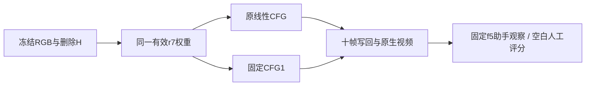

# v77 r13：同权重CFG采样控制

固定r7权重／RGB／H／seed42／25steps／previous=false，仅将2D guider的线性1.2→2.0换为常数1；3D guider不变、不训练、不改结构。

8个已曝光真实DEV与2个真实Y合成哨兵，全部10窗完成。固定f5实看每例：A022仍生车且更糊，A041/A048/A042仍车形涂抹；A013白公交前部未恢复，未取得真实跨例收益。A061仍白色车形但真实隐藏身份未知，不将所有车辆存在都判再生。单帧不能认证视频时序。

已知真实Y的P006在应为道路处明确多生棕黄色车。10帧洞MAE 0.04720→0.09647（+104.37%），洞内保护车0.10580→0.16484（+55.81%）。P012洞MAE−17.91%、保护车−16.60%，但固定f5仍有两个车身融合；像素误差改善不能替代身份结构通过。两哨兵不是完整GTbenchmark。

结论：不推广固定CFG1，停止本策略，不做CFG网格。本结果不能否定其它采样算法、数据或模块范围。r14已独立预登记等数量时间self attention控制，保持默认CFG，不叠加本轮改动。

[10例四列同步审核](C:/Users/dengyunlong/Documents/Codex/2026-09-26/xia/outputs/v77-target-protected-r13/index.html)，原生输出另链。60视频/600帧实际解码、400逐帧引用图、10contact和JS语法核对通过；浏览器同步播放未实测，人工0/1/2为空。洞外写回原像素不是神经保护收益。所有权重/原生/写回保留，final未用。

完整run：/root/autodl-tmp/runs/worldsim_v77/WS-V77-TARGET-PROTECTED-20260929/r13。failure_ledger_refs [V77-F02]；failure_ledger_delta 更新同一卡，不新增。真实DELETE＋补景收益关机条件false，不关机，后续控制继续。
