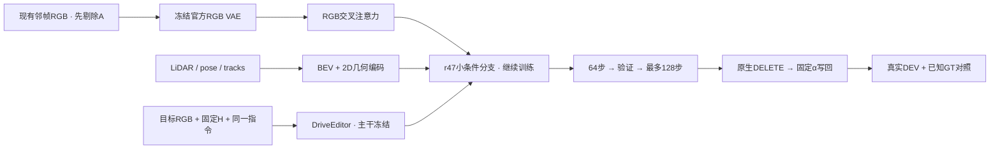

# r48：短循环检查、训练与真实DELETE验证

task `WS-V77-TARGET-PROTECTED-20260929/r48`，parent r47，failure refs `V77-F02`。2026-10-07，wm-3090-1001。当前仅CPU准备；训练0步、模型采样0窗，等待用户开GPU。



## 人工记录与本轮问题

新版 `打分记录.xlsx` 5sheet完整只读归档到run的user_review；16条r46/r47真实记录分版本、逐单元格保存，源文件未改。r47已填5例均1分；A013、A007、A022空白保留null。A034/A061保护车局部结构改善但仍有薄膜，A048与r46相近，A041写明条件组涂抹更严重；不能写成其他case都没有回退。A022的r46人工2分保留作回退检查。

真实参考检查沿用实际选中的输入，未重新选图：A034/A061保护角色有效token161/94，但多个slot属于不同B或背景，不等于同一车身面积；slot0/1有主要保护车部分视角。A048保护token40、slot3为0，A041仅12且车身局部。用户A041“RGB足够”的判断原样保存，与当前进入模块的局部参考区分，不擅自改为RGB不足。参考充足度、VAE压缩损失与融合绑定分别待GPU验证。

## 已修正的工程混杂

旧r47在RGB和几何同时移除时，也清空四维任务参数；其他条件组却保留指令。旧“完整比全未知洞MAE低13.3%”包含这项变化，不能作为纯先验增量证据。历史输入、权重、数值和视频均保留。

r48训练dropout和所有C消融始终保留相同参数化指令；UC显式清空新RGB/几何/指令，保留原官方CFG接口与查询mask/相对时间合同。完全关闭分支的r46是部署基线，不冒充同一学习分支的纯先验消融。

沿用389856参数的r47分支与state_dict，没有改网络、loss或参考选择。仅增加采样第1/25次C/UC的四处RGB head、几何head及门控Δ/激活RMS；非有限即停。记录输出敏感性不能代替语义或时序收益。

## CPU输入与接口验证

11例110帧通过：4train与7QUERY场景分离，真实DEV和合成DEV不入训练；查询H/alpha、参考实际PNG、数组和source-mask检查来自不可变r47/旧r21。修改隐藏X不改变条件，Y只作监督/度量；O/N/U划分、维度、有限性、控制H的浮点面积缩放一致；C指令四种组合相同、UC参数显式零且不原地改变源条件。r47 checkpoint严格加载、参数有限；添加记录前后与原r47在受控激活上逐元素相同。10份源码语法通过；GPU入口在加载官方模型前要求可用GPU。

五真实case的保存PNG、实际alpha在f05精确重现写回。A034/A061洞内alpha=1区域分别约77.8%/89.0%，该区域原生和写回完全相同；这是融合定位证据，不单独认定残影的模块根因。只看f05也不能推断整段时序。

CPU准备约62秒（0.5核/1线程）。数据盘600GB约剩92GB，不需要清理/扩盘。CPU审核页复用42条既有视频并明确标旧r46/r47，244个媒体/证据链接存在；未跑的r48留空。媒体是DELETE，不是factual原位重建。

## GPU固定短循环（尚未执行）

1. 用r47 step320检查A034/A061的冻结VAE输入→重构，正确RGB、跨case错配RGB、无RGB、全未知C四组；错配只换RGB latent，query几何、pose、valid、时间、指令固定，仅是模块探针。
2. 从同一r47 checkpoint继续，仅M010/scene-0240、M013/scene-0228、M018/scene-0290、M042/scene-0295；AdamW1e-4、seed6201、320×576、原diffusion loss，RGB/几何各25%独立dropout，主干/3D/VAE冻结。
3. 64步立即验证A034、A061_w08、A022及M003、M006；无工程/数值错误才继续到128步，在上述五例加A048、A041_w10。真实无隐藏GT，M003/M006的Y仅算恢复误差。
4. 所有推理保留旧query H/alpha、10帧、576×1024、seed42、25采样步；保存原生与写回PNG。16步断点保留branch、AdamW、顺序和随机状态，64/128固定权重不按真实结果择优。64验证必须先完成；子进程串行释放显存。

GPU启用后手动入口：

```bash
cd /root/autodl-tmp/motion_proj_v77
OMP_NUM_THREADS=1 OPENBLAS_NUM_THREADS=1 /root/autodl-tmp/envs/driveeditor/bin/python scripts/worldsim_v77/target_protected/iteration15/run_cycle.py
```

此CPU阶段没有启动控制器、定时任务、GPU模型或等待开卡的后台进程。预计3090完整短循环约45–75分钟，依据r47耗时，仍需实际计时；工程/数值错误即停。128步后收口，不自动增步数/扩数据/扫参数。

HTML将并列r46、r47、本轮64/128，以及原生/写回、参考VAE重构和模块响应。重点是后车结构、残影、幻觉及A022回退；人工0/1/2留给用户。先确定编码信息、融合利用或监督迁移的具体证据，再提出一项模块修改，不能以本轮小数据/预算否定全部架构，也不继续无边界增加分布微调。

## 证据

本地 `outputs/v77-priors-r48/index.html`，远端run的 `review/index.html`。轻量证据：[登记](../autoresearch/worldsim_v77/target_protected_20260929/r48/manifest.json)、[CPU检查](../autoresearch/worldsim_v77/target_protected_20260929/r48/preflight.json)、[实际输入](../autoresearch/worldsim_v77/target_protected_20260929/r48/input_checks.json)、[新版人工记录](../autoresearch/worldsim_v77/target_protected_20260929/r48/human_review.json)。原件、数组、旧输出和r47权重在数据盘保留。

failure_ledger_delta: updated V77-F02（新版人工结果、消融混杂、CPU工程修正）；无新增模型科学结论或新failure ID。


### GPU启动（按最新用户授权）

2026-10-07用户明确“直接开始gpu任务”，3090已检测，单控制器PID1414启动，当前执行既定模块探针，随后64/128步短循环。前文CPU阶段记录保留；当前状态以RESEARCH_STATUS与controller_state为准。启动时尚无新语义收益判定，没有定时任务。
