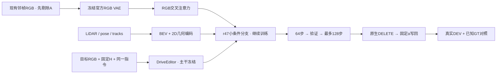

# r48：短循环检查、训练与真实DELETE验证

task `WS-V77-TARGET-PROTECTED-20260929/r48`，parent r47，failure refs `V77-F02`。2026-10-07，wm-3090-1001。本轮GPU短循环已完成：128步、20个新采样窗。独立图像review已完成，人工verdict待用户；没有追加GPU任务。



## 人工记录与本轮问题

新版 `打分记录.xlsx` 5sheet完整只读归档到run的user_review；16条r46/r47真实记录分版本、逐单元格保存，源文件未改。r47已填5例均1分；A013、A007、A022空白保留null。A034/A061保护车局部结构改善但仍有薄膜，A048与r46相近，A041写明条件组涂抹更严重；不能写成其他case都没有回退。A022的r46人工2分保留作回退检查。

真实参考检查沿用实际选中的输入，未重新选图：A034/A061保护角色有效token161/94，但多个slot属于不同B或背景，不等于同一车身面积；slot0/1有主要保护车部分视角。A048保护token40、slot3为0，A041仅12且车身局部。用户A041“RGB足够”的判断原样保存，与当前进入模块的局部参考区分，不擅自改为RGB不足。参考充足度、VAE压缩损失与融合绑定分别待GPU验证。

## 已修正的工程混杂

旧r47在RGB和几何同时移除时，也清空四维任务参数；其他条件组却保留指令。旧“完整比全未知洞MAE低13.3%”包含这项变化，不能作为纯先验增量证据。历史输入、权重、数值和视频均保留。

r48训练dropout和所有C消融始终保留相同参数化指令；UC显式清空新RGB/几何/指令，保留原官方CFG接口与查询mask/相对时间合同。完全关闭分支的r46是部署基线，不冒充同一学习分支的纯先验消融。

沿用389856参数的r47分支与state_dict，没有改网络、loss或参考选择。仅增加采样第1/25次C/UC的四处RGB head、几何head及门控Δ/激活RMS；非有限即停。记录输出敏感性不能代替语义或时序收益。

## CPU输入与接口验证

11例110帧通过：4train与7QUERY场景分离，真实DEV和合成DEV不入训练；查询H/alpha、参考实际PNG、数组和source-mask检查来自不可变r47/旧r21。修改隐藏X不改变条件，Y只作监督/度量；O/N/U划分、维度、有限性、控制H的浮点面积缩放一致；C指令四种组合相同、UC参数显式零且不原地改变源条件。r47 checkpoint严格加载、参数有限；添加记录前后与原r47在受控激活上逐元素相同。10份源码语法通过；GPU入口在加载官方模型前要求可用GPU。

五真实case的保存PNG、实际alpha在f05精确重现写回。A034/A061洞内alpha=1区域分别约77.8%/89.0%，该区域原生和写回完全相同；这是融合定位证据，不单独认定残影的模块根因。只看f05也不能推断整段时序。

CPU准备约62秒（0.5核/1线程）。数据盘600GB约剩92GB，不需要清理/扩盘。CPU审核页复用42条既有视频并明确标旧r46/r47，244个媒体/证据链接存在；未跑的r48留空。媒体是DELETE，不是factual原位重建。

## GPU固定短循环（已执行；下列是预先冻结方案）

1. 用r47 step320检查A034/A061的冻结VAE输入→重构，正确RGB、跨case错配RGB、无RGB、全未知C四组；错配只换RGB latent，query几何、pose、valid、时间、指令固定，仅是模块探针。
2. 从同一r47 checkpoint继续，仅M010/scene-0240、M013/scene-0228、M018/scene-0290、M042/scene-0295；AdamW1e-4、seed6201、320×576、原diffusion loss，RGB/几何各25%独立dropout，主干/3D/VAE冻结。
3. 64步立即验证A034、A061_w08、A022及M003、M006；无工程/数值错误才继续到128步，在上述五例加A048、A041_w10。真实无隐藏GT，M003/M006的Y仅算恢复误差。
4. 所有推理保留旧query H/alpha、10帧、576×1024、seed42、25采样步；保存原生与写回PNG。16步断点保留branch、AdamW、顺序和随机状态，64/128固定权重不按真实结果择优。64验证必须先完成；子进程串行释放显存。

GPU启用后手动入口：

```bash
cd /root/autodl-tmp/motion_proj_v77
OMP_NUM_THREADS=1 OPENBLAS_NUM_THREADS=1 /root/autodl-tmp/envs/driveeditor/bin/python scripts/worldsim_v77/target_protected/iteration15/run_cycle.py
```

此CPU阶段没有启动控制器、定时任务、GPU模型或等待开卡的后台进程。预计3090完整短循环约45–75分钟，依据r47耗时，仍需实际计时；工程/数值错误即停。128步后收口，不自动增步数/扩数据/扫参数。

HTML将并列r46、r47、本轮64/128，以及原生/写回、参考VAE重构和模块响应。重点是后车结构、残影、幻觉及A022回退；人工0/1/2留给用户。先确定编码信息、融合利用或监督迁移的具体证据，再提出一项模块修改，不能以本轮小数据/预算否定全部架构，也不继续无边界增加分布微调。

## 证据

本地 `outputs/v77-priors-r48/index.html`，远端run的 `review/index.html`。轻量证据：[登记](../autoresearch/worldsim_v77/target_protected_20260929/r48/manifest.json)、[CPU检查](../autoresearch/worldsim_v77/target_protected_20260929/r48/preflight.json)、[实际输入](../autoresearch/worldsim_v77/target_protected_20260929/r48/input_checks.json)、[新版人工记录](../autoresearch/worldsim_v77/target_protected_20260929/r48/human_review.json)。原件、数组、旧输出和r47权重在数据盘保留。

failure_ledger_delta: updated V77-F02（新版人工结果、消融混杂、CPU工程修正）；无新增模型科学结论或新failure ID。


### GPU启动（按最新用户授权）

2026-10-07用户明确“直接开始gpu任务”，3090已检测，单控制器PID1414启动，当前执行既定模块探针，随后64/128步短循环。前文CPU阶段记录保留；当前状态以RESEARCH_STATUS与controller_state为准。启动时尚无新语义收益判定，没有定时任务。


## GPU收口与独立图像review

按用户最新要求，GPT-5.6 Sol、xhigh（未启用fast）直接检查七例对照图像；GT洞内MAE只归档为辅助记录，不用于视觉质量排序。固定f05的结论如下，抽帧不等于整段视频通过率或时序 verdict。

| case | 视觉比较 | 回退风险 |
|---|---|---|
| A034 | r47 ≈ r48_64 ≳ r48_128 > r46 | 中：r48_128 增强了车尾色块和不透明感，且 r48_64 没有提供可见增益。 |
| A061_w08 | r47 ≳ r48_64 > r48_128 > r46 | 高：训练步数增加时，保护车清晰度与删除车残影一起增强；r48_128 的残影最重。 |
| A022 | r46 ≳ r47 ≈ r48_64 >>> r48_128 | 严重：r48_128 破坏墙、人行道和道路，远超局部纹理瑕疵。 |
| A048 | r48_128 ≈ r47 ≈ r46（不同伪影之间的取舍，无明确赢家） | 中：r48_128 只有很小的拖影改善，没有解决保护车形变，不能算稳健收益。 |
| A041_w10 | r46 > r48_128 > r47 | 高：r48_128 虽回收一部分 r47 回退，仍保留大块车形伪影和道路边界污染。 |
| M003 | r47 ≈ r48_64 ≈ r48_128 >> r46 | 低至中：r48 保住了 r47 的主要结构，但轻微色偏说明继续训练没有稳定改善。 |
| M006 | r47 ≈ r48_64 ≈ r48_128 >> r46 | 低至中：两个 r48 没有出现大回退，但也没有解决 r47 已有的背景拖影。 |

独立评审总结：没有证据支持把 r48 视为相对 r47 的一致视觉升级；r48_64 多数近似持平，r48_128 存在明确回退。

### 模块证据与边界

两例可靠参考的冻结VAE源图与重构图中，保护车大体车身和可见前／后脸仍可识别；不能据此保证细部纹理、视角覆盖或身份绑定充分。所有新窗口实际25次UC与25次C调用通过，C消融任务指令相同，UC新指令另行清空；主干/3D/VAE保持冻结、训练梯度有限。没有发现本轮输入、加载或数值错误。

相同r47权重和指令下，替换错配RGB造成的洞内原生输出差异（0–1，全部10帧）A034=0.000402、A061=0.001143；移除RGB分别0.006600、0.010694。RGB head确实响应不同输入，但具体参考内容对输出的影响较弱。像素差和RMS只是模块敏感性，不是保护车质量或“模型忽略参考”的证明。

代码中六张参考被压成各8×8 token，只有slot级pose；query来自池化UNet激活和时间，BEV/2D几何走并行残差，没有显式把某张crop的某个车身位置绑定到查询中对应保护车区域。这是下一步可以单独验证的融合限制，并非已确定的全部根因。四训练例均有保护车appearance参考；不能把本轮解释成“训练完全没有车身参考”。少量数据、视角差、覆盖和原监督仍未排除。

下一模块假设（独立评审）：编辑洞内的保护车占据门控与删除目标残影抑制。当前主要失败不是保护车完全缺失，而是保护车补全与删除目标残影一起被增强；单纯继续训练会把薄膜变成更实的车形，并可能触发 A022 的结构崩坏。

后续只考虑一项RGB参考融合改动：给参考token与query建立显式空间对应及局部保护区域门控，其他数据、主干、BEV、mask、预算固定；先做正确／错配／无RGB图像对照。O仍是proxy，U仍未知，不能把门控外区域强认作背景，也不能凭单帧确诊删除车特征。本轮没有实现或启动下一实验。M003/M006/A022只用于验证，不能转作训练监督。默认保留r46，不追加步数，不把r48替换成默认权重。

### 执行与资源

从r47 branch_0320开始，389856参数小分支仅4既有训练例，64步后5窗验证完成，再续到128步并验证7窗；另2例各4组模块探针。共20新窗、200原生与200写回PNG；7个独立QUERY，其中5真实DEV、2合成GT DEV，不能把20窗当20个独立case。真实DEV未进入训练；本轮没有未曝光最终测试。

3090 GPU阶段约33分钟（报告开始前）；64/128段训练分别约209/206秒，训练峰值allocated 10.42GiB，推理观测设备使用峰值约23.4GiB。报告82条视频中42条来自原r46/r47，40条新视频已实际解码400帧；本地链接验证完成。磁盘约余92GB。控制器已结束、GPU无计算进程，不自动重启或新增定时任务。

合成GT误差和C/UC记录保存在[summary.json](../autoresearch/worldsim_v77/target_protected_20260929/r48/summary.json)；独立视觉证据见[指定模型review](../autoresearch/worldsim_v77/target_protected_20260929/r48/assistant_image_review.json)。人工0/1/2及视频时序判定保留null。原资产、源工作簿、全部输入、16步断点、64/128权重、优化器和随机状态继续保留在run。

failure_ledger_delta: updated V77-F02（修正消融、参考融合敏感性及有界视觉结果）；不新增failure ID，不认定整体架构或数据分布已被排除。
