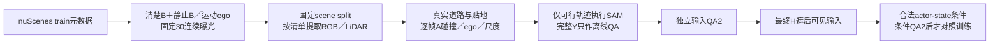

# r42–r43：按实际空间判断来源，避免过早的距离代理

任务`WS-V77-TARGET-PROTECTED-20260929`，wm-3090-1001，v77。此处是数据工厂控制；未证明条件或真实DELETE模型有新增收益。

## 截断控制：保留负结果

取消每scene前三截断后440→612窗口；原440及r41过滤逐条重现，但固定过程筛选仍0来源；停止将截断作为主因。无截断索引仍保持原每actor可见性、尺寸与遮挡过滤，未扩大到val/test。取消截断新增172窗口，但不是静止清楚B＋运动ego缺口的直接解；不继续排列旧候选次序。

## 用实际空间检查替代距离预筛选

16m是之前为合成A预留空间的启发式代理，不是用户规定的清晰度标准。r43整体移除这一距离代理，不搜索新的距离阈值；B全8关键帧visibility4、100×60最小尺寸、真实30曝光几何、静止位移≤0.5m、相机三秒行程1–8m保持。候选89窗口中67可解析曝光、22抽样失败，最终6scene：预先按scene与location固定代表及5train/1DEV，完整Y只质检和监督。它们均为训练来源，不是最终测试。

下一层不放宽物理门槛。只试每来源旧规则最多24个车道中点和世界静止A，不追加速度／offset网格；所有帧保留地图、真实LiDAR贴地、GT间距、ego保护、尺寸、连续性等检查。现在将这些检查放在昂贵SAM之前，避免先分割物理上无法合成的来源。

空间结果：`{"sources": 6, "spatial_candidates": 4, "candidate_scenes": 3, "attempts": 13, "rejects": {"ground_support_gap": 5, "collision_clearance": 2, "ground_fit_unavailable": 2, "size_border_or_ego": 2}, "mask_QA_and_condition_not_done": true, "training_steps": 0, "training_admission": 0}`

实例结果：`{"protected_depth_order": 2, "insufficient_other_frame_evidence": 1, "instance_identity_or_visibility_uncertain": 1}`

阶段：有界来源对照已完成；4候选独立QA为0/0/1/0，均未准入。技术通过不是独立QA2，更不是训练或真实DELETE收益。

独立输入QA：G001=0：绿色B是近处白色SUV，紫洞实质擦掉其右半部；但黄色A的车体更小、接地点更高，视觉上在白车之后，却被画在白车前面，camera→A→B顺序不成立。f0、f15、f29均如此，30帧平顺不改变深度错误；右侧驶来的深色车并非可替代的同一B。；G002=0：黄色A和实际灰洞一直位于绿色白色SUV的右侧，白车基本未被遮住；早期洞反而压到向相机驶来的右侧深色轿车的边缘，随后该车离开，洞仍留在车道中间。无法建立A挡住指定绿色B的目标关系，也不能用右侧移动邻车或远处小车替换B身份。洞覆盖A、位置连续，但不是所需保护车恢复样本。；G003=1：黄色A在交叉口斜纹区域前景，紫洞覆盖它及后方绿色深色轿车的大部，空间投影和30帧尺度变化尚可理解，未见明确串到行人。但绿色B是路边同一辆静止轿车，随着小幅ego变化始终落在相近洞位；三段联系表和原生f0/f15/f29看不到被遮车身在其他帧充分露出的互补视角。蓝色邻车提供不了同一B的真实表面依据。且A停在斜纹禁停区域，落点仍有疑虑。仅凭其可见轮廓和几何平滑不能将洞内未知当成已观测车体，故暂不进入合法条件构建。；G004=0：绿色来源B是随ego接近而逐渐放大的左侧银色轿车；黄色A和灰洞却固定在更远的中间车道，f0/f15/f29及全段均与该B分离，未真正遮住要恢复的车。洞主要抹掉车道箭头/路面，并接近多辆蓝框远车，无法确认其中哪辆才是同一受挡B；A的尺度、深度也不足以位于近处银车之前。身份和目标遮挡关系不成立。

新知识：碰撞可行与所需遮挡过程不是同一约束。G001/G002没有建立camera→A→指定B顺序，G004洞与来源B分离，G003缺乏同一B的互补显露。静止A、静止B与运动ego本身并不保证reveal。关闭本次固定来源对照；下一步修生成入口的目标关系与显露约束，不在这六个来源上增加位置／速度网格。技术失败仍有效，独立QA1也不能放行。

审核页保留全部4候选、12段三列视频、360个可解码帧。第三列是灰洞输入而不是模型补景；人工verdict均空。Y只作监督／离线质检。页面：本地`outputs/v77-target-protected-r43/index.html`，完整抽帧意见见`independent_quality.json`。

## 工程与资源

旧提取器写死最多两个归档，遇到新6来源对应的04/05/06/09停止；已增加显式允许的冻结分片清单，旧调用默认两分片限制保留。公共包只流式读取所需member，不整体落盘。单路读取较慢，在04完成的记录边界续跑后，剩余最多两路读取；中断时刚开始的下一个分片移到备份，不把部分文件当完成数据。来源、质量规则和模型均未改动。原错误和续跑检查点保存于r43/before_changes，新增CPU预算见extraction_amendment.json。

最终409个必要RGB/LiDAR文件全部找到，无缺失与损坏，落盘70,316,986字节，180个真实RGB帧完成解码。跨05/06归档的成员查询返回码不作为完整性判断，最终逐文件核对为准。提取器回归验证覆盖默认两分片保护、显式分片范围、两路读取、已完成归档续跑。

空间仍约44GiB可用，尚未删除任何历史数据、权重或对照。旧r37–r41报告和S016失败视频保留。此对照的CPU/GPU作业已结束。正式A/B/C训练0步，surfel后置；真实DELETE两侧跨scene收益关机条件没有满足。
