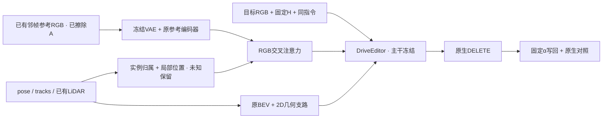

# r49：参考到恢复位置的空间绑定

task `WS-V77-TARGET-PROTECTED-20260929/r49`，parent r47，同预算控制 r48_64，failure refs `V77-F02`。2026-10-07，wm-3090-1001。CPU准备已完成；训练0步、新推理0窗；没有后台等卡进程或定时任务，等待用户开启GPU。



## 本轮只验证一个变化

r48没有消除半透明车形，128步还使A022明显回退。本轮只改RGB参考信息的分配：为可靠参考patch保留实例归属、源像素与actor-local框面坐标；按当前时刻的同一保留实例位姿投影到query。原参考仍是每张8×8 token，query仍最多18×32，四处注入、BEV编码、mask、输入和389856参数范围都沿用r47。没有新增可训练参数、backbone、loss或数据来源。

空间绑定作用于RGB cross-attention logit：`min(Qquery,Qref) × log(0.1 + 0.9 × similarity)`。已知同一实例/背景且有可用对应时使用位置高斯；sigma取一格query与源patch投影半径的较大值；已知不同身份/角色降低相互作用；未知和空token偏置0。只有身份却没有可见局部对应时做身份绑定，不虚造位置。没有改DriveEditor主干的self-attention，也没有加入DORS/Attentive Eraser、RGVI传播。

## 信息合同与覆盖边界

车辆crop含道路或邻车，整景参考也含车列；不把整张参考当主B或纯背景。源patch必须有效且单一归属比例≥95%，混合身份保持U；O仍是GT cuboid框面proxy、Q=.5，不是SAM silhouette。N只接受已有真实LiDAR可见落点、Q=.8；框外和无点区域不推出N。当前稀疏N没有形成纯背景token/查询格，因此本轮首先检验局部车辆绑定，不能声称已实现整洞背景控制。

query删除A后重新检查保留实例的first return；source A仍遮挡的位置及无效参考不可建对应。使用实际round后的letterbox宽高做逆坐标映射，原RGB、参考PNG、H、α与几何数组继续直接读取不可变r47。条件构建只读几何、已擦除参考valid和原LiDAR，不读Y或洞内RGB。Y仅在GPU合成训练loss/对照度量中使用。

f05覆盖（空间patch指经过投影与遮挡检查的主B来源，不等于恢复成功）：

| case | split | 主B归属patch数 | f05可投影主B patch | f05主B绑定query / 洞内query |
|---|---|---:|---:|---:|
| M010 | train | 8 | 8 | 4/20 |
| M013 | train | 0 | 0 | 2/18 |
| M018 | train | 16 | 14 | 1/22 |
| M042 | train | 24 | 24 | 5/18 |
| A034 | real_DEV | 35 | 32 | 3/30 |
| A061_w08 | real_DEV | 26 | 8 | 8/72 |
| A022 | real_DEV | 0 | 0 | 0/184 |
| M003 | validation | 4 | 4 | 1/12 |
| M006 | validation | 0 | 0 | 0/22 |

A034只有第一层粗格的局部绑定，后续10×18/5×9多数仍U；A061也有未覆盖区域。M013没有可靠纯参考patch，保留同一训练输入作为对照但不提供路由监督；A022/M006同样不施加可靠patch偏置。不得据此声称所有后车细节已绑定，也不放大框或改门槛以制造覆盖。真实DEV均不进入训练；三个真实DEV/两个已知GT DEV已经曝光，不是最终测试。

## 已完成的CPU验证

9例90帧sidecar已生成；原查询索引、独立mask/α、参考PNG、query时间和C指令逐例核对。r47 checkpoint严格加载，关闭空间绑定和全未知sidecar均逐元素重现原RGB路径；有约束时可到达RGB融合，支路梯度有限；18×32、10×18、5×9的logit尺寸、身份冲突、未知中性、目标删除前后深度顺序、round后裁切逆变换通过。CPU受控激活不等于实际官方模型或视觉收益。

错配只交换双方有效主B的池化外观特征，按归一化actor-local位置固定一对一配对；保留recipient slot pose、query位置、身份、valid、几何、任务指令、背景和其他车。当前可换数量：A034 26/35；A061_w08 26/26。只换主B patch避免旧整参考错配污染背景；具体变化仍需直接看对应车身，像素差不是效果证明。

CPU输入构建约61.9秒（0.5核、1线程）。本地 `outputs/v77-priors-r49/index.html` 包含9例f00/f05/f09、原参考/patch归属、当前位置投影、逐尺度覆盖及明确标历史的原/r46/r47视频。r49效果栏仍为空，人工verdict未填写。

## GPU短循环（尚未运行）

1. 从冻结r47 step320先跑5个correct窗：A034/A061_w08/A022/M003/M006；A034/A061另各wrong/noRGB，共9个窗口。新C各组同指令，UC另行清空；旧H/几何/α、seed42、25采样步、10帧576×1024均固定。
2. 先直接review零训练原生/写回图像。若已满足接受条件就停止；输入/工程有明确反证先修或记录，不能自动转成科学失败。只有未达标且输入/工程有效，才登记一次64步适配。
3. 64步只用M010/M013/M018/M042，四scene与query分开；从同一r47初始化，同r48_64的数据顺序、seed6201、320×576、AdamW1e-4与loss/dropout；原DriveEditor/3D/VAE冻结，只更新原小分支。16步断点保存优化器/顺序/RNG，最多64步，不继续到128、不扫参数。
4. 64步后5correct + 4wrong/noRGB + A034/A061同权重routing_off，共11窗；整轮最多20新窗。用原r48_64作同预算控制；路由关闭必须走原路径。

零训练入口（用户开GPU后手动运行）：

```bash
cd /root/autodl-tmp/motion_proj_v77
OMP_NUM_THREADS=1 OPENBLAS_NUM_THREADS=1 /root/autodl-tmp/envs/driveeditor/bin/python scripts/worldsim_v77/target_protected/iteration16/run_cycle.py zero
```

`adapt64` 入口要求零训练完成、实际图像review及准入记录，CPU阶段没有启动控制器。依据r48耗时，首9窗约12–20分钟；若需要一次64步和11窗，额外约18–25分钟，以实际运行计时为准。

## 判定和收口

A034/A061都要后车轮廓保住且薄膜减少，不能仅使后车与残影一起清楚；A022保留r46可用删除，不能出现车/矩形/结构崩坏；M003/M006保住既有结构。正确参考应使对应车身优于错配，不能用更大的像素变化作替代。若路由有视觉收益但仍不区分具体外观，只能记局部空间约束收益，身份绑定仍未成立；对应不足记输入边界。

按照已批准计划，用GPT-5.6 Sol/xhigh、不开fast对GPU结果直接看固定三帧；独立助手review与用户0/1/2分分开，单帧不推断视频时序。HTML保留原生、写回、历史r46/r47、同预算r48_64与本轮各条件。真实任务是主判据，合成GT误差只辅助。若无收益记录边界并停止本轮；需要去噪抑制时另立下一项有界改动。

证据：[轻量配置](../autoresearch/worldsim_v77/target_protected_20260929/r49/manifest.json)、[CPU检查](../autoresearch/worldsim_v77/target_protected_20260929/r49/preflight.json)、[逐帧/尺度记录](../autoresearch/worldsim_v77/target_protected_20260929/r49/input_checks.json)、[错配清单](../autoresearch/worldsim_v77/target_protected_20260929/r49/mismatch_plan.json)。完整sidecar和来源坐标保留数据盘；Git不复制RGB、完整轨迹或checkpoint。

failure_ledger_delta: updated V77-F02（r49融合入口准备与有限对应覆盖）；模型效果未运行，不新增failure ID。
