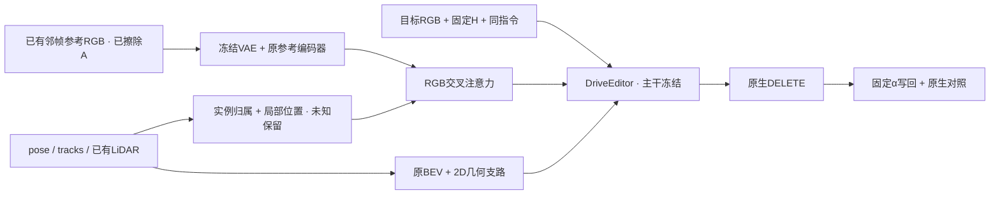

# r49：参考到恢复位置的空间绑定

task `WS-V77-TARGET-PROTECTED-20260929/r49`，parent r47，同预算控制 r48_64，failure refs `V77-F02`。2026-10-07，wm-3090-1001。2026-10-08 GPU收口完成：64步、20新窗口。GPU和控制器已空，用户已获通知可切CPU；没有定时任务。



## 本轮只验证一个变化

r48没有消除半透明车形，128步还使A022明显回退。本轮只改RGB参考信息的分配：为可靠参考patch保留实例归属、源像素与actor-local框面坐标；按当前时刻的同一保留实例位姿投影到query。原参考仍是每张8×8 token，query仍最多18×32，四处注入、BEV编码、mask、输入和389856参数范围都沿用r47。没有新增可训练参数、backbone、loss或数据来源。

空间绑定作用于RGB cross-attention logit：`min(Qquery,Qref) × log(0.1 + 0.9 × similarity)`。已知同一实例/背景且有可用对应时使用位置高斯；sigma取一格query与源patch投影半径的较大值；已知不同身份/角色降低相互作用；未知和空token偏置0。只有身份却没有可见局部对应时做身份绑定，不虚造位置。没有改DriveEditor主干的self-attention，也没有加入DORS/Attentive Eraser、RGVI传播。

## 信息合同与覆盖边界

车辆crop含道路或邻车，整景参考也含车列；不把整张参考当主B或纯背景。源patch必须有效且单一归属比例≥95%，混合身份保持U；O仍是GT cuboid框面proxy、Q=.5，不是SAM silhouette。N只接受已有真实LiDAR可见落点、Q=.8；框外和无点区域不推出N。实际查账：A061_w08有2个、M003有1个N源patch，其他七例为0；九例f05洞内粗query的N均为0，其他时刻仅有零星N。不能把“f05没有N对应”概括为全程无N源token，本轮也没有实现整洞背景控制。

query删除A后重新检查保留实例的first return；source A仍遮挡的位置及无效参考不可建对应。使用实际round后的letterbox宽高做逆坐标映射，原RGB、参考PNG、H、α与几何数组继续直接读取不可变r47。条件构建只读几何、已擦除参考valid和原LiDAR，不读Y或洞内RGB。Y仅在GPU合成训练loss/对照度量中使用。

f05覆盖（空间patch指经过投影与遮挡检查的主B来源，不等于恢复成功）：

| case | split | 主B归属patch数 | f05可投影主B patch | f05主B绑定query / 洞内query |
|---|---|---:|---:|---:|
| M010 | train | 8 | 8 | 4/20 |
| M013 | train | 0 | 0 | 2/18 |
| M018 | train | 16 | 14 | 1/22 |
| M042 | train | 24 | 24 | 5/18 |
| A034 | real_DEV | 35 | 32 | 3/30 |
| A061_w08 | real_DEV | 26 | 8 | 8/72 |
| A022 | real_DEV | 0 | 0 | 0/184 |
| M003 | validation | 4 | 4 | 1/12 |
| M006 | validation | 0 | 0 | 0/22 |

A034在18×32粗格仅有局部绑定，CPU/训练较低尺度10×18/5×9多数仍U；A061也有未覆盖区域。GPU推理的实际尺寸在后文单独记录。M013没有可靠纯参考patch，保留同一训练输入作为对照但不提供路由监督；A022/M006同样不施加可靠patch偏置。不得据此声称所有后车细节已绑定，也不放大框或改门槛以制造覆盖。真实DEV均不进入训练；三个真实DEV/两个已知GT DEV已经曝光，不是最终测试。

## 已完成的CPU验证

9例90帧sidecar已生成；原查询索引、独立mask/α、参考PNG、query时间和C指令逐例核对。r47 checkpoint严格加载，关闭空间绑定和全未知sidecar均逐元素重现原RGB路径；有约束时可到达RGB融合，支路梯度有限；18×32、10×18、5×9的logit尺寸、身份冲突、未知中性、目标删除前后深度顺序、round后裁切逆变换通过。CPU受控激活不等于实际官方模型或视觉收益。

错配只交换双方有效主B的池化外观特征，按归一化actor-local位置固定一对一配对；保留recipient slot pose、query位置、身份、valid、几何、任务指令、背景和其他车。当前可换数量：A034 26/35；A061_w08 26/26。只换主B patch避免旧整参考错配污染背景；具体变化仍需直接看对应车身，像素差不是效果证明。

CPU输入构建约61.9秒（0.5核、1线程）。本地 `outputs/v77-priors-r49/index.html` 包含9例f00/f05/f09、原参考/patch归属、当前位置投影、逐尺度覆盖及明确标历史的原/r46/r47视频。这描述CPU交付时刻；现已加入GPU视频与直接图像对照，人工verdict仍未填写。

## 已执行的GPU短循环

1. 从冻结r47 step320先跑5个correct窗：A034/A061_w08/A022/M003/M006；A034/A061另各wrong/noRGB，共9个窗口。新C各组同指令，UC另行清空；旧H/几何/α、seed42、25采样步、10帧576×1024均固定。
2. 先直接review零训练原生/写回图像。若已满足接受条件就停止；输入/工程有明确反证先修或记录，不能自动转成科学失败。只有未达标且输入/工程有效，才登记一次64步适配。
3. 64步只用M010/M013/M018/M042，四scene与query分开；从同一r47初始化，同r48_64的数据顺序、seed6201、320×576、AdamW1e-4与loss/dropout；原DriveEditor/3D/VAE冻结，只更新原小分支。16步断点保存优化器/顺序/RNG，最多64步，不继续到128、不扫参数。
4. 64步后5correct + 4wrong/noRGB + A034/A061同权重routing_off，共11窗；整轮最多20新窗。用原r48_64作同预算控制；路由关闭必须走原路径。

手动零训练入口（本轮已运行）：

```bash
cd /root/autodl-tmp/motion_proj_v77
OMP_NUM_THREADS=1 OPENBLAS_NUM_THREADS=1 /root/autodl-tmp/envs/driveeditor/bin/python scripts/worldsim_v77/target_protected/iteration16/run_cycle.py zero
```

`adapt64` 入口要求零训练完成、实际图像review及准入记录，CPU准备阶段没有启动控制器；本轮用户开卡后才手动启动。依据r48耗时，首9窗约12–20分钟；若需要一次64步和11窗，额外约18–25分钟，以实际运行计时为准。

## 判定和收口

A034/A061都要后车轮廓保住且薄膜减少，不能仅使后车与残影一起清楚；A022保留r46可用删除，不能出现车/矩形/结构崩坏；M003/M006保住既有结构。正确参考应使对应车身优于错配，不能用更大的像素变化作替代。若路由有视觉收益但仍不区分具体外观，只能记局部空间约束收益，身份绑定仍未成立；对应不足记输入边界。

按照已批准计划，用GPT-5.6 Sol/xhigh、不开fast对GPU结果直接看固定三帧；独立助手review与用户0/1/2分分开，单帧不推断视频时序。HTML保留原生、写回、历史r46/r47、同预算r48_64与本轮各条件。真实任务是主判据，合成GT误差只辅助。若无收益记录边界并停止本轮；需要去噪抑制时另立下一项有界改动。

证据：[轻量配置](../autoresearch/worldsim_v77/target_protected_20260929/r49/manifest.json)、[CPU检查](../autoresearch/worldsim_v77/target_protected_20260929/r49/preflight.json)、[逐帧/尺度记录](../autoresearch/worldsim_v77/target_protected_20260929/r49/input_checks.json)、[错配清单](../autoresearch/worldsim_v77/target_protected_20260929/r49/mismatch_plan.json)。完整sidecar和来源坐标保留数据盘；Git不复制RGB、完整轨迹或checkpoint。

failure_ledger_delta: updated V77-F02（CPU覆盖边界及GPU未观察到稳定视觉升级）；不新增failure ID。

## GPU结果与证据边界

零训练9窗未达标后，主agent看完五例且指定GPT-5.6 Sol/xhigh、不开fast独立看固定三帧，才登记唯一64步准入。64步后十一窗全部完成，包括两个主要真实例的同权重routing_off。没有延长到128、扩数据、换mask、改seed或加入去噪抑制。

| case | 64步后的独立助手图像判断 | 额外轮廓 / 薄膜 |
|---|---|---|
| A034 | r49 step64 未显示相对 zero、r47 或 r48 的稳定视觉改善 | 未改善到可验收。车周围灰黑薄膜、车下矩形暗块和悬浮感在 step64 NATIVE 中仍清楚；相对 zero/r47/r48 没有稳定缩小或变淡。 |
| A061_w08 | step64 没有相对 zero/r47/r48 的稳定增益；仅后方白车清晰度仍高于 r46 | 未同时改善。f00 的额外白色车体、f05/f09 的半透明粉灰车形和左侧拖尾在 step64 中仍明显，形态与 zero/r47/r48 同类。 |
| A022 | r46 > r49 step64 ≈ r49 zero ≈ r48 ≈ r47 | 仍有宽矩形/椭圆状暗影补丁。step64 相对 zero 最多是轻微强度变化，没有跨 f05/f09 的可靠消失；r46 的对应路面明显更均匀。 |
| M003 | step64 保持近期方法相对 r46 的结构优势，但没有相对 zero/r47/r48 的稳定可见改善 | 车左侧仍有向路面延伸的深色楔形/矩形拖影，左半车身带半透明暗膜；step64 没有稳定减轻。 |
| M006 | step64 继续避免 r46 的巨大浅色车壳，但未清除近期方法共有的透明车形 | 明显存在。三帧的遮挡轮廓内仍有半透明棕灰车形/暗膜，边界和内部纹理与 GT 不连续；step64 没有跨帧稳定变淡或缩小。 |

64步耗时 206.8s，峰值分配显存 10.44GiB；20窗采样耗时合计 1293.5s，以上不含模型加载和CPU评审。训练范围共389856个标量参数，其中60个参数张量相对初始权重发生变化；主干/3D/VAE保持冻结，每步loss/梯度有限，实际case顺序与RGB/geometry dropout逐步匹配r48_64。400张原生/写回PNG实际解码，CFG为25C+25UC、C同指令、UC单独清空、洞外保留和alpha=1区等于原生均通过。这些是工程与刺激有效性证据，不是质量分。

实际576×1024推理的四个注入block为18×32、18×32、18×32、9×16；10×18/5×9是CPU代表尺度及320×576训练尺度，不应当成全部GPU推理尺寸。偏置在有证据的block实际生效，未知或无RGB时中性；日志中的biased_pairs是候选logit数量，不是成功注意力质量。

两个主要真实例中correct/wrong/no_RGB及同权重routing_off目视近同，没有观察到参考或路由的独立稳定增益；薄膜在原生已有，不能整体归因于固定alpha写回。A022仍有比r46明显的宽暗路面补丁，但没有r48_128的大块结构崩坏；它没有可绑定patch，因此不能把零训练的暗影直接归因于空间偏置。两个合成例保住相对原模型的恢复收益，但没有证明本轮升级。

**本轮不推广新权重，默认仍r46。** 图像判断只覆盖五例各f00/f05/f09，真实隐藏区无GT；人工0/1/2与视频时序verdict留空。不能将当前稀疏、无参数软偏置的失败外推为完整空间绑定假设、全部架构或数据分布的否定。

下一项候选先检验“已知B查询只选对应B的可靠源patch与null”的更明确绑定，未知查询继续走原路径；未知源不能被误标背景。本轮软偏置对未知源保持0，混合/未知来源仍可能竞争，这是一项接口限制，不是已经测得的注意力因果。不要靠增加参考数量或延长训练规避这一项检验；主干去噪抑制仍作为后续独立改动，不与绑定同时添加。

本地审核交付9卡、40个新结果视频与35个历史视频；75个视频实际解码为1024×576、10帧/1秒，图片链接与JS通过。HTML保留零训练、64步、原生/固定写回、参考控制、关闭路由、CPU几何图和直接三帧图板。全部旧资产、权重和反例保留，数据盘约余90.8GiB，无需清理。

轻量GPU证据见同run的[gpu_execution_check.json](../autoresearch/worldsim_v77/target_protected_20260929/r49/gpu_execution_check.json)、[独立64步图像review](../autoresearch/worldsim_v77/target_protected_20260929/r49/step64_assistant_review.json)、[实际尺度/来源](../autoresearch/worldsim_v77/target_protected_20260929/r49/actual_eval_coverage.json)、[交付检查](../autoresearch/worldsim_v77/target_protected_20260929/r49/local_delivery_check.json)。模型权重、原始PNG和完整视频只留数据盘和本地输出，不复制进Git。
