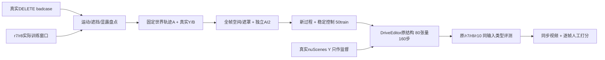

# v77：运动—遮挡—显露过程控制 r9/r10

task `WS-V77-TARGET-PROTECTED-20260929`，r9数据盘点与工厂、r10有限过程微调；默认主机wm-3090-1001，分支v77。failure_ledger_refs [V77-F02]。人工结论为空，未使用final，原/r7/r8和所有反例保留。

## 本轮结论

r10未形成稳定收益，不替换原/r7/r8：旧GT保护车MAE对r8下降5.18%，但新过程GT洞内/保护车分别变差16.41%/11.90%；扫过验证P006在真实GT道路上补出额外车辆，真实DEV关键失败也仍在。

## 缺口是否实际存在

| 实际训练窗口 | 例/世界 | 静止A＋运动ego＋图像变化 | 遮挡扫过B | 显露变化 |
|---|---:|---:|---:|---:|
| r7 | 68 / 9 | 0 | 0 | 1 |
| r8 | 50 / 25 | 12 | 0 | 4 |
| r10 | 50 / 25 | 11 | 4 | 12 |

上述过程可以重叠，选择类别并非实际过程计数。世界静止直径≤0.20m、ego路径≥0.50m、图像中心变化≥8px；B归一化遮挡中心跨度≥0.20、至少3帧有效重叠；显露变化为B遮挡比例范围≥0.15。是可复核的操作判据，不是完整过程语义。

70个已曝光真实审计例中56个有完整目标几何，14个缺track，不填运动类别；56例中13个静止A＋运动ego且图像变化，28个后车GT包络扫过代理。真实B车身遮挡/隐藏纹理未逐实例认证，不能把包络代理当SAM2像素证据。真实全段约3秒与训练一秒分母分开；固定8例DEV另用同10帧窗口盘点。A022固定窗ego几乎静止、A明显运动，时序缺口不能统一解释所有失败。

## 数据与质量

工厂改为世界静止或固定世界速度轨迹，不再随B逐帧加固定偏移。真实相机、GT朝向、地图、LiDAR地面、0.3m间距、底部ego禁入、A前于活跃B、完整合成影响先擦除后缩放等门槛保留。Y来自真实nuScenes；模型看到遮洞条件，不看到完整synthetic-X车漆。

r9先复用旧合法锚点，再一次冻结16来源扩展；原8train/3val/2val-world扫过目标未达，按预案训练0步。未无限扩大位置网格。选22例全220帧重读X/Y/H并复查三次独立静态扫描；稀疏静态扫描零正证据不能认证空地。

独立gpt-6-sol xhigh、无fast检查0/5/9：18通过、2不确定、2拒绝。P014人行区、P022跨双黄线拒绝；P002/P007视觉扫过证据不足未训练。4例旧B/C标签与实际活跃实例错配，修显示标签后定向复核通过，Y/X/H/几何未改，原标签和先前分数保留。技术AI2不等于人工通过。

r10另行预注册有限pilot，50train/25world、最多3例/scene；20背景/27单保护/3密集。选择类别4扫过（3world）、4显露、5静止A+ego、37稳定控制。新过程验证4例/3world，其中扫过仅1world；旧合成7例/4world、真实8例DEV全部冻结。新增验证world未进入r7/r8/r10训练，预训练重叠未知。密集train仍只1world，两种已曝光DEV形状、Boston白天、一秒窗口不变。

实际160步采样：{'r8_stable_control': 119, 'visibility_transition': 13, 'sweep_B': 13, 'static_A_moving_ego': 15}。扫过4例分别采样3/3/3/4次；频率不是梯度贡献。新增过程与背景/保护类别比例同时变化，不能把结果解释为单一因素的因果证明。

## 同预算四臂评测

80空间attention张量、49,574,080参数、320×576、160步、AdamW 1e-5/0.01、seed6201，官方原StandardDiffusionLoss，严格恢复官方106目标encoder，0missing/0unexpected；80有限非零梯度。新权重从原模型开始，不继续训练r8。10帧输入、原网络结构不改，不同时加权loss或扩模块。训练峰值分配10.48GiB、保留11.05GiB。

19例×4权重=76窗，31新采样，45旧PNG逐帧核对X/H/Y及seed42/25steps/previous=false后复用。采样576×1024。同一原模型Engine重新加载各臂，恰好替换80键，避免权重污染。报告原生输出MAE；局部写回只恢复原范围，洞外原像素保持不能当神经保护能力。

| 组别 / 指标（scene等权MAE，越低越好） | 原 | r7 | r8 | r10 | r10对r8 | case / scene |
|---|---:|---:|---:|---:|---:|---:|
| new_temporal_validation / hole | 0.07263 | 0.06590 | 0.06839 | 0.07961 | +16.41% | 4 / 3 |
| new_temporal_validation / protected_inside_hole | 0.10046 | 0.09949 | 0.09970 | 0.11156 | +11.90% | 3 / 2 |
| r8_frozen_synthetic / hole | 0.08703 | 0.05697 | 0.05637 | 0.05692 | +0.98% | 7 / 4 |
| r8_frozen_synthetic / protected_inside_hole | 0.13925 | 0.09712 | 0.10176 | 0.09650 | -5.18% | 4 / 2 |

| 新过程 / 指标 | 原 | r7 | r8 | r10 | case / scene |
|---|---:|---:|---:|---:|---:|
| static_A_moving_ego / hole | 0.07529 | 0.06234 | 0.06398 | 0.06885 | 2 / 2 |
| static_A_moving_ego / protected_inside_hole | 0.10280 | 0.08471 | 0.08711 | 0.08703 | 1 / 1 |
| sweep_B / hole | 0.04995 | 0.04720 | 0.04638 | 0.10746 | 1 / 1 |
| sweep_B / protected_inside_hole | 0.09406 | 0.10580 | 0.10418 | 0.16197 | 1 / 1 |
| visibility_transition / hole | 0.08022 | 0.08489 | 0.08926 | 0.08296 | 1 / 1 |
| visibility_transition / protected_inside_hole | 0.10249 | 0.10372 | 0.10375 | 0.09863 | 1 / 1 |

旧合成、新过程分别统计，不合并掩盖退化。单一场景的扫过胜负不能推到充分泛化。像素恢复误差不是车辆身份或视频通过率；真实DEV没有actor-free GT。

## 其他帧证据与剩余分布差异

按真实Y的SAM2 B像素与定向GT cuboid16格交点，分别保存其他帧几何支持、没有支持、无法对应的洞内像素及误差；不是准确纹理对应。纯背景证据未测量，真实隐藏纹理未知，不把未知写为“从没见过”。

| 新过程例 | 洞内B其他帧几何支持像素比例 | 支持区MAE r8→r10 | 无支持区MAE r8→r10 |
|---|---:|---:|---:|
| temporal_P006 | 65.5% | 0.11234→0.17204 | 0.09865→0.14988 |
| temporal_P012 | 25.9% | 0.06437→0.05673 | 0.11806→0.11356 |
| temporal_P019 | 15.3% | 0.07365→0.07370 | 0.08964→0.08961 |

P006的f5明确在真实GT道路上生成额外金/棕色车，整10帧洞内MAE对r8上升131.66%、洞内B上升55.47%。这不是把未知隐藏车存在误判为目标再生，而是已知Y的额外实体反例。其65.5%洞内B像素有其他帧GT框格几何支持，但该支持区域误差也上升；不能只用“所有帧完全不可见”解释此例，准确纹理对应仍未认证。P012像素误差略降，固定f5仍有合并车身，量化小收益不认证两车身份恢复。

| 分布 | r8 train | r10 train | 固定真实DEV8 |
|---|---:|---:|---:|
| 洞面积均值 | 1.63% | 1.82% | 5.60% |
| 触边帧比例 | 0.00% | 0.00% | 48.75% |
| 洞中心路径速度中位数(px/s) | 20.001 | 21.608 | 116.589 |
| 洞尺度max/min中位数 | 1.129 | 1.136 | 2.340 |
| 洞框填充率中位数 | 0.821 | 0.816 | 1.000 |

- 恢复原覆盖目标：8个扫过训练例跨至少3个world、3个扫过验证例跨至少2个训练隔离world；通过过程优先的来源/窗口选择获得新证据，不继续在当前来源池扫位置网格。
- 训练须实际包含静止A＋运动ego、A相对B扫过/显露，并补A022类运动A＋近静止ego的快速投影过程；不是只看world速度或scene数量。
- 联合盘点洞面积、速度、尺度和截边；H仍覆盖全部可见合成影响、避ego、保持正确深度。合法截边和更长过程需先验证真实帧间隔与fps条件，不放宽空间/泄漏质量门槛。
- 按其他帧几何支持、无支持、未知分开；仅GT框表面格不认证准确纹理对应。优先明确真正有输入证据可恢复的车身部分和保护实例数。
- 原/r7/r8/r10与固定GT/真实DEV结果保留；已曝光例只作DEV，不进入final。数据分布与质量冻结后再进行一次同80张量/160步/原loss控制，暂不加权、不扩模块、不换seed。

已知真实Y、完全擦除合成RGB及梯度合同通过；数据有效不等于过程覆盖充分。本轮只有4个扫过训练例/3world、13次训练采样、1个扫过验证world和一秒窗口，并同时改变了背景/保护类别比例。因此可以否定“这批有限过程补充已带来稳定迁移”，不能否定更充分的过程数据，也不能证明80张量模块错误。P006明确反例保留，不据此撤销输入AI2或选择性丢评测例。

## 审核与工程记录

[19例六列模型视频/逐帧打分](C:/Users/dengyunlong/Documents/Codex/2026-09-26/xia/outputs/v77-target-protected-r10/index.html) · [22候选四列数据全帧](C:/Users/dengyunlong/Documents/Codex/2026-09-26/xia/outputs/v77-target-protected-r10/data_review.html)。每例原生视频另链。人工0/1/2全空，助手效果观察仅固定f5，不认证时序。

实际278视频/2780帧解码、2020引用JPG及HTML脚本语法验证通过；浏览器同步播放未实测。4项过程语义测试通过、代码编译通过。期间统计脚本的NumPy int64 JSON序列化错误已修复，未改变数据或训练；训练/推理无额外重跑。

完整run保留在`/root/autodl-tmp/runs/worldsim_v77/WS-V77-TARGET-PROTECTED-20260929/r10`；新权重`training/attention_step_0160.safetensors`，所有40/80/120/160和优化器快照保留。Git轻量JSON不是完整资产备份。当前资源未要求删数据或扩盘；无关机、定时或追加训练操作。

failure_ledger_delta: updated V77-F02；没有新增ID。原/r7/r8仍保留，本轮结果不改变用户历史评分。
