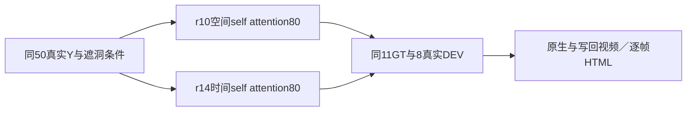

# r14：等参数量时间自注意力控制

真实 DELETE 尚无跨例稳定收益，本轮不推广、不关机。时间更新改善了有限的新过程GT，但不能替代目标删净与真实保护对象保持。

唯一变量为空间→时间self attention；两臂均80张量49,574,080参数，原DriveEditor架构及初始化、官方106目标encoder、160步、320×576、AdamW 1e-5/wd.01、seed6201、原loss和50train/25world相同。160次case/window顺序实际核对一致，所有loss/梯度有限，首次80张量均有有限非零梯度；峰值10.529GiB allocated/11.115GiB reserved。没有叠加r13 CFG1、加loss权重、更多参数或继续训练r10。

推理同seed42/25steps、10帧576×1024、默认CFG1.2→2.0、previous=false。旧四臂76窗逐帧RGB/H/Y匹配才复用，19窗新r14；95/95完成。旧合成7case/4world与新过程4case/3world分别统计，真实8例是已曝光DEV，无真实去车GT，final未用。

| scene等权MAE | r7 | r8 | r10 | r14 | r14对r10 |
|---|---:|---:|---:|---:|---:|
| 新过程洞H／4case/3world | .065898 | .068389 | .079612 | .064263 | −19.28% |
| 新过程保护B／3case/2world | .099487 | .099700 | .111563 | .090436 | −18.94% |
| 旧合成洞H／7case/4world | .056969 | .056371 | .056924 | .056356 | −1.00% |
| 旧合成保护B／4case/2world | .097119 | .101757 | .096497 | .101244 | +4.92% |

19例固定f5均实际查看，人工空、时序结论空。P006道路额外棕黄色车在r14固定帧未再出现，整窗H/B对r10分别−62.7%/−50.8%，但后方保护白车仍有错误浅色补片。P012仍有车身融合；P016仍有灰轮／腿状残留，不能说背景闭合。真实A022仍补黑车，A041仍车形涂抹，A013客车前部箱状，A048停车车辆拉伸；其它真实例缺明确稳定增量，未知隐藏身份不判恢复。像素降低不是实体通过率。

当前一秒窗口、仅4扫过train/3world、扫过val仅1world、dense train1world、旧开发形状和GT/LiDAR辅助限制仍在。可以拒绝“这批数据和预算的时间更新已经解决真实任务”，不能否定时间注意力或整体路线。保留权重、原始PNG、全部正反对照；不追加同配方步数。

[19例七列视频与逐帧评分](C:/Users/dengyunlong/Documents/Codex/2026-09-26/xia/outputs/v77-target-protected-r14/index.html)。228视频实际解码2280帧、1330引用图片、19固定帧对照与JS语法通过；浏览器同步播放尚未验证。全部原生另链、人工0/1/2空。task WS-V77-TARGET-PROTECTED-20260929/r14，wm-3090-1001，failure_ledger_refs [V77-F02]。
