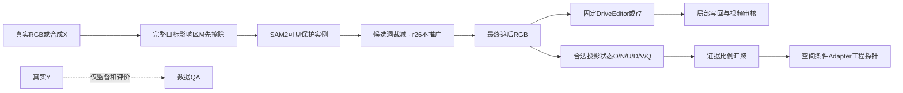

# Temporal reveal 工厂与可见保护输入修复

本轮先修输入和条件接口，尚未启动新的 A/B/C 同预算训练。真实任务对照只使用固定原模型和有效 r7，不能将其变化归因新微调。task 为 `WS-V77-TARGET-PROTECTED-20260929`，run 为 r23–r27；主机 wm-3090-1001，分支 v77，failure_ledger_refs `[V77-F02]`。

## 组件与输入边界

mask规划可以使用原始可见RGB，但先抹除完整目标影响区；新状态特征必须从**最终H遮后RGB**重建，不能将前一阶段SAM特征直接当成同输入的状态条件。Y完整视频SAM只用于独立质量标签。身份分支和surfel均未运行。

## r23：固定新来源未形成50条合格数据

预先冻结80个不同scene各一条来源；61条通过连续30曝光/2.9秒入口，补603张公共RGB后，1830帧均可解码。77条保护轨迹SAM完成，69条通过技术mask检查。技术检查不是独立视觉准入。

固定车道中点、0/3/6m/s、原碰撞和地面门槛，共1293次轨迹尝试。只得到2条同源普通背景候选，按来源/类型去重后仅R001一条；reveal和密集背景为0，训练准入0。不能称50条新训练数据，也不能把无产量归因补景模型。

| 主要拒绝项 | 次数 |
|---|---:|
| 实测地面支持不足 | 594 |
| 尺度、出画或ego区域 | 294 |
| 单个车道片段长度不足 | 229 |
| GT间距不足 | 79 |
| 未核验动态实例的投影包络 | 73 |

另有11个来源缺地面或稳定mask、11次静态前景、7次实际轮廓尺度、2次时序和2次深度顺序拒绝。来源级拒绝与轨迹级次数不合并为独立样本分母。

R001独立gpt-6-sol xhigh抽帧给1分：模型H矩形误遮了较近保护车的肩部/后视镜。该反例保留，未准入训练。r25针对这个具体入口修复。

地面支持定位控制仅取N054/N065/N152：保持拟合平面、±0.08m带宽、2.5m最大角点距离，以窗口内实际观测点替换B周围16m裁剪。原支持失败41/49/52条中，分别0/0/6条通过几何；未扩大阈值，未据此推广全工厂。未核验对象的三例排查图中既有行人也有车辆，GT包络交叠本身不等于真实mask交叠。

## r24：条件接口可反传，但最近邻丢掉稀疏证据

空间支路只接D/V/O/N/U/Q，新增160,192个参数，零连接到UNet输入块2/5/8/11。骨干9通道保持，**架构是新增支路的接口扩展**，不能称完全不变。真实30帧、320×576的前后向探针中，零初始化前后输出/损失精确一致，8个零连接参数张量都有有限非零梯度，峰值14.63GiB，优化0步。

随后实际检查3例×30帧×4尺度：含背景正证据的2869个特征格，经最近邻仅保留91个（约3.17%）；车辆证据1559格保留890格。这里是帧×尺度的格计数，不能当恢复像素或独立样本。

已将降采样改为区域证据比例：O/N/U保留面积比例，D/Q仅对已知支持归一化，未知比例保留；非零N不表示整个格都是已见空背景。条件尺度缓存按样本重置。10项合同通过，修复后再次实际跑30帧网络：输出/损失差仍为0，8个连接张量梯度正常，峰值14.63GiB。没有把RGB身份特征混入空间支路，优化0步、模型收益仍未证明。原最近邻实现和原探针完整保留。

## r25：三例输入边界修复

统一规则为：完整目标影响区M先抹除→在剩余真实可见RGB上跑SAM2→从外扩H中保留可见保护实例，M必须全覆盖。R001是r23新普通背景候选；L001/L009是旧r16 DEV，不能充作新留出集。

| case | 30帧可见B误遮像素次：旧→新 | 独立抽帧QA |
|---|---:|---|
| R001 | 9744→139 | 2 |
| L001 | 40677→896 | 2 |
| L009 | 46720→1309 | 2 |

90帧目标影响全覆盖，实际被遮B放回条件的标签像素为0。完整Y-SAM标签只是近似评价依据。独立QA只看0/15/29帧；2分表示当前输入合同通过，不是全段视频、新训练集或补景效果通过。人工分数为空。

本地页 `outputs/v77-target-protected-r25/index.html` 包含12视频、360实际解码帧，链接和内联JS验证通过；未声称浏览器实际播放已验收。

## r26：固定八例真实DELETE的输入工程对照

原r21完整目标SAM及7px椭圆写回保护区先擦除，然后对触及H的可见邻车共17轨迹跑SAM2。8个固定DEV窗口、80帧，完整目标保护区洞外遗漏/alpha遗漏0，累计保留85,595可见像素次。A022输入不变；A041模糊截边、A042立柱处实例疑点保留。

原模型/r7各8窗，仍为10帧、576×1024、seed42、25步、previous_condition=false。对照旧r21相同权重；新空间Adapter未启用。局部写回与原生输出都保存，不将deletion称作factual重建。输入QA仅准入这次有界诊断，未给这些旧DEV自动训练准入。

**16窗完成，出现明确反例，不推广洞裁减规则；继续使用r21默认入口。** 全8例均查看事先固定f5、同区六臂对照：

| case | 固定帧助手观察 |
|---|---|
| A022 | 输入不变；两臂全部20帧与旧r21逐像素一致，完整覆盖收益保留 |
| A041_w10 | 车形/深色涂抹仍在，未解决 |
| A013 | 白巴士错误前部从箱状变为圆拱车身状；隐藏结构仍失败 |
| A048 | 新两臂出现大块近处车身/轮子，明显退化 |
| A007 | 小远目标局部变化，无明确新增收益 |
| A034 | 新两臂出现突出的近处车尾样鼓包，退化 |
| A042 | 灰色车形/涂抹仍在，实例疑点保留 |
| A061_w08 | 新两臂把紧凑白色后车延展成横向长车身，保护结构退化 |

这不是全段时序通过率，人工分数不代填；单帧明确反例已足以否定“可直接统一推广”。输入更完整不等于冻结生成模型更会删除。mask形状/上下文变化可能影响原模型先验，但本轮未单独分解这些机制，不能确认为唯一原因。保留48个六列对照视频、全部原生/写回PNG。HTML链接、JS与实际解码验证单列，单帧观察不能称完整视频人工验收。

## r27：车道连接的有界定位

从r23单车道长度拒绝最多的前三个来源N114/N117/D_T015w2预选，共43条原长度拒绝轨迹。根据官方nuScenes连接关系，固定最小切向变化分支、最多前后各5跳，保持原中点/速度和所有空间门槛。官方接口：[NuScenesMap车道连接](https://github.com/nutonomy/nuscenes-devkit/blob/master/python-sdk/nuscenes/map_expansion/map_api.py)。

连接后1条通过几何，另34条地面支持、4条尺寸/ego、4条碰撞拒绝；那1条进一步实际轮廓检查仍遇到未核验动态对象包络，训练准入0。组合全窗口实测地面的控制，几何通过也只有1条。单片段终止会误拒轨迹，但修复这个问题仍不足以形成有效训练配方；停止同一小组继续枚举。

## 保留与后续边界

原模型、r7/r14/r18、全部旧结果和失败资产保留。当前数据问题是来源/轨迹与可见实例标注的联合覆盖缺额；条件接口新增了可验证的采样修复，但不能据此宣布条件有任务收益。真实DELETE保护车与无车背景尚未同时出现新模型跨场景收益，关机收口条件未满足。暂不启surfel或扩大模型，先补有效显露样本和条件输入，再做固定A/B/C对照。磁盘约49GB可用，本轮未删除资产。

r28另登记在原r23的30scene/73条“未核验动态实例”候选上补完整实例标签；保持原位置、速度、阈值，不再枚举。Y评价标签与M遮后X上的方法SAM分别存放。它只是来源/数据核验，不自动启用r26洞裁减、不自动准入训练。真实推理默认仍为r21。

轻量证据：`docs/autoresearch/worldsim_v77/target_protected_20260929/r23` 至 `r27`；完整PNG、SAM、NPZ、视频及日志在同run远端目录。failure_ledger_delta：更新同一V77-F02，不新增ID。
