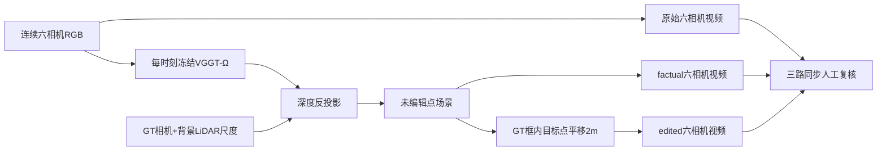

# V77 连续视频人工复核

任务 `WS-V77-VIDEO-REVIEW-20260926/r1`。用户要求把静态对象图改为逐场景“原始 / factual / 基础编辑”视频。已生成三个场景、九段完整连续视频，覆盖583个场景时刻和六相机；累计解码验证1749个视频帧。此材料供用户人眼复核，不代填质量判定。

## Architecture components



## 逐场景合同

| 场景 | 连续帧数 | MP4时长 | 目标actor | 默认相机 | 有GT的帧 | 选中非空目标点的帧 |
|---|---:|---:|---:|---:|---:|---:|
| official_000 | 191 | 19.1s | 14 | 3 | 146 | 104 |
| scene_0230 | 196 | 19.6s | 22 | 5 | 131 | 130 |
| scene_0255 | 196 | 19.6s | 25 | 3 | 181 | 181 |

均从frame0开始，10FPS。最后时间戳分别19.0/19.5/19.5s，容器时长19.1/19.6/19.6s。每个视频2064×768，六路688×384画面按上排0/1/2、下排3/4/5排列。播放器的相机选项仅同时裁切三路，不换内容。原视频为同一processed RGB缩放版，无音频，不称包含原始精确timestamp的视频文件。

三个目标沿用前轮已经查看过的truck14、car22、car25，未根据本轮视频效果替换对象。每场景用frame20目标的水平侧向定义固定世界位移2m，整段相同；每帧按同一GT track的框选点，yaw、尺寸、颜色不变。缺GT或点集为空时edited=factual，页面明确显示，不推测轨迹、不生成替代目标。整段共415帧有非空目标点支持，125帧没有该目标GT，不能将所有583帧记成有效对象编辑。

## factual的实际含义与边界

每时刻六张RGB独立送入冻结Ω，再用GT内外参和同帧背景LiDAR单尺度读出三维点。使用P0纠正后的规则：先在全部LiDAR中取每像素最近回波，再筛除所有GT框内部回波。框内LiDAR不用于尺度拟合。没有训练、跨时刻融合、平滑、补帧、补面或逐场景优化。

factual是在当时输入相机下重新渲染点集，可能因使用该视角RGB而与输入非常接近；它不代表未见视角质量或持久4D资产。每帧独立尺度也可能带来全图呼吸，应作为当前适配管线的一部分观察。GT框不是实例分割，点编辑正确不保证完整车辆被移动；0.5–80m过滤、天空缺失、3×3点splat采样、对象缺面与移动后暴露区域应分别解释。

本轮新增574次冻结六视图前向，复用P0的9个已有时刻，总计583个时刻/3498张输入视图角色。583帧输出均有限，训练步数0。推理环境worldsim-v77与前轮相同，GPU恢复后为RTX3090。完整帧与预测保留，未用静帧重复拼接时序。

## 编辑与交付验证

运行时逐帧检查：非目标点坐标最大变化0，颜色不变；非空目标点相对固定2m平移的最大误差1.11e-14m。这只是解析算子一致性，不是物体重建精度。

每个MP4使用PyAV/libx264 H.264、yuv420p、10FPS、无B帧并每秒关键帧，逐帧解码检查帧数、2064×768尺寸及严格递增PTS。原始PNG逐帧保留；视频编码有损，不宣称与PNG逐像素相等。

页面支持三路同步播放/暂停、0.25×/0.5×/1×/2×、逐帧前后、时间轴、2.0s目标参考帧、六路总览/相机裁切、单列放大、可关GT位置标注、人工备注和JSON导出。浏览器人工记录默认空白，只在本机保存，不自动发给外部服务。

## 来源与恢复

核心渲染代码在`82d0dc69`引入；登记当时HEAD为e5e1eabf，三帧smoke使用同一份当时未提交的核心代码。后续增量编码/HTML打包在同一v77分支保存。远端路径：

```text
/root/autodl-tmp/runs/worldsim_v77/WS-V77-VIDEO-REVIEW-20260926/r1/
  registration.json
  <scene>/instances_snapshot.json
  <scene>/frames/<frame>/prediction.npz, alignment.json, metrics.json
  <scene>/frames/<frame>/original.png, factual.png, edited.png
  review/index.html
  review/<scene>/original.mp4, factual.mp4, edited.mp4
  review/<scene>/sequence_metrics.json
```

frame0/20/40的prediction.npz沿用前轮绝对路径，见逐帧metrics。当前HTML不会fetch本地JSON，数据直接嵌入，所以离线file://也可打开；视频文件夹需与HTML一起保留。

`failure_ledger_refs: [V77-F01]`；`failure_ledger_delta: none`；`human_verdict: null`。本轮补齐时序review证据，不从选中点数或静态图替用户作质量判决。
