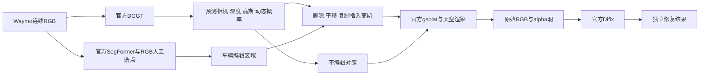

# DGGT Waymo 官方重建与高斯编辑

task/run：`WS-V81-DGGT-WAYMO-INFERENCE-20261011/r1`。用户确认是小米 DGGT（基于 VGGT），并授权按论文实现车辆增删和移动。Seen-to-Scene 正式10000步及六窗完成后运行了本任务；本任务没有启动12500步或修改Seen-to-Scene训练。远端run位于`/root/autodl-tmp/runs/worldsim_v81/WS-V81-DGGT-WAYMO-INFERENCE-20261011/r1`。

[论文 §4.3 Scene Editing](https://arxiv.org/html/2512.03004v1#S4.SS3)明确描述移除或平移动态高斯、插入实例，并用扩散修复移除后暴露区域。公开`inference.py`提供mode 2重建与mode 3插帧，编辑CLI未公开。这里复用官方预测和渲染公式，新增高斯编辑入口；不能将缺CLI当成论文不支持编辑，也不能把新增入口说成作者已发布的接口。

GT位姿、深度和动态标签不进入DGGT预测，也不用GT框选择编辑实例。原始渲染、暴露洞与Difix外观修复分开保存，最终质量由真实输出判断。

## 已执行的准备

- 官方代码`/root/autodl-tmp/dggt`，固定`a3276d2bbe4cbb03bcc117830b1836110a27adeb`，官方模型结构和权重不改。
- 已下载Waymo权重`model_latest_waymo.pth`为5,411,266,466字节；模型仓库固定revision`735ac9a6486057b1eb886c33a8c6dc79e0b43214`。Difix、sd-turbo、SegFormer与LPIPS缓存均复用现有资产，不重新下载。源验证见外部`.preparation/all_asset_checks.json`，不是本轮重新验证全量权重的声明。
- 官方CPU预处理已完成scene 009与128，各199帧、五相机；images、images_4、dynamic_masks各995张，位姿199份，内外参各5份。CPU TensorFlow检测GPU为0。
- 对现有8个validation TFRecord做一次首帧RGB扫描。009夜间眩光使车辆语义连成大块；主展示改为白天scene128，`segment-4612525129938501780_340_000_360_000_with_camera_labels`。仅依据输入可见性选演示片段，未看生成结果挑样本，009证据保留。
- 官方SegFormer B5在CPU处理128前8张前视RGB，输出sky_masks、custom_masks、semantic_raw19，raw19转换与前两组逐像素一致。语义标签不能直接当实例，人工ROI与anchor只作为编辑控制。
- 隔离推理环境`/root/autodl-tmp/envs/dggt_inference`复用现有Torch/gsplat依赖，不修改Seen-to-Scene环境。CUDA扩展在GPU隐藏、MAX_JOBS=1的CPU编译阶段461.85秒成功，随后官方mode 2基线及高斯编辑真实运行完成。
- 四个新增脚本编译、官方兼容副本`--help`与队列CPU预检均通过；随后四支高斯渲染与16帧Difix真实运行完成。Difix第一次运行发现共享环境的diffusers 0.31.0使`AutoencoderKL.add_adapter`缺失；仅在隔离`dggt_inference`环境安装diffusers 0.32.2后恢复，未改官方模型、权重、推理公式或S2S环境。

普通Waymo数据没有scene-flow GT深度；原始动态掩码已转换并保留，但不假造官方fine_dynamic_masks、不下载未获访问权限的数据，也不将GT仅供展示的字段填成生成条件。

## 编辑与对照合同

主运行固定scene128、首4张前视RGB、官方mode 2、FP32。官方基线保存实际模型输出、相机、point_map、gs_map、生命周期、动态概率、天空和RGB为`baseline_official/official_trace.pt`。编辑复用此trace，不再单独预测一次模型。

| 分支 | 实际操作 | 证据边界 |
| --- | --- | --- |
| noop | 同静态与动态高斯、时间衰减、相机和天空重新渲染 | 与官方trace逐值max_abs必须≤1e-4 |
| delete | 从所有来源静态高斯及每帧动态高斯移除选中实例 | 记录被移除数量和alpha损失；未观测背景可能形成洞 |
| move | 选中高斯沿预测相机右方向平移一个预测车辆宽度 | 保持颜色、尺度、旋转和生命周期；模型尺度不是米 |
| insert_copy | 保留原场景并追加平移后的同实例高斯副本 | 同场景复制插入；尚未验证跨场景车辆迁移 |

选择方式为RGB SegFormer car类13，与归一化ROI`[.52604,.53906,.79688,.82813]`相交，再用RGB anchor`[.67,.70]`选择前景MPV。首轮CPU检查发现ROI右上混入邻工程车、左上有语义误分，已在任何生成前根据RGB添加两块排除多边形，保存首四帧明确的RGB编辑mask，设置`neighbor_radius_widths=0`。原始选择与修改证据均保留。这里是人工RGB轮廓控制，预测3D位置仅记录诊断，不声称自动3D实例关联已通过；控制不来自GT框。最终选择overlay已与四帧RGB、alpha洞和编辑结果逐项核对。

Difix使用已下载作者权重，timestep199、mv_unet=false、prompt `remove degradation`，沿官方resize、sample、bilinear流程。仅将5处硬编码sd-turbo仓库位置替换为本地完整目录；一次加载模型复用16张图片，同帧不同分支配对seed1234。PNG量化在修复前发生，该适配与官方每帧重新加载的差别明示，不覆盖原始输出。

## 实际运行、工程适配和结果

`scripts/worldsim_v81/queue_dggt_waymo_inference.py --worker --scene128`完成了官方基线→高斯编辑→Difix。第一次Difix尝试因环境中的diffusers 0.31.0缺少VAE的`add_adapter`而返回1；隔离环境升级到0.32.2后只续Difix，第二次返回0。两次命令及返回码均保留；首次失败栈已移入`resolved_engineering_failures`并另存原快照，活动状态为`complete_assistant_reviewed`，不再将历史error当成当前故障。全程只做推理，没有训练DGGT或更改已下载权重。

`prepare_dggt_mode2_runtime.py`生成隔离副本：延迟mode 2未使用的TAPIP3D/插帧依赖；修复公开args.difix拼写；保存trace；跳过缺失GT动态/深度展示并保留预测深度。此副本在mode 2不调用Difix；网络、相机解码、Gaussian组装、时间衰减、渲染和天空公式保持官方实现。上游原件及各次副本保留在run/source，外部源码不入Git。

官方基线同输入重建的PSNR为28.0511、SSIM为0.862652、LPIPS为0.0823603，日志平均推理时间1.631秒；这些数值不是删除、移动或插入后的反事实质量指标。

官方scene128首4张前视RGB基线及`noop/delete/move/insert_copy`四支均完成。所有分支复用同一次官方模型预测、预测相机和天空。原生无编辑高斯重渲染与官方trace的浮点RGB逐值`max_abs=mean_abs=0`。原始manifest自报`same_8bit_quantization=true`，但独立媒体审计发现已保存的基线PNG与noop PNG最多相差1灰阶、平均约0.5/255；因此不能把实际PNG文件说成逐像素完全相同。

RGB-derived、人工排除邻车的四帧mask在模型输入之外控制编辑：静态高斯共603,830，选中218；逐帧动态高斯约179,917–180,115，选中11,700–12,032。删除过滤该实例的原始高斯；平移沿预测第0相机右方向一车宽，预测宽度约0.01888模型单位；复制插入每帧追加11,918–12,250个同场景平移副本。此数值不是米。直接的RGB mask跨四帧来自人工控制，记录的3D距离仅用于诊断，不是已通过的自动3D实例关联。

从四帧原生PNG看，delete确实去掉前方深色目标车主体，却留下明显黑灰空洞与原车下方阴影/残留，不能称作背景自然补全。move和insert_copy显示目标车位置变化，但复制或移动后的轮廓、遮挡、阴影与邻近白色作业车互相影响，并在画面右缘部分裁切；copy是同场景实例复制，未验证跨场景迁移。alpha与alpha-loss展示该洞的覆盖损失，原始编辑没有像素级修补。独立评审同时指出：官方基线本身相较输入RGB较软，不能把此退化归咎于编辑。

随后用作者Difix权重分别处理四支各4帧，共16张：固定timestep199、`mv_unet=false`、`remove degradation`，一份模型复用全部帧，结果与原生高斯输出分开保存。Difix改变了外观并平滑部分区域，但delete中的黑灰洞仍明显，move/copy的形态、接缝、邻车遮挡问题未消失；这是逐帧外观修复，不是inpainting或车辆删除算法。其16张PNG及4支MP4与原生四支均已完成独立CPU媒体审计。实际Difix模型加载8.613秒、CUDA分配峰值6,321,043,456B；高斯编辑峰值380,165,632B，不将局部异步渲染计时当端到端FPS。

深色本地查看页`outputs/v81-dggt-waymo/index.html`交付64张PNG、16个MP4，全部80条链接存在；MP4各解码4帧、8fps，JS语法检查通过，尚未做浏览器视觉QA。独立助手已将`assistant_review.json`写入run根目录，结论为**工程执行完成，但只是存在明显伪影的局部编辑演示，不能视作视觉质量通过**：四帧选中的是同一前方深色车，四分支效果持续出现，未见明显身份切换或分支掉帧；删除后未显露可信道路纹理，Difix也未修好洞、邻车重叠或右缘裁切。路面被目标车遮挡而未观测是与洞相容的解释，现有四帧不足以证明其唯一根因。该窗口无法判断长时序跟踪、稳定性和场景泛化；`human_verdict=null`。不得据此宣称论文编辑质量通过、跨场景迁移、米尺度控制或自动3D实例关联。

证据：run内`baseline_official/official_trace.pt`、`gaussian_edits/manifest.json`、`difix_refined/manifest.json`、`assistant_review.json`、`queue_state.json`、`source/edit_config.json`及准备阶段证据。已同步的本地审计为`work/dggt-official-inspect/audit.json`、`assistant_review.json`、`completion_snapshot.json`、`local_delivery_verified.json`。无新增科学根因，`failure_ledger_refs=[V77-F02]`、`failure_ledger_delta=none`；diffusers异常是隔离依赖兼容问题，已修复。

有依据的下一项仅为增加合法且实际显露原车后方路面的帧或视角，再测删除背景覆盖与Difix；当前未执行，不通过调seed或更换场景隐藏本例失败。
