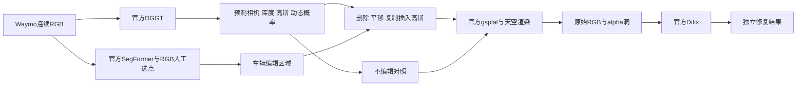

# DGGT Waymo 官方重建与高斯编辑

task/run：`WS-V81-DGGT-WAYMO-INFERENCE-20261011/r1`。用户确认是小米 DGGT（基于 VGGT），并授权按论文实现车辆增删和移动。Seen-to-Scene 正式10000步及六窗完成后先运行本任务，不自动追加12500步；服务器保持开机。远端run位于`/root/autodl-tmp/runs/worldsim_v81/WS-V81-DGGT-WAYMO-INFERENCE-20261011/r1`。

[论文 §4.3 Scene Editing](https://arxiv.org/html/2512.03004v1#S4.SS3)明确描述移除或平移动态高斯、插入实例，并用扩散修复移除后暴露区域。公开`inference.py`提供mode 2重建与mode 3插帧，编辑CLI未公开。这里复用官方预测和渲染公式，新增高斯编辑入口；不能将缺CLI当成论文不支持编辑，也不能把新增入口说成作者已发布的接口。

GT位姿、深度和动态标签不进入DGGT预测，也不用GT框选择编辑实例。原始渲染、暴露洞与Difix外观修复分开保存，最终质量由真实输出判断。

## 已执行的准备

- 官方代码`/root/autodl-tmp/dggt`，固定`a3276d2bbe4cbb03bcc117830b1836110a27adeb`，官方模型结构和权重不改。
- 已下载Waymo权重`model_latest_waymo.pth`为5,411,266,466字节；模型仓库固定revision`735ac9a6486057b1eb886c33a8c6dc79e0b43214`。Difix、sd-turbo、SegFormer与LPIPS缓存均复用现有资产，不重新下载。源验证见外部`.preparation/all_asset_checks.json`，不是本轮重新验证全量权重的声明。
- 官方CPU预处理已完成scene 009与128，各199帧、五相机；images、images_4、dynamic_masks各995张，位姿199份，内外参各5份。CPU TensorFlow检测GPU为0。
- 对现有8个validation TFRecord做一次首帧RGB扫描。009夜间眩光使车辆语义连成大块；主展示改为白天scene128，`segment-4612525129938501780_340_000_360_000_with_camera_labels`。仅依据输入可见性选演示片段，未看生成结果挑样本，009证据保留。
- 官方SegFormer B5在CPU处理128前8张前视RGB，输出sky_masks、custom_masks、semantic_raw19，raw19转换与前两组逐像素一致。语义标签不能直接当实例，人工ROI与anchor只作为编辑控制。
- 隔离推理环境`/root/autodl-tmp/envs/dggt_inference`复用现有Torch/gsplat依赖，不修改在途S2S环境。CUDA扩展在GPU隐藏、MAX_JOBS=1的CPU编译阶段461.85秒成功；实际CUDA渲染仍待运行。
- 四个新增脚本编译通过；真实远端官方兼容副本`--help`与队列CPU预检通过。两个编辑入口的CPU合同检查完成；并未因此宣称CUDA编辑完成。

普通Waymo数据没有scene-flow GT深度；原始动态掩码已转换并保留，但不假造官方fine_dynamic_masks、不下载未获访问权限的数据，也不将GT仅供展示的字段填成生成条件。

## 编辑与对照合同

主运行固定scene128、首4张前视RGB、官方mode 2、FP32。官方基线保存实际模型输出、相机、point_map、gs_map、生命周期、动态概率、天空和RGB为`baseline_official/official_trace.pt`。编辑复用此trace，不再单独预测一次模型。

| 分支 | 实际操作 | 证据边界 |
| --- | --- | --- |
| noop | 同静态与动态高斯、时间衰减、相机和天空重新渲染 | 与官方trace逐值max_abs必须≤1e-4 |
| delete | 从所有来源静态高斯及每帧动态高斯移除选中实例 | 记录被移除数量和alpha损失；未观测背景可能形成洞 |
| move | 选中高斯沿预测相机右方向平移一个预测车辆宽度 | 保持颜色、尺度、旋转和生命周期；模型尺度不是米 |
| insert_copy | 保留原场景并追加平移后的同实例高斯副本 | 同场景复制插入；尚未验证跨场景车辆迁移 |

选择方式为RGB SegFormer car类13，与归一化ROI`[.52604,.53906,.79688,.82813]`相交，再用RGB anchor`[.67,.70]`选择前景MPV。首轮CPU检查发现ROI右上混入邻工程车、左上有语义误分，已在任何生成前根据RGB添加两块排除多边形，保存首四帧明确的RGB编辑mask，设置`neighbor_radius_widths=0`。原始选择与修改证据均保留。这里是人工RGB轮廓控制，预测3D位置仅记录诊断，不声称自动3D实例关联已通过；控制不来自GT框。最终仍需核对选择overlay与编辑结果。

Difix使用已下载作者权重，timestep199、mv_unet=false、prompt `remove degradation`，沿官方resize、sample、bilinear流程。仅将5处硬编码sd-turbo仓库位置替换为本地完整目录；一次加载模型复用16张图片，同帧不同分支配对seed1234。PNG量化在修复前发生，该适配与官方每帧重新加载的差别明示，不覆盖原始输出。

## 调度、工程适配和当前结果

`scripts/worldsim_v81/queue_dggt_waymo_inference.py --worker --scene128`已实际启动，父PID79455，状态`waiting_p1_10000_and_cpu_preparation`；PID仅为启动证据，运行时需核对真实命令。CPU资产已齐、S2S还在运行，DGGT GPU推理尚未执行。

队列等待P1完整10000原件校验、固定六窗完成、旧P1控制器退出及GPU空闲，复用P1固定窗口合同并持有controller.lock与launch.lock，然后串行官方基线→高斯编辑→Difix。两名独立助手静态审核后补充了场景绑定、完成产物复核与失败目录归档；失败留栈，只续未完成阶段，不重复已完成输出。

`prepare_dggt_mode2_runtime.py`生成隔离副本：延迟mode 2未使用的TAPIP3D/插帧依赖；修复公开args.difix拼写；保存trace；跳过缺失GT动态/深度展示并保留预测深度。仅此副本可运行mode 2且不在其内调用Difix；网络、相机解码、Gaussian组装、时间衰减、渲染和天空公式保持官方实现。上游原件及各次副本保留在run/source，外部源码不入Git。

现阶段结果为**CPU准备完成、GPU队列已挂、真实输出待执行**。不能用论文能力、代码检查或语义mask来代替真实编辑结果。后续需实际解码四分支全部帧与Difix视频，由gpt-6-sol/xhigh/no-fast助手分别审核实例操作、接缝/洞、结构和跨帧一致性；`human_verdict=null`。交付深色`outputs/v81-dggt-waymo`页面。

证据：run内`cpu_preparation_manifest_128.json`、`source/scene_scan_cpu/scan.json`、`evidence/segformer_cpu_manifest.json`及128对应证据、`evidence/car13_anchor_128/manifest.json`、`evidence/car13_rgb_negative_128/manifest.json`、`source/edit_config.initial_semantic_roi.json`、`source/edit_config.json`、`evidence/official_runtime_compatibility.json`、`logs/gsplat_cpu_build_final.log`、`queue_launch.json`、`queue_state.json`。无新增科学根因，`failure_ledger_refs=[V77-F02]`、`failure_ledger_delta=none`。
