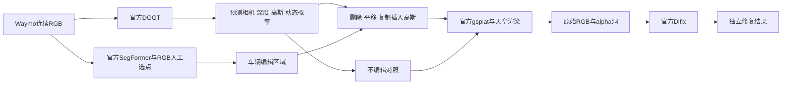
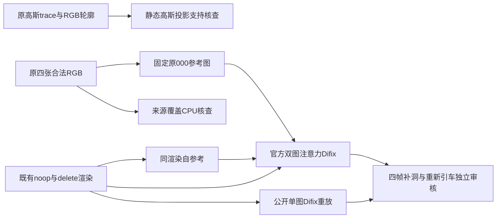

# DGGT Waymo 官方重建与高斯编辑

task/run：`WS-V81-DGGT-WAYMO-INFERENCE-20261011/r1`。用户确认是小米 DGGT（基于 VGGT），并授权按论文实现车辆增删和移动。Seen-to-Scene 正式10000步及六窗完成后运行了本任务；本任务没有启动12500步或修改Seen-to-Scene训练。远端run位于`/root/autodl-tmp/runs/worldsim_v81/WS-V81-DGGT-WAYMO-INFERENCE-20261011/r1`。

[论文 §4.3 Scene Editing](https://arxiv.org/html/2512.03004v1#S4.SS3)明确描述移除或平移动态高斯、插入实例，并用扩散修复移除后暴露区域。公开`inference.py`提供mode 2重建与mode 3插帧，编辑CLI未公开。这里复用官方预测和渲染公式，新增高斯编辑入口；不能将缺CLI当成论文不支持编辑，也不能把新增入口说成作者已发布的接口。

GT位姿、深度和动态标签不进入DGGT预测，也不用GT框选择编辑实例。原始渲染、暴露洞与Difix外观修复分开保存，最终质量由真实输出判断。

## 已执行的准备

- 官方代码`/root/autodl-tmp/dggt`，固定`a3276d2bbe4cbb03bcc117830b1836110a27adeb`，官方模型结构和权重不改。
- 已下载Waymo权重`model_latest_waymo.pth`为5,411,266,466字节；模型仓库固定revision`735ac9a6486057b1eb886c33a8c6dc79e0b43214`。Difix、sd-turbo、SegFormer与LPIPS缓存均复用现有资产，不重新下载。源验证见外部`.preparation/all_asset_checks.json`，不是本轮重新验证全量权重的声明。
- 官方CPU预处理已完成scene 009与128，各199帧、五相机；images、images_4、dynamic_masks各995张，位姿199份，内外参各5份。CPU TensorFlow检测GPU为0。
- 对现有8个validation TFRecord做一次首帧RGB扫描。009夜间眩光使车辆语义连成大块；主展示改为白天scene128，`segment-4612525129938501780_340_000_360_000_with_camera_labels`。仅依据输入可见性选演示片段，未看生成结果挑样本，009证据保留。
- 官方SegFormer B5在CPU处理128前8张前视RGB，输出sky_masks、custom_masks、semantic_raw19，raw19转换与前两组逐像素一致。语义标签不能直接当实例，人工ROI与anchor只作为编辑控制。
- 隔离推理环境`/root/autodl-tmp/envs/dggt_inference`复用现有Torch/gsplat依赖，不修改Seen-to-Scene环境。CUDA扩展在GPU隐藏、MAX_JOBS=1的CPU编译阶段461.85秒成功，随后官方mode 2基线及高斯编辑真实运行完成。
- 四个新增脚本编译、官方兼容副本`--help`与队列CPU预检均通过；随后四支高斯渲染与16帧Difix真实运行完成。Difix第一次运行发现共享环境的diffusers 0.31.0使`AutoencoderKL.add_adapter`缺失；仅在隔离`dggt_inference`环境安装diffusers 0.32.2后恢复，未改官方模型、权重、推理公式或S2S环境。

普通Waymo数据没有scene-flow GT深度；原始动态掩码已转换并保留，但不假造官方fine_dynamic_masks、不下载未获访问权限的数据，也不将GT仅供展示的字段填成生成条件。

## 编辑与对照合同

主运行固定scene128、首4张前视RGB、官方mode 2、FP32。官方基线保存实际模型输出、相机、point_map、gs_map、生命周期、动态概率、天空和RGB为`baseline_official/official_trace.pt`。编辑复用此trace，不再单独预测一次模型。

| 分支 | 实际操作 | 证据边界 |
| --- | --- | --- |
| noop | 同静态与动态高斯、时间衰减、相机和天空重新渲染 | 与官方trace逐值max_abs必须≤1e-4 |
| delete | 从所有来源静态高斯及每帧动态高斯移除选中实例 | 记录被移除数量和alpha损失；未观测背景可能形成洞 |
| move | 选中高斯沿预测相机右方向平移一个预测车辆宽度 | 保持颜色、尺度、旋转和生命周期；模型尺度不是米 |
| insert_copy | 保留原场景并追加平移后的同实例高斯副本 | 同场景复制插入；尚未验证跨场景车辆迁移 |

选择方式为RGB SegFormer car类13，与归一化ROI`[.52604,.53906,.79688,.82813]`相交，再用RGB anchor`[.67,.70]`选择前景MPV。首轮CPU检查发现ROI右上混入邻工程车、左上有语义误分，已在任何生成前根据RGB添加两块排除多边形，保存首四帧明确的RGB编辑mask，设置`neighbor_radius_widths=0`。原始选择与修改证据均保留。这里是人工RGB轮廓控制，预测3D位置仅记录诊断，不声称自动3D实例关联已通过；控制不来自GT框。最终选择overlay已与四帧RGB、alpha洞和编辑结果逐项核对。

Difix使用已下载作者权重，timestep199、mv_unet=false、prompt `remove degradation`，沿官方resize、sample、bilinear流程。仅将5处硬编码sd-turbo仓库位置替换为本地完整目录；一次加载模型复用16张图片，同帧不同分支配对seed1234。PNG量化在修复前发生，该适配与官方每帧重新加载的差别明示，不覆盖原始输出。

## 实际运行、工程适配和结果

`scripts/worldsim_v81/queue_dggt_waymo_inference.py --worker --scene128`完成了官方基线→高斯编辑→Difix。第一次Difix尝试因环境中的diffusers 0.31.0缺少VAE的`add_adapter`而返回1；隔离环境升级到0.32.2后只续Difix，第二次返回0。两次命令及返回码均保留；首次失败栈已移入`resolved_engineering_failures`并另存原快照，活动状态为`complete_assistant_reviewed`，不再将历史error当成当前故障。全程只做推理，没有训练DGGT或更改已下载权重。

`prepare_dggt_mode2_runtime.py`生成隔离副本：延迟mode 2未使用的TAPIP3D/插帧依赖；修复公开args.difix拼写；保存trace；跳过缺失GT动态/深度展示并保留预测深度。此副本在mode 2不调用Difix；网络、相机解码、Gaussian组装、时间衰减、渲染和天空公式保持官方实现。上游原件及各次副本保留在run/source，外部源码不入Git。

官方基线同输入重建的PSNR为28.0511、SSIM为0.862652、LPIPS为0.0823603，日志平均推理时间1.631秒；这些数值不是删除、移动或插入后的反事实质量指标。

官方scene128首4张前视RGB基线及`noop/delete/move/insert_copy`四支均完成。所有分支复用同一次官方模型预测、预测相机和天空。原生无编辑高斯重渲染与官方trace的浮点RGB逐值`max_abs=mean_abs=0`。原始manifest自报`same_8bit_quantization=true`，但独立媒体审计发现已保存的基线PNG与noop PNG最多相差1灰阶、平均约0.5/255；因此不能把实际PNG文件说成逐像素完全相同。

RGB-derived、人工排除邻车的四帧mask在模型输入之外控制编辑：静态高斯共603,830，选中218；逐帧动态高斯约179,917–180,115，选中11,700–12,032。删除过滤该实例的原始高斯；平移沿预测第0相机右方向一车宽，预测宽度约0.01888模型单位；复制插入每帧追加11,918–12,250个同场景平移副本。此数值不是米。直接的RGB mask跨四帧来自人工控制，记录的3D距离仅用于诊断，不是已通过的自动3D实例关联。

从四帧原生PNG看，delete确实去掉前方深色目标车主体，却留下明显黑灰空洞与原车下方阴影/残留，不能称作背景自然补全。move和insert_copy显示目标车位置变化，但复制或移动后的轮廓、遮挡、阴影与邻近白色作业车互相影响，并在画面右缘部分裁切；copy是同场景实例复制，未验证跨场景迁移。alpha与alpha-loss展示该洞的覆盖损失，原始编辑没有像素级修补。独立评审同时指出：官方基线本身相较输入RGB较软，不能把此退化归咎于编辑。

随后用作者Difix权重分别处理四支各4帧，共16张：固定timestep199、`mv_unet=false`、`remove degradation`，一份模型复用全部帧，结果与原生高斯输出分开保存。Difix改变了外观并平滑部分区域，但delete中的黑灰洞仍明显，move/copy的形态、接缝、邻车遮挡问题未消失；这是逐帧外观修复，不是inpainting或车辆删除算法。其16张PNG及4支MP4与原生四支均已完成独立CPU媒体审计。实际Difix模型加载8.613秒、CUDA分配峰值6,321,043,456B；高斯编辑峰值380,165,632B，不将局部异步渲染计时当端到端FPS。

深色本地查看页`outputs/v81-dggt-waymo/index.html`交付64张PNG、16个MP4，全部80条链接存在；MP4各解码4帧、8fps，JS语法检查通过，尚未做浏览器视觉QA。独立助手已将`assistant_review.json`写入run根目录，结论为**工程执行完成，但只是存在明显伪影的局部编辑演示，不能视作视觉质量通过**：四帧选中的是同一前方深色车，四分支效果持续出现，未见明显身份切换或分支掉帧；删除后未显露可信道路纹理，Difix也未修好洞、邻车重叠或右缘裁切。路面被目标车遮挡而未观测是与洞相容的解释，现有四帧不足以证明其唯一根因。该窗口无法判断长时序跟踪、稳定性和场景泛化；`human_verdict=null`。不得据此宣称论文编辑质量通过、跨场景迁移、米尺度控制或自动3D实例关联。

证据：run内`baseline_official/official_trace.pt`、`gaussian_edits/manifest.json`、`difix_refined/manifest.json`、`assistant_review.json`、`queue_state.json`、`source/edit_config.json`及准备阶段证据。已同步的本地审计为`work/dggt-official-inspect/audit.json`、`assistant_review.json`、`completion_snapshot.json`、`local_delivery_verified.json`。无新增科学根因，`failure_ledger_refs=[V77-F02]`、`failure_ledger_delta=none`；diffusers异常是隔离依赖兼容问题，已修复。

## 2026-10-11 论文协议排查与有界迭代

用户新增要求对照官方 HTML 论文查编辑质量并自主迭代。沿用同一 task/run、scene128、四个目标 RGB、原高斯渲染和作者权重，不覆盖已完成基线。Seen-to-Scene 10000→12500 在途训练保持运行；DGGT 新 GPU 诊断只安排在正式12500完整保存、固定六窗完成及控制器退出后的短间隙，随后继续下一段 Seen-to-Scene。

### 论文、公开路径和本次路径

| 核对项 | 一手材料 | 当前判断与边界 |
| --- | --- | --- |
| 修复条件 | [论文§3.3 Eq.11](https://arxiv.org/html/2512.03004v1#S3.SS3)接收渲染图与输入序列参考图；[公开 infer.py](https://github.com/xiaomi-research/dggt/blob/a3276d2bbe4cbb03bcc117830b1836110a27adeb/third_party/difix/infer.py)用`mv_unet=False`且未传参考图 | 旧结果沿用公开单图路径，确有论文条件差距；尚未证明是黑洞的唯一原因 |
| 参考图接口 | [公开 inference_difix.py](https://github.com/xiaomi-research/dggt/blob/a3276d2bbe4cbb03bcc117830b1836110a27adeb/third_party/difix/src/inference_difix.py)提供`ref_image`并启用`mv_unet=True`；[mv_unet.py](https://github.com/xiaomi-research/dggt/blob/a3276d2bbe4cbb03bcc117830b1836110a27adeb/third_party/difix/src/mv_unet.py)在自注意力中合并两图token | 普通UNet把参考图当独立batch不能构成参考内容对照；下一项走作者已有双图接口，不增算法 |
| 背景覆盖 | 原四帧与11个时间点×五相机RGB接触图，另核对八个固定候选 | 后段目标车仍挡道路，侧视未证实删除洞已显露；延长时间范围不等于获得背景，当前不盲加帧重建 |
| 高斯实例筛选 | 原官方trace、603830静态点、四张RGB轮廓及预测E/K/point_map | 218个已选静态点与来源轮廓完全对应；跨源投影有149个符合轮廓与固定深度容差的未选候选，不能凭候选数确认实例身份或残影来源 |
| 论文展示可比性 | [论文§4.3/Fig.5](https://arxiv.org/html/2512.03004v1#S4.SS3)展示高斯编辑与扩散修复；附录A.2的0/5/10/15与三相机合同用于NVS评测 | 不把NVS三相机合同直接套成Fig.5编辑必需设置；当前单景四近帧、同景复制也不能充当跨景或长时序结论 |

**已完成CPU证据。** 来源候选`015_0/025_0/040_0/060_0/085_0/120_0/198_0/198_2`均为合法原RGB；没有明确看到原目标车后的待填道路。核查限于上述抽样，不声称证明全部995图完全无微小覆盖。证据在run的`coverage_cpu_obs_20261011/`，本地`work/dggt-coverage-20261011/`。

静态高斯按来源与目标建立4×4投影统计，以0.1预测车宽、即0.0018880549模型单位为单一深度容差。跨源未选候选149个，按官方生命周期加权的opacity和26.3919；其中源3→目标0为115个、24.4408。它们也可能是路面、邻车或预测几何误差；统计未计算高斯覆盖范围、遮挡及实际渲染贡献，因此不据此扩大删除mask。该审计在单CPU线程、隐藏GPU、nice10下约3秒完成，证据在`diagnostics/edit_support_cpu_20261011/support_stats.json`及同目录脚本。

已直接检查本地原生/Difix四帧局部图：删除位仍为灰黑团块、车下黑影覆盖部分斑马线。官方图像接口只返回链接，当前Cua报告浏览器不可用；**官方Fig.5像素视觉核对未完成**，不声称已逐像素比较作者图。论文文字与源码合同已核对；独立核查记录为本地`work/dggt-edit-protocol-20261011/paper_figure5_visual_review.md`。

**部署时的固定参考修复对照计划（真实执行结果见本节末）。** `probe_dggt_reference_refinement.py`在既有noop/delete各四帧上最多生成24张：公开单图重放8张，官方双图自参考8张、双图合法原000参考8张。双图两支同尺寸、batch、seed、timestep199与作者权重，落盘实际UNet入口的首图VAE latent、文本和timestep并逐值核对；参考图只从原官方四输入取，不用GT。原参考仍含被删车辆，需要同时审核背景连续性、接缝、邻车保持和重新引车，不能预设加参考一定更好。单图与双图之间的架构及随机消费差别另记，收益主要由相同双图路径的配对对照评估。发布权重是否正是论文参考条件训练后的版本尚未确立。

`queue_dggt_edit_diagnostics.py`绑定正式12500保存校验与六窗合同，使用与S2S相同的controller/launch锁，单次子诊断上限30分钟；仅自身子作业可因超时停止，不能关机或打断S2S。队列完成后需gpt-6-sol/xhigh/no-fast独立审核全部四帧，human=null并同步深色结果页。本节不把准备/排队记成真实GPU完成，也不改旧质量hold；确定新科学根因仍无，`failure_ledger_delta=none`。

**CPU预检已实际通过。** 公开双图类在diffusers0.32.2下需要旧`unet_2d_blocks`模块名alias；另一个已移除的`PositionNet`只在未启用的gated分支构造，检查本地sd-turbo为default注意力后安装本进程“构造即抛错”名称占位，未替换执行数学、未修改外部源码/权重或S2S环境。首次导入栈保留。标准与官方双图UNet在meta设备各686键，逐键形状与本地基座/作者UNet权重一致；VAE LoRA元数据90权重键、rank4/43目标，真实完整加载、首图latent配对和前向尚待GPU。预检单CPU线程、隐藏GPU，cgroup内存78.255→78.276GB。独立队列CPU隔离模拟覆盖未就绪、GPU忙、正式六窗完成且空闲、后继段拒绝、双锁冲突释放后重试五支；不把模拟当生产GPU互斥已实测。证据为run内`source/reference_refinement_r1/`及本地`work/dggt-edit-protocol-20261011/queue_cpu_validation.json`。

**初次生产部署快照（18:23；不代表当前状态）。** Git提交`61a5a11c`已推送并在清洁远端ff-only同步，现有文件先备份到run的`source/backups/reference_protocol_20261010T182242/`。canonical脚本在隔离DGGT环境隐藏GPU预检通过；实际启动控制器PID91174，UTC18:23核对`queue_dggt_edit_diagnostics.py --worker`存活及状态`waiting_s2s_12500_and_six_windows`。同次核对Seen-to-Scene父87877/子87943仍从10000正式恢复，已连续新增304更新至10304，单GPU仅87943、loss/梯度有限冻结0、5.797秒/步；未暂停或重启训练。数据盘余131,195,490,304B、系统盘6,459,707,392B。生产证据在`diagnostics/reference_queue_deployment_verified.json`、`reference_refinement_cpu_check.json`、`reference_queue_cpu_check.json`和`reference_refinement_queue.json`；本地`work/dggt-edit-protocol-20261011/deployment_verified.json`、`s2s_concurrent_snapshot.json`。新结果页构建器已独立CPU验证缺失/在途结果显示待执行、24真实输出及配对合同须齐全才显示完成；合成测试不能算生产媒体。实际新图、配对trace、GPU耗时/显存和四帧助手结论仍待12500间隙。

### 参考图对照真实完成与独立审核

UTC2026-10-10T22:03:00正式12500六窗及S2S控制器退出后，队列单独启动GPU probe；22:03:30状态`complete_pending_assistant_review`，随后独立四帧noop/delete审核和深色页完成。没有抢占S2S、重新跑高斯基线、训练权重或改变精度/分辨率。24新输出齐全，公开单图8帧逐像素重放旧Difix；双图8组首图latent、文本、timestep与batch形状实际逐值配对全部通过。真实作者UNet686键、VAE90键形状匹配并成功加载前向；单图加载8.559秒/峰6,320,594,944B，双图加载5.204秒/峰7,438,604,800B，加载时间不等于每帧吞吐。

双图自参考与公开单图在noop/delete共8张保存PNG的最大通道差均为1灰阶，平均绝对通道差0.00727–0.00864灰阶；它们近似同一可见输出，不能把双图路径本身计为收益。原000 RGB参考使删除区的车形暗块更黑、更不透明，没有补出可信道路。三支delete全部保留宽灰色车形带与下方黑斑；邻白车和工程车大体保持，无法从残影确认被删车重新引入还是原高斯洞残留。双图参考不采用，`meaningful_gain=false`、`human_verdict=null`。发布权重是否为论文最终参考训练版本仍未确立，不能唯一归因输入缺口或权重。此对照不是等预算重训消融。

初版视觉审核曾误读接触图，把单图暗团称为连续道路；直接打开12张命名delete原PNG后纠正，初版保留`review_attempt_1.json`，只把修正版`assistant_review.json`用于报告和页面。原始公共单图输出与旧结果逐像素一致，没有出现本次新补洞收益。

`diagnostics/reference_refinement_r1/`保留真实run、8组paired_inputs、三支24PNG及审核。深色`outputs/v81-dggt-waymo/reference_refinement_r1/index.html`实际解码44张输入/旧/新RGB，98媒体与证据链接无缺失，不重编码视频，未做浏览器视觉QA。Seen-to-Scene随后已从12500正式原件启动至15000。下一步继续核对作者编辑演示的观测、选择与背景覆盖合同；先做有依据CPU来源检查，不重复此次参考对照或盲扫seed/阈值，不抢占S2S。仍无确定新科学根因，`failure_ledger_delta=none`。

### 官方Figure 5实际像素核对与下一CPU问题

随后当前内置浏览器可用，已直接显示并截图审阅同篇[官方HTML Figure 5](https://arxiv.org/html/2512.03004v1#S4.SS3)的全部十个原始分图，没有下载远程媒体。此事实更新了上面“浏览器当时不可用”的旧访问快照；PDF仍未打开，不声称查看过PDF页面。[输入3.1](https://arxiv.org/html/2512.03004v1/images/3.1.png)、[未修复删除3.2](https://arxiv.org/html/2512.03004v1/images/3.2.png)、[修复删除3.3](https://arxiv.org/html/2512.03004v1/images/3.3_.png)显示：作者开阔道路示例删除近白车后，未修复渲染已经显出大部分道路，远车位置只留下较小暗条；有扩散的红框区域仍有模糊和暗痕。平移示例也有车部分出左缘，第二行跨场景插车/骑行者仍可见局部边界、碎片和裁切，作者图不能作为零伪影证明。

本地四帧是城市路口近MPV，原生删除就留下整车宽的灰黑区域，alpha损失同位置明显；Difix三支都未恢复连续道路。作者和本地的对象面积、场景及未知观测覆盖不同，不能由图像差异确认单一实现错误，也不把NVS的三相机合同当Figure 5编辑必需条件；同场景复制未复现作者跨场景插入。

这一差距支持下一项有界CPU审计：仅现有trace、相机、RGB选择与alpha图，计算投影Gaussian足迹及深度层约束下删除洞内的非目标背景支持估计。旧149个中心候选没有足迹或遮挡信息，不重复候选计数，也不据此扩大mask。新统计必须标为`estimated geometric support`，不冒充真实gsplat贡献、隐藏道路GT或根因；单CPU线程、隐藏GPU、有界时间与内存，不抢占正在运行的15000训练。具体来源与独立像素记录保存在本地`work/dggt-edit-protocol-20261011/figure5_actual_primary_review.md`。
