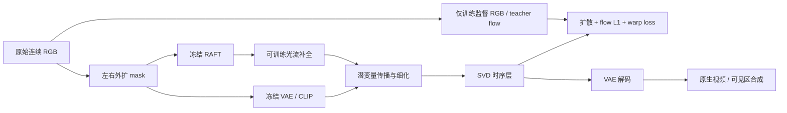

# v8.1 r1：nuScenes 真实传播—生成工程验收

task/run：`WS-V81-SEEN-TO-SCENE-20261009/r1`。配置：[nuscenes_p0_r1.json](../../configs/worldsim_v81/nuscenes_p0_r1.json)。主机 `wm-3090-1009`，运行根 `/root/autodl-tmp/runs/worldsim_v81/WS-V81-SEEN-TO-SCENE-20261009/r1`。当前执行状态见 [RESEARCH_STATUS](../RESEARCH_STATUS.md)。

本轮按 Seen-to-Scene 的公开训练方法接入真实组件，用 nuScenes 连续原始 RGB 验证可训练性。它是 P0 方法适配，不是 YouTube-VOS 论文指标复现，也不验证真实车辆 DELETE 收益。初始化为原始 SVD XT 1.1、RAFT 与 ProPainter 光流补全权重；未使用 Seen-to-Scene 或 DriveEditor 的编辑微调权重。

## Architecture components

条件 RAFT、CLIP、VAE 和传播只读取遮蔽后的输入；完整 RGB 和完整光流仅用于无梯度监督分支。推理入口不接收 target RGB。VAE/CLIP/RAFT/SVD 空间参数冻结，训练 FCNet、LatentPropagation 的对齐/细化和 SVD temporal transformer。

## 输入与范围

通过 `sample_data.next` 读取 CAM_FRONT 的25帧原始序列，校验 scene、camera、前后链、正向时间戳及间隔。原图每张须解码为1600×900 RGB，拒绝旧case缩放图和生成图。缺失成员只从 `/root/autodl-pub/nuScenes/Fulldatasetv1.0/Trainval` 对应tgz选取，不整包解压。

固定6个官方train scene和2个官方val scene；按原RGB缓存可用性选择，不能解释成均匀采样或泛化测试。数据读取按公开代码 resize→256²中心裁切，左右各84像素为hole；归一化洞填0。训练/推理 model fps 条件仍为官方7（added time id=6），原数据帧率另按真实时间戳报告。当前不研究宽画幅，不使用2Hz关键帧替代连续链，不重新采样成固定10/12Hz。

正式数据文件在 `r1/data/`，包含 `train.jsonl`、`val.jsonl`、逐帧token/时间戳/来源metadata和准备状态。控制器等8段齐全后复制为 `r1/fixed_inputs/`，防止渐进补图改变恢复训练的样本池。

## 训练与恢复

唯一入口 `scripts/worldsim_v81/run_p0.py` 有界等待依赖，然后顺序执行：

1. 一个真实优化步，保存 `train/checkpoint-000001.pt`。
2. 退出训练进程，重新加载权重、Adam、scaler和随机状态，恢复到第2步。
3. 在固定val名单第一例执行25步Euler短片生成。
4. 编码原视频、模型可见输入、原生外绘、可见区合成；保留缺失预测的训练场景输入预览。

batch=1，25帧256²，Adam 1e-5，seed=8101。采用float32参数和SVD UNet bf16 autocast；这是3090上的P0数值设置，区别于原起步配置的fp16。每步记录三项loss、真实未缩放梯度norm/finite/nonzero、冻结参数梯度数与GPU峰值；合法条件dropout导致的传播零梯度明确为skipped，不能当成已验证该模块更新。

checkpoint只保存实际可训练模块及恢复状态，未将整个原始SVD重复打包。控制器遇工程错误停止并保存 `controller_state.json`，不偷偷降帧数、换toy网络、扩大训练预算或自动关机。详细日志、模型和视频全部在仓库外。

## 已完成输入核验

[轻量输入证据](P0_R1_INPUTS.json)：6个train scene为0259/0239/0240/0241/0262/0290，2个val scene为0562/0564；200张原始1600×900图逐张解码通过。每段20–21张sweep，25帧跨度约2秒，50/100ms混合间隔使均值约83.33ms、中位数100ms。

远端 `pytest -q tests/worldsim_v81` 为20 passed。官方LatentPropagation另做3帧小尺寸CPU forward/backward，32个参数张量有梯度且输出有限；只是组件工程探针，不算SVD真实训练。8段原RGB/可见输入共16个视频完整解码通过，输入审核页位于本地 `outputs/v81-nuscenes-p0/index.html`；模型生成结果须以实际队列日志为准。

## 公开实现与论文的边界

依据：[Seen-to-Scene 论文](https://arxiv.org/html/2604.14648)、[固定官方源码](https://github.com/InSeokJeon/Seen_to_Scene/tree/2a9dfc9888e44c7fd00b08af41ef967ae46b6323)。

| 项目 | r1实际协议 |
|---|---|
| 传播 | 公开train.py的全帧顺序传播；未验证论文m=4/SSIM参考链 |
| 传播接口 | 删除源码传入但forward不接受的orig_lats；不以隐藏GT替代 |
| Flow条件 | 可见RGB估计、补全；完整RGB flow只作teacher |
| 损失 | 公开源码EDM diffusion +双向flow L1 +ternary warp |
| 推理 | Euler条件采样；未复现官方test.py的DDIM inversion |
| 解码 | VAE每4帧解码，可能产生分块边界问题；原生输出单列 |
| 外扩mask | 固定左右84/256，用于工程闭环，非正式随机100K采样 |

只有真实训练、恢复和生成通过后才能称 P0 工程闭环；两步训练不足以验证生成质量、时序能力或论文指标。下一阶段仍需补齐参考选择、inversion及正式评测协议，不能因本轮烟测通过直接宣布P1完成。

## 下载及资产

YouTube-VOS三文件各一个续传worker，状态在 `r1/downloads/{train.tar,test.zip,valid.tar}.json`，数据在 `/root/autodl-tmp/data/worldsim_v81/youtube_vos_2019/downloads`。配额HTML明确拒绝，遇配额退避到上限2小时。只挂下载，不读取test RGB选择参数或构造训练样本。

SVD原始组件固定版本 `043843887ccd51926e3efed36270444a838e7861`，目录 `/root/autodl-tmp/models/worldsim_v81/svd_xt_1_1`。fp16 safetensors通过完整传输后才移到最终路径，避免把预分配或未下载完的文件作为训练输入。下载状态 `r1/downloads/svd_state.json`。

报告证据以实际日志和metadata为准；人工verdict留空。未观察到新的研究失败时 `failure_ledger_delta=none`，历史边界引用 `V77-F02`，不把Google配额或输入缺失写成新模型失败。
