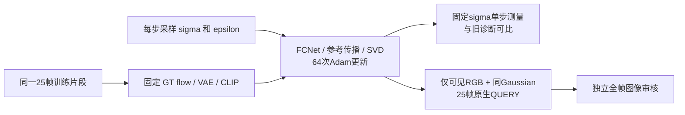

# P1：固定片段的 diffusion 噪声分布控制

task/run：`WS-V81-SEEN-TO-SCENE-P1-20261009/r1`。本页记录已固定的控制协议；实际运行与收口见同run状态/结果，不能把CPU测试当GPU结果。P1仍未通过，正式四指标未计算。failure_ledger_refs=[V77-F02]，failure_ledger_delta=none。

此前两组固定输入64步，训练与teacher测量均复用同一 sigma、epsilon、GT flow、VAE后验和CLIP。其单步去噪改善约22%，Gaussian QUERY仍不可靠跟随主体动作。不能用一个噪声点的拟合结果判断整个去噪轨迹的学习能力；下一轮只改变训练的 diffusion sigma/epsilon。



两支从相同正式500权重和Adam状态开始；新支复用旧 `fixed_input_capacity_step500_64/fixed_inputs.pt`。片段 `0fc958cde2/start2`、25帧256²、每侧mask .33、seed2026，QUERY seed2036/25采样步。学习率1e-5、Adam/wd0、损失与可训练参数不变，仍不使用作者编辑权重。

唯一成组改变的是每次训练重新采样 `sigma~LogNormal(.7,1.6)`（调用现有官方 util）和 `epsilon~N(0,I)`。sigma实际值逐步写入原有updates.jsonl；不截断、不择优重采样。其余GT flow、VAE posterior、条件噪声、完整首帧CLIP、time IDs/fps7都复用缓存，仍无CFG dropout。teacher继续使用原缓存，不被训练噪声污染；QUERY仍仅可见RGB/fps6、同Gaussian初值。它匹配论文的diffusion噪声分布，但**不是完整论文训练协议**；64次随机抽样也不保证覆盖每一个采样档位。

GPU启动前先核对真实进程/队列、GPU、磁盘与源断点；不覆盖任何旧输出，不自动扩步数。仅执行以下一项：

```bash
cd /root/autodl-tmp/motion_proj_v81
OMP_NUM_THREADS=4 MKL_NUM_THREADS=4 /root/autodl-tmp/envs/motionproj/bin/python -m motion_proj.worldsim_v81.p1_fixed_capacity_probe \
  --checkpoint /root/autodl-tmp/runs/worldsim_v81/WS-V81-SEEN-TO-SCENE-P1-20261009/r1/paper_bidirectional_m4/train/p1-checkpoint-000500.pt \
  --fixed-inputs /root/autodl-tmp/runs/worldsim_v81/WS-V81-SEEN-TO-SCENE-P1-20261009/r1/fixed_input_capacity_step500_64/fixed_inputs.pt \
  --output-dir /root/autodl-tmp/runs/worldsim_v81/WS-V81-SEEN-TO-SCENE-P1-20261009/r1/fixed_clip_resampled_diffusion_step500_64 \
  --training-diffusion-noise resampled --teacher-clip-source full-gt --updates 64 --seed 2026 --query-steps 25
```

结束后核对实际Adam增量与冻结梯度、QUERY-before与旧500原生全25帧逐像素一致，再由6sol xhigh（no fast）对两支QUERY-after的全部25帧独立看图。主体轮廓、动作跟随、接缝是判断依据；GT写回中心不计入生成能力。teacher误差只是诊断，不替代视觉通过。

若原生结构/运动改善，只能说本片段此预算的单sigma/epsilon限制有所缓解；sigma与epsilon共同改变，不能单独归因。若无改善，也不能断言充分训练后的模型容量不足。两种结果都不自动放行100K或进入P2。终态使用独立格式保存，不能进入正式训练恢复。之前同规模GPU计算约3–4分钟，含检查/编码/审核预计10–20分钟；本次尚未实测。

CPU验证：固定与重采样模式均执行真实小模块反向更新；确认只有sigma/epsilon改变、teacher缓存保持、CLIP/time IDs未变，且FCNet/传播仍重算。本地与远端各8项测试通过；旧结果全部保留。用户最新要求不通过后持续排查，不自动关机；本控制收口后由主任务选择有证据的下一项，不把质量hold当作全任务停止。

## 实际结果（2026-10-10，新加坡）

上述命令与判断条件是执行前协议；本控制现已完成。独立输出位于仓库外 `outputs/v81-paper-p1/fixed_clip_resampled_diffusion_step500_64/`。`run.json` 记录64次尝试、64次真实Adam更新，`optimizer_update_verification.json` 确认514个Adam状态计数均增加64、梯度/更新有限，正式训练新增0步。`updates.jsonl` 的64个训练σ各不相同，实测最小0.055625、最大216.222702；它们是按分布抽样，不代表均匀覆盖各噪声档位。训练用时132.33秒，总用时196.36秒。先前“本次尚未实测”的表述仅属于上面的运行前估计。

固定teacher基准输入未变；其加权latent MSE为0.191143→0.182955，而固定σ/ε旧支为0.191143→0.149839。这只比较带噪GT单步BUILD的同锚点误差，不给QUERY质量排序。两支QUERY-before的五张全帧图板文件逐个相同，原生视频起点一致；after各25帧已经独立逐帧审核：[完整审核与限制](../../../../outputs/v81-paper-p1/fixed_clip_resampled_diffusion_step500_64/assistant_review.json)。

重采样后的原生QUERY仍主要是暗树林、草带和模糊浅棕鸟形；GT在f07–f14明显展翼，原生主体近乎静止，没有可辨的同步展翼。相对固定σ/ε支，植被纹理与明暗有变化，但没有一致的鸟体结构、动作或接缝收益。合成视频中的清晰鸟头与翅膀是可见中心真实RGB硬写回，不能算作模型原生预测。故本片段/种子/64步未见重采样联合σ+ε修复QUERY；这既不能分别归因σ或ε，也不能证明充分容量、泛化失败或完整论文训练无效。P1质量仍hold，正式四指标未算，`human_verdict=null`。

下一项GT flow→可见flow的同预算单因素控制正在准备；它将单独检验训练与QUERY的光流条件落差，尚无结果。现有[本地HTML总览](../../../../outputs/v81-paper-p1/condition_gap_review.html)并排展示原生与中心硬合成，不将本控制计入正式训练。
