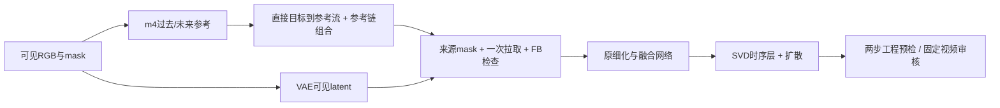

# P1 短周期审计：先确认训练与采样，再进入长预算

task/run：`WS-V81-SEEN-TO-SCENE-P1-20261009/r1`，2026-10-09。用户要求查看当前进度、数据构造并与原文比较，避免七天结束后才发现基础问题。两名独立 `gpt-6-sol / xhigh` subagent 分别只读审计训练与推理；没有使用 fast，也没有人工准入。

## 当前实测与输入

2026-10-10 00:24 新加坡时间：公开 All Frames 路径完成1000更新，最近100步均值5.823秒；同速100K剩余纯训练6.67天只是吞吐估算。1000断点、3条固定valid×两倍率及1个现成feedforward诊断均完成。损失/梯度有限、冻结梯度为0；独立助手审核原生与硬合成全部25帧，已出现天空、建筑、水下动物结构，但仍有形变、重复、近乎冻结及边界断裂，未达到可用质量。旧step2视频保留作为历史对照。

train 包3471视频、94588张JPEG；1951视频严格>25帧，19313连续窗口。100K是虚拟采样/优化预算，不是独立视频数。每次均匀选视频、随机连续25帧，缩放中心裁剪256²，左右各84像素洞；监督始终是真实视频。没有伪标签、SAM车辆贴片或P2驾驶数据。CPU审核页按真实日志复现step1、2、300，保存源文件名、原图尺寸、监督/可见视频、mask联系图和运行快照。

输入/视频输出在仓库外：`/root/autodl-tmp/reviews/worldsim_v81/WS-V81-SEEN-TO-SCENE-P1-20261009/progress-preview`；同步至本地 `outputs/v81-paper-p1`。审核脚本为 `scripts/worldsim_v81/build_p1_progress_review.py`。播放fps7仅为导出/模型条件，不据此宣称数据原始帧率。

补充独立目视QA：三个输入联系图的五张抽帧均有合理姿态/镜头变化，未见明显重复、错序或损坏；可见带、mask和监督角色正确，但五帧不能证明整段时序通过。源JPEG文件名实际每5递增，所以包内连续25张不等于原视频逐帧；正式YouTube评测另用全帧包，作者实际训练帧采样率仍需核对。[数据集官方说明](https://youtube-vos.org/dataset/vos/)亦区分带标注训练帧和版本统计。此前完整CPU检查41 passed；本轮审核页另补1000步7窗及同条件采样3窗，实际链接/解码核对另记录。

## 原文与公开代码的实质边界

来源：[论文§4、§5.1、附录D.1](https://arxiv.org/html/2604.14648)、[固定公开代码](https://github.com/InSeokJeon/Seen_to_Scene/tree/2a9dfc9888e44c7fd00b08af41ef967ae46b6323)。

| 项目 | 已核对事实 | 本轮判断 |
|---|---|---|
| 训练采样 / mask | P1基本对齐公开dataset.py与util.py，25帧、256²、双侧84px | 基本一致；不是当前驾驶DELETE训练 |
| 训练传播 | 旧P1未传flow_pairs_info，实际All Frames；新入口按m=4成对RAFT、传播与warp监督 | 旧结果保留诊断，新参考链训练重新开始；正式等价与指标仍待核验 |
| 官方训练可执行性 | train.py:438传入传播模块不接受的orig_lats，固定签名line170无此参数 | P1删掉该无效参数可运行，但这不解决上述传播差距 |
| GT与条件 | 完整RGB算RAFT和首帧CLIP，masked RGB进入条件VAE；QUERY仅可见RGB | 对齐公开train.py，但训练/QUERY有条件分布风险 |
| 参数与损失 | FCNet、潜变量传播、SVD temporal transformer更新；空间层、RAFT/VAE/CLIP冻结；diffusion+flow L1+ternary warp | 主要对齐公开训练；不是只训练新Adapter |
| 优化与硬件 | 论文Adam、两张A6000；源码AdamW、per_gpu_batch_size=1；当前单3090、bf16、CPU卸载 | 明示差异；作者双卡启动方式/有效batch未公开，不能断言完全一致 |
| 推理 | 论文Gaussian初始噪声前向生成；公开test.py:611另执行inverse | 旧literal保留；新参考链阶段主模式为Gaussian feedforward，另保留literal诊断 |

公开inverse还有可证实风险：test.py:473把B1复制B2，483–484广播更新后两支latent不同，639–647再作为CFG两支，653–655只解码第一支。反演把UNet输出当epsilon使用，而SVD scheduler是v_prediction，且alpha索引不是实际scheduler timestep。静态审计足以要求短对照，不能证明它是霓虹色块唯一成因。训练EDM、VAE目标/条件标度、解码缩放未发现本仓库独有的确定错配。

现成literal/feedforward两路径还存在RAFT洞区-1/0填值及RNG消费差异，不能把两者画质差直接作为“反演导致失败”的因果证据。若分叉，下一次必须固定同一CLIP/flow/传播条件和同一初始latent，仅切采样分支，先处理协议差距，不加P2/P3创新。

## 已实施的节省预算措施

控制器新增1000、5000步助手质量门：各做预选3个valid×两倍率；1000另做同断点首个valid/.33的feedforward诊断，输出独立目录。随后只接受对应`quality_gates/stepXXXXXX.json`、`reviewer=assistant`、`decision=continue`；缺失或hold不自动启动后续训练。8项流程测试通过。

部署采用控制器交接，未中断GPU训练PID29673：保存原控制器状态与命令后，仅替换旧父控制器PID29301。交接进程33980等待当前1000步训练退出及完整断点，再启动新控制器；不会并行加载GPU模型。证据在run的`checkpoint_handoff.json`和`controller_state.before_quality_gate.json`。不等待用户审核。

质量门查看原生与硬合成的完整25帧，比较固定输入的结构、边界和时序，不把训练损失下降当画质证据。若仍为色块、存在采样/数值错误或论文协议未澄清，保留断点做有界诊断；不能无条件放行七天训练。只有生成开始恢复结构且工程链路可信，才考虑到5000步。正式150个测试ID不用于调参。

正式四指标尚未计算，`protocol_verified=false`保持；failure_ledger_refs=[V77-F02]、failure_ledger_delta=none。本轮发现是公开复现工程/协议风险，尚未构成方法失败。媒体、数据、第三方源码、权重不入Git，源码ZIP仍受100MB上限约束。

## 1000步质量门与同条件采样结果

旧路径质量门最终为 `hold`，不是等待人工。两个独立助手均建议可到5000作学习诊断，但主审不放行额外4000步 All Frames：已确认训练传播与论文不一致，应先修成对传播及其监督。完整1000断点与全部原始输出保持；没有把质量未通过写成论文复现失败。

固定1000断点、滑板验证例 `00f88c4f0a`、side .33、seed2026、25采样步，以一次公开路径编码缓存完全相同的 CLIP、RAFT、补全flow、传播latent及初始噪声。三分支为原公开路径、无反演+标准CFG、保留反演首支+标准CFG。公开路径重放25帧与原1000验证逐像素一致。

| 对照 | 相对公开路径RGB MAE（0–1） | 独立完整25帧观察 |
|---|---:|---|
| 无反演+标准CFG | 0.00721895 | 同样未延展地面/树木/人物，仍有天空黑色碎片及额外局部残影 |
| 保留反演首支+标准CFG | 0.00128656 | 与公开路径肉眼几乎相同，同样有接缝和缺失结构 |

全部诊断latent有限；反演两支latent MAE为0.000252008。小像素差不等于画质改善，也不证明反演参数化无害。这一单窗没有“去掉反演或修CFG即可修好画质”的证据；现成feedforward与literal的其他条件差异不用于因果解释。

数值：run下 `sampler_controlled/step001000/sampler_diagnostic.json`；三分支原生/写回在同级模式目录。独立QA在仓库外review根 `step001000/{smallmask_assistant_review,inference_assistant_review,sampler_controlled_assistant_review}.json`；`human_verdict=null`。本地HTML含11个生成窗口（旧step2×1、1000验证×7、同条件诊断×3），各四列、各25帧。

## 参考链的必要修正

固定公开 `test.py:233–303` 实现m=4参考选择及chain+to_frame；25帧得到24个成对关系。`RAFT_bi.forward_pairs`算每对非相邻flow；`LatentPropagation`必须收到同序`flow_pairs_info`。只把该参数塞入旧训练是不正确的：现公开 `FlowLoss.forward`将flow绑定相邻RGB，参考对 `(s,t)` 必须分别用真实source/destination帧计算warp监督。当前P1所有时刻同一双侧mask，FCNet的相邻mask索引恰等价；新入口仍须显式检查。

下一步最小修正包括成对RAFT、带参考对的传播及pair-aware warp loss；不增加新网络或P2/P3。旧1000步记作公开All Frames诊断，不计为论文参考链训练。从原始SVD/RAFT/ProPainter在独立子阶段重新做短步/1000质量门，禁止静默从旧checkpoint切换协议。训练协议写入日志与checkpoint。

### 修正后的短预检

已实现 `train_p1.py --propagation-protocol reference-m4` 和相应控制器协议。CPU49项通过；旧断点不允许静默跨协议恢复。`reference_m4`子阶段从原SVD/RAFT/ProPainter初始化，真实两步损失6.4800138/4.6684742；FCNet、propagator、SVD temporal梯度有限且非零，冻结梯度0，峰值分配21.318GiB。真实日志明确打印 `Propagation with the Reference Frames`。

新控制器40743先验证新两步checkpoint，再恢复至新1000步重新独立审核；主模式使用Gaussian前向生成，公开literal保留为独立诊断。旧控制器35923只在child为空的hold时停止，旧checkpoint与产物不移动不覆盖。阶段交接为根run `reference_m4_handoff.json`，活动状态为 `reference_m4/controller_state.json`；相同task/run，不把旧All Frames步数混算。

旧审核页50个视频全部逐帧解码、78本地链接无缺失；新两步参考链视频已独立标注补入，完整交付再次核对。修正后数值通过仅代表工程入口能反向传播，尚无新1000画质或正式四指标。

## 参考传播的方向与双向覆盖反证

2026-10-10 01:32（新加坡），`reference_m4`已到838步，约4.5秒/步；本轮两个6-sol/xhigh subagent继续审计，没有使用fast。更深审计证明：修正选帧和成对监督，还没有修正固定公开传播本身。论文§4.2 Eq.5–6分别使用目标到最近过去、未来参考的流，再沿参考链组合；§4.3明确说参考引导条件进入训练，但无法据此确认作者实际训练排序与公开代码完全一致。

实际导入固定官方 `LatentPropagation`、从固定 `test.py` AST取pair builder做CPU反证：两帧点从f00的x4移到f01的x5，公开pair为(1,0)，RAFT方向应为fw=-1、bw=+1。拉取f01到f00需要目标→来源流：正确峰x4，公开forward分支峰x6。只有f00提供可见点时，末帧f01的两个分支最大值都为0。两分支沿同一未来父链，仅交换flow，不等于真实过去/未来路径。

owned候选 `paper-bidirectional-m4` 已接训练/推理：统一早→晚pair，用对应反方向拉取过去，正方向拉取未来；组合流一次采样来源latent，未知来源先mask掉，继承原FB一致性及 `_post_fuse` 参数结构。来源coverage只施加一次，避免半像素边界重复衰减。此处来源mask与固定公开未屏蔽源latent有明确差异，依据论文§4.2的source-mask语义，不能包装成公开代码逐像素复现。

25帧、R个参考时K=2(25−R)+(R−1)=49−R；m4最稀R7时K42，旧未来父链恒K24。FCNet静态mask可扩为K+1，端点mask数值等价；稀疏pair列表并不保证原ProPainter连续时轴语义，端到端能否适配、3090显存是否足够均待实测，不能仅看形状合法放行。旧 `reference-m4` 和新协议禁止交叉恢复；不加载作者编辑权重。

独立subagent接线复核未发现新方向、来源mask或FB检查错误，同时指出控制器返回既存断点/跳过旧结果未核对协议的缺口，已修复：检查断点内部协议，缓存结果须同checkpoint及协议。CPU最终全套59项通过。当前GPU仍完成旧阶段1000完整断点及7窗验证；该质量门已预置工程hold，不继续到5000。串行worker46090只在旧控制器无child且hold后交接，排队新子阶段 `paper_bidirectional_m4` 两步真实训练、一窗推理；不自动追加1000或100K，不同时启动GPU作业。实际状态为根run `bidirectional_handoff.json`，该候选尚无GPU结果。HTML87本地链接、54视频实际解码通过；源码ZIP约34.3MB，低于100MB。

原始反证、图片、后续预检在同run仓库外保留；HTML已展示实际联系图。来源：固定官方 `models/bidirectional_flow_raft.py:70–91`、`models/latent_warping.py:10–27,271–363`、[论文§4.2](https://arxiv.org/html/2604.14648)。这是真实工程/协议差距，不构成论文方法科学否定，failure_ledger_delta=none。

## 正式评测边界补充

已修 `evaluate_p1.py` 完整性入口：必须同时包含完整DAVIS90和附录YouTube60，不允许因 `coverage()`只列出现的数据集而漏掉整套基准。两个有意义的缺整套反例通过；局部调试仍显式 `--allow-partial`。

论文25帧明确用于训练；附录D.2和公开test默认支持整段视频、25帧重叠去噪。当前仅生成排序前25帧再评分前16帧，不能从Follow-Your-Canvas的评分抽帧反推其生成也只使用25帧。本地协议保留、明确命名并继续 `protocol_verified=false`；正式完整复现尚须处理长视频窗口、预处理及FVD汇总边界，未计算四指标，更未声称论文表1已达标。

## 双向GPU预检与第二步OOM修复

2026-10-10 01:57新加坡：旧reference_m4完成1000、六个paper-feedforward验证及一个literal诊断，已进入工程hold并停止闲置控制器。新双向子阶段第一次第1步loss5.931074、K42、梯度有限、allocated20.914GiB；Adam状态建立后第2步在官方ternary_transform分配96MiB时OOM，日志显示GPU已用23.55GiB。原始栈和第一步checkpoint保留，不把资源错误记为方法失败。

修复只改激活保存：原FCNet完整pair序列做非重入checkpoint，不切其时轴；ternary loss按8对分块checkpoint，以各块mask像素数占比加权，保持整批官方归一化。真实固定官方FlowLoss的值和flow梯度与整批对照通过。从原step1断点/RNG恢复step2：loss4.496088（diffusion.897418、flow1.904432、warp1.694238），FCNet/传播/SVD temporal梯度均有限且非零，冻结梯度0；峰值allocated18.402GiB，耗时8.26秒。

新阶段按论文文字Adam/wd0，不混载旧AdamW；精度仍bf16/单3090/CPU卸载，未宣称两A6000等价。传播方向、来源mask及Adam均变化，画质变化不能单独归因方向。CPU完整75项通过。

独立subagent报告 `r1/review/assistant_p1_visual_review_20261009T175643Z.json` 覆盖9窗×4模态×25帧，human_verdict=null。旧reference1000六窗仍hold：滑板倒挂建筑、海豚重复错位、白鲸运动滞后模糊；literal25帧近冻结。所有可见带/硬合成接线逐帧通过，不能把模型失败归咎写回。新双向两步输出仍抽象色块/强闪烁，只判工程预检完成，画质尚未定。

第三次只读接线审计未找到cond标度/拼接/新pull方向确定错误，建议同协议100步短学习诊断。root已在同run阶段限定恢复至100后固定一窗推理并退出，controller52384、trainer52387（以实时PID为准）；不自动1000/100K。两步关键checkpoint硬链接在preflight_checkpoints以保留。正式150 ID不用于这次预算决策。

## 全视频协议入口

公开test默认整段输入，25帧窗口/stride16；即使FYC指标只评分前16，生成也不能静默截成前25。owned入口新增显式full-video：全T可见条件/参考、全局Gaussian latent、每个扩散步重叠窗口预测均值、单次Euler更新、分块VAE编解码。控制器正式300段调用full-video并记录原始source_dir；正式评测核对源/GT/pred/comp全帧数量。短窗默认保留历史诊断、缓存与路径分离。长视频上游RAFT/FCNet/传播资源尚待GPU检查；不能用CPU测试宣称正式推理已完成。

独立文献/源码核对：FYC的前三指标明确两倍率平均，FVD脚本分别输出，因此FVD均值属于推定；MOTIA均匀16不同于FYC前16，不混用。DAVIS480p与固定AppendixYT60不变；256² GT裁剪预处理作者未完整公开，当前中心裁剪是假设。实际正式指标仍未算，protocol_verified=false。failure_ledger_delta=none。
