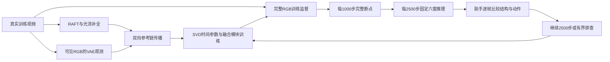

# P1 正式训练与周期复盘

task/run：`WS-V81-SEEN-TO-SCENE-P1-20261009/r1`。2026-10-10用户重新授权继续Seen-to-Scene复现；本策略覆盖此前“7500后仅评估”的执行范围，历史7500评估和停止记录保留。

2026-10-11最新优先级：完成当前10000完整保存及六窗后，先运行DGGT Waymo官方重建与论文高斯编辑；此阶段不启动12500，即使10000的训练收益gate为continue。每1000保存与已授权清理规则保持，清理等待真实复盘和GPU空闲，不中断DGGT。服务器保持开机。[当前独立任务与组件图](DGGT_WAYMO_INFERENCE_R1.md)。以下周期说明是此前策略，不覆盖这项最新调度要求。

从正式7500完整原件恢复到累计10000步，只新增2500更新。模型、Adam、constant调度器、CPU/CUDA/NumPy/Python/CFG随机状态、数据池、seed123、bf16、lr1e-5和paper-bidirectional-m4均沿用。只调整训练上限、保存频率和保存目录，不混入诊断权重，不加入P2/P3。完整断点写数据盘，不写剩余空间较小的系统盘。

图中的完整RGB仅表示BUILD训练监督；训练CLIP和GT-flow沿用当前公开方法协议，其训练—推理差异仍明示。QUERY仅可见RGB进入条件。该图不表示新增方法或论文能力已验收。

| 周期 | 执行 | 首轮 |
| --- | --- | --- |
| 全局每1000步 | 原子保存完整模型、Adam、scheduler、scaler和全部RNG；禁止训练器提前trim | 8000、9000、10000 |
| 每新增2500步 | 额外保存复盘点，即使不是整千；固定三valid×两侧比例，各25帧 | 10000，下一候选12500 |
| 每小时 | 心跳读取真实PID、GPU、日志、完整断点与空间，正常无变化不通知 | 不重复启动在途作业 |
| 全局每5000步 | 新完整断点验证、六窗和助手复盘完成后清理旧正式训练文件 | 10000、15000、20000… |

正式控制器是 `scripts/worldsim_v81/continue_p1_review_cycles.py`，每次只启动一段2500步，完成六窗后退出并标记`waiting_assistant_training_review`。它不调用旧Controller的100K循环。后续由每小时心跳读取真实审核结果并启动下一段；没有相同步数的`train_decision=continue`不能自动继续。

## 收益决策与质量验收

比较上一2500复盘点的相同六窗：`00f88c4f0a`、`7e625db8c4`、`ff6eb95840`，侧边`.125/.33`，原valid稀疏帧来源、seed2026、25采样步、paper-feedforward不变。完整原生与硬写回各25帧均由gpt-6-sol/xhigh/no-fast助手审核，人工verdict留空。硬写回的中央正确不能计为模型能力。

`quality_decision`记录当前视频是否通过质量门；`train_decision`记录继续训练是否有依据。主体结构、动作/尺度跟随、洞区和接缝有可重复观察的局部学习进展，且无严重整体回退时，可以在`quality_decision=hold`下决定继续下一2500步。loss下降、像素变化或一段平滑视频本身不构成放行依据，也不要求每2500步立即达到论文终点画质。

若无明确收益或存在数值/协议异常，先保留证据，选择一个有依据的新诊断并串行执行，不盲目追加100K，不默认等待用户。此前完成的fps、GT oracle/teacher、CLIP/flow短控制、singleclip512、恒CFG1、FCNet边序等阴性实验不重复扫描。

收益gate位于phase下`review_cycles/gates/stepXXXXXX.json`，必须绑定当前完整原件、上一复盘步数、六窗run.json和当前validation目录内的真实助手记录；每例标记`frames_reviewed=25`、`native_reviewed=true`、`composite_reviewed=true`。记录需要`step`、`comparison_step`、`reviewer=assistant`、`human_verdict=null`、`quality_decision=continue|hold`、`train_decision=continue|diagnose|complete`及具体理由。审核证据JSON必须标记相同`step`，不能用旧评分放行新训练。

## 保存与清理

新断点目录：`paper_bidirectional_m4/review_cycles/train/`。训练器设置`save_every=1000`、`keep_checkpoints=100000`，使自动trim不提前删除，复盘点另存完整断点。10000→12500时保存11000、12000、12500。

全局5000倍数复盘后保留**最新与上一2500复盘点**的完整训练状态；例如10000后保留10000和7500，15000后保留15000和12500。其余旧正式断点逐项删除，不递归清run。清理范围仅当前`review_cycles/train`、原正式`phase/train`及明确列出的5000/7500原件；诊断源副本、P0、诊断模型、外部基座、原RGB、评分和视频均不在清理范围。历史旧权重删除后可能不能精确重跑旧实验，已有完整输出与诊断副本保留。

清理前校验真实路径、完整正式格式、步数、inode、设备、链接类型和CPU/mmap/GPU使用状态；先写清单，软链先unlink再处理原件，硬链接只记录实际unlink。以清理前后分区free差记录实际释放，不把逻辑文件大小当释放空间。清单位于`review_cycles/cleanup/stepXXXXXX.json`。首次10000清理已完成；实际清单和释放空间见下方本轮记录。

## 核对与当前边界

远端CPU预检已验证7500原件完整4,833,164,791B、514个Adam状态、scheduler7500及RNG字段，六窗来源与协议固定，当前GPU空闲；首轮预期整千保存为8000/9000/10000。CFG条件丢弃可以合法令传播模块无梯度、Adam个别计数不增加，不强制全部参数计数等于全局步。最终断点要求参数名/形状、Adam参数组、数据profile、关键训练args保持一致，计数合法单调、日志新增更新连续。

真实7500→10000阶段已完成新增2500更新，完整10000原件4,833,164,855B、514 Adam状态、scheduler10000及RNG通过校验；数值有限、冻结梯度0，平均5.957秒/步。整千8000/9000/10000曾完整保存；六窗共150帧由两名独立gpt-6-sol/xhigh/no-fast助手全部审查，原始观察与当前side evidence落盘后才生成收益gate。

## 10000实际复盘与清理

以下评分是两名助手针对同一批媒体的主观展示分，native为结构/动作/稳定三个维度均值，comp只评价生成边带与接缝；不是正式指标，也不与旧独立评分直接混合。

| 固定窗 | 7500 native* | 10000 native* | 7500 comp边带 | 10000 comp边带 | 收益判断 |
| --- | ---: | ---: | ---: | ---: | --- |
| 滑板 · 小侧区 | 2.33 | 3.00 | 2 | 2 | modest_visual_gain_with_remaining_errors |
| 滑板 · 大侧区 | 1.67 | 2.67 | 1 | 2 | clear_relative_gain_but_low_absolute_quality |
| 海豚 · 小侧区 | 3.00 | 3.00 | 3 | 2 | mixed_no_clear_gain |
| 海豚 · 大侧区 | 2.17 | 2.17 | 1.5 | 1.5 | mixed_no_clear_overall_gain |
| 白鲸 · 小侧区 | 3.00 | 3.50 | 2.5 | 3 | modest_consistent_relative_gain |
| 白鲸 · 大侧区 | 1.83 | 2.50 | 1 | 1.5 | clear_relative_gain_from_weak_baseline |

滑板和白鲸宽側区从弱基线有明确相对进步；窄侧区有局部持续学习。海豚两窗无明确整体收益或被新伪影抵消，所有宽侧区仍存在结构、尺度、模糊和接缝问题。quality_decision=hold，train_decision=continue，含义为后续有界训练具有依据；按DGGT优先阶段，本轮没有启动12500。真实gate在review_cycles/gates/step010000.json，六case evidence在当前validation/step010000同side目录，human_verdict=null。

已在GPU及控制器退出、10000完整校验和真实复盘后调用--cleanup-reviewed --target10000。清单status=complete，保留10000与7500完整原件；实际数据盘free增加14,499,500,032B，系统盘4,833,169,408B。只逐项移除明确旧正式断点/软链，原1000硬链接诊断源、P0/诊断模型、RGB、指标和失败媒体未动；原8000/9000已随该轮清理退役。清单review_cycles/cleanup/step010000.json保留每条inode/links及真实释放量，不能再重复清理。旧5000原件已移除，已有视频评分仍保留。

深色本地step10000_review.html展示7500/10000原生与硬写回配对六窗，已加载全部六窗真实助手记录。新增24MP4共600帧及600张PNG均实际解码；页面36个视频链接、900个逐帧PNG链接存在，JS语法通过。当前原生中央是否正确由模型输出判断，硬写回中央GT不计能力。本轮不重复7500传播消融，不以学习分替代论文四指标。

P0闭环完成，P1训练体系和局部学习已经建立；正式四指标尚未计算、`protocol_verified=false`。达到论文DAVIS21.95/.141/.783/218.8、YouTube21.89/.143/.783/242.8需实际完整评估，不以训练步数、审核分或当前局部收益替代。无新增科学根因，`failure_ledger_refs=[V77-F02]`、`failure_ledger_delta=none`。服务器保持开机。
