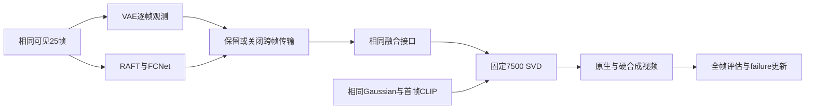

# P1 7500步评估：执行范围与判据

task/run：`WS-V81-SEEN-TO-SCENE-P1-20261009/r1`。2026-10-10用户要求7500保存后先不继续训练；本报告记录本轮评估，结果尚待生成。P1能力没有通过，P2/P3未开始。此次评价不启动新训练，不加载作者编辑权重，不改变正式验证ID、seed、mask或采样协议。

## 1. 5000与7500：匹配学习曲线

当前5000→7500最多新增2500次更新，保存完整模型、Adam、scheduler及RNG至数据盘 `paper_bidirectional_m4/checkpoint_retained_step007500/p1-checkpoint-007500.pt`。`phase/train`软链接不是备份。旧关键断点保留；现有控制器完成后只生成六个固定验证窗口。

| 固定条件 | 内容 |
|---|---|
| 验证序列 | 滑板00f88c4f0a、海豚7e625db8c4、白鲸ff6eb95840 |
| 每侧外扩比例 | .125与.33；总遮挡约.25与.66 |
| 片段与采样 | 相同源25帧；seed2026；25采样步 |
| 推理协议 | paper-feedforward、paper-bidirectional-m4、bf16 |
| 审核 | gpt-6-sol / xhigh / no fast；原生与硬合成各看完整25帧；human_verdict=null |

逐窗比较主体轮廓与部件、动作/位置/尺度跟随、镜头转向后场景变化、侧区与可见中心的边界连续性以及闪烁/冻结。将局部进步、回退和整体是否可用分开记录，不用一个总分替代失败类型。明确变化发生的帧段，并保留5000/7500图板、视频和原始PNG。

硬合成保留的真实中心不算模型能力；只评生成侧区及接缝。辅助数值若计算，只是这六个固定窗口的诊断值，不能充当DAVIS90/附录YouTube60正式指标；本轮不以六窗FVD估计泛化。

## 2. 跨帧传播：信息存在与生成利用分别检查

固定7500权重，正常参考链传播与关闭跨帧传输配对。关闭支仍保留每帧VAE可见观测和相同融合接口，不把全视频条件置零、不重复首帧替代后续帧。两支共享实际CLIP、time IDs、flow、mask、初始Gaussian与采样器；普通支必须逐像素重放正式7500的25张原生PNG。源真值只用于评价，不进入QUERY条件。

先检查传播是否为洞区带来可见来源的信息、特征/解码结构是否改变，再检查最终输出是否有结构、运动或边界收益。条件发生变化、像素响应非零、损失下降均不能单独证明传播有效。结果只支持当前权重对该推理干预的依赖性；关闭传播可能造成分布外输入，不能替代相同数据/预算下从头重训的模块消融。阴性不唯一定位传播或U-Net的根因。

只有六窗正式推理完成、原父/子进程已退出且GPU空闲后，才串行执行该零更新消融。遇工程错误保存栈与已完成媒体后修复，禁止另起训练或参数网格。

## 3. v77对照与failure更新

v77主要是驾驶车辆DELETE，v81当前是通用视频外扩，任务、数据、预算不同，不能凭六窗评分宣布v81优于或劣于v77。对照重点是问题边界：可见观测是否真实覆盖隐藏区，实例/时空对应是否可信，条件中有信息但生成器是否使用，以及生成错误与写回后处理错误是否分离。

现有历史证据限定三项启发，尚不是7500结论：v77 r47/r49的条件响应及局部后车改善没有证明真实DELETE整体通过；v77 r52的矩形伪标签训练已退役，v81当前用真实视频监督，没有同一伪标签接缝原因；v81的GT-x_t teacher改善也不能算纯Gaussian生成改善。对应证据是远端既有 `docs/research_failures/entries/V77-F02.md`（r47/r49/r52段）及本run的5000质量门、条件诊断。共同的是需要隔离条件与输出的评审方法，不能据相近的暗块表象认定共同机制。

读取既有failure卡及原始证据，保留v77指令/放置审计的更正，不恢复已撤回的资产失败归因。收到7500和传播实测后，选择已有卡追加同类证据；仅在出现独立新失败边界时新增ID。未确定的原因写为待检假设，不把训练未充分、推理干预阴性写成方法族证伪。修改卡后运行failure索引生成脚本。

## 交付

深色5000/7500六窗对照HTML，传播配对与中间条件图板，助手全帧评分/理由，轻量数值及证据路径，更新的failure卡。媒体同步本地 `outputs/v81-paper-p1` 并实际解码、核对链接；Git仅收代码和轻量结果，源码ZIP小于100MB。

当前UTC10:14训练快照6643步，约6秒/步；7500结果尚不存在。5000仅海豚.125有局部进步，其余五窗仍hold；不能提前写7500结论。评估全部交付前保留监控，完成后停止本评估监控；不擅自恢复训练，AutoDL保持开机。

执行范围另存于同run `evaluation_7500_policy.json`；独立评估队列 `evaluation_7500_queue_state.json` 等待原7500控制器和六窗全部完成，再做传播消融，避免未来监控误按旧授权续训。队列不含训练命令，采用唯一启动标记；出现工程失败保留日志、trace与已完成媒体，修复前不重复启动。
