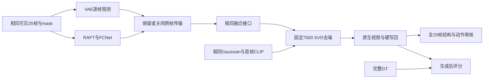

# P1 7500步评估：有局部进步，整体未通过，传播未显示明确视觉收益

task/run：`WS-V81-SEEN-TO-SCENE-P1-20261009/r1`。2026-10-10，正式训练到7500后停止，完整checkpoint已保存，没有新增训练，服务器保持开机。P0工程闭环完成，P1能力未通过，P2/P3未开始。

**5000→7500确实学到了一些主体结构和动作，小外扩白鲸达到本次2分可用门槛；其余五窗未达标。六窗跨帧传播开／关均为 `no_clear_gain`。这不是对完整训练方法的否定，也不是v81优于v77的证明。**

## 5000到7500：局部进步和整体质量

三个独立 `gpt-6-sol/xhigh/no-fast` subagent每人负责一个序列的两窗50帧，合计直接查看六窗全部150帧；原生、硬写回、传播两支和条件图板分别审核，不是每窗三重评分。0–3分，2表示本窗口可用；不是论文指标。`human_verdict=null`。硬写回中央来自真实输入，只评生成侧区和接缝，不能把真实主体算为模型收益。

| 窗口 | 5000原生／写回旧分 | 7500原生／写回 | 直接观察5000→7500 | 判定 |
|---|---:|---:|---|---|
| 滑板，小外扩 `.125` | .25／.25 | 1／1 | 05–14形成连续滑手、滑板、下蹲—起跳—落地；机位、尺度和位置仍错 | 局部明显进步，hold |
| 滑板，大外扩 `.33` | .25／0 | 1／0 | 中央狭缝人体更连贯；两侧黑竖条、灰白雾柱及错误建筑持续 | 不可用，hold |
| 海豚，小外扩 `.125` | 1.25／1.5 | 1.5／1.5 | 02–24身体和尾鳍更清楚；多主体位置、尺度、尾鳍轨迹不对 | 局部进步，hold |
| 海豚，大外扩 `.33` | .8／.7 | 1.3／.9 | 07–24中央海豚及摆尾更清楚；邻近主体缺失、边界截断、布局仍错 | 局部进步，hold |
| 白鲸，小外扩 `.125` | .9／1.1 | 2／2 | 07–14双体／拖影减少，保持单一白鲸，大体跟随靠近镜头的放大 | 仅此窗口达到门槛 |
| 白鲸，大外扩 `.33` | .6／.7 | 1／0 | 00–14单体改善；15–24转向、头肩／胸鳍错位，写回后断裂更明显 | 原生局部进步、写回回退 |

旧分与新分来自不同轮助手，仅作历史参照，提升依据是匹配帧段直接观察。**1/6窗口可用、整体hold。** 小外扩每侧32px、中央192px；大外扩每侧84px、中央88px。窄侧区成功不能代表大面积恢复能力。

原生洞区PNG L1五降一升：滑板 `.125` .26384→.20056、`.33` .32071→.29466；海豚 `.125` .12882→.10736、`.33` .11235→.12676；白鲸 `.125` .09669→.06125、`.33` .13153→.12160。海豚大外扩L1升高却有局部部件改善；白鲸大外扩L1下降却有写回回退。这两个反例说明像素误差不能代替结构、运动和接缝审核。

## 跨帧传播：有条件响应，未见明确生成收益

固定7500权重、seed2026、25采样步，两支保持相同逐帧visible VAE、CLIP、time IDs、RAFT／FCNet flow、mask、融合接口和初始Gaussian，只跳过跨帧参考latent汇集。无跨帧支以自身观测、自身coverage和零传输flow进入原 `_post_fuse`。评价零更新，没有训练新模型。

六窗正常支各25PNG逐像素重放正式7500，19项实际输入与干预合同均通过。完整GT只在两支QUERY完成后编码／评分，没有进入生成条件。三套未缩放条件latent乘正确VAE scale后解码，只解释条件，不是生成结果。

| 窗口 | 普通／无跨帧原生视觉分 | 普通传播洞区MAE改善，0–255（正值有利） | 全25帧判定 |
|---|---:|---:|---|
| 滑板 `.125` | 1／1 | +.195 | no_clear_gain |
| 滑板 `.33` | 1／1 | −1.781 | no_clear_gain |
| 海豚 `.125` | 1.5／1.5 | +.089 | no_clear_gain |
| 海豚 `.33` | 1.3／1.3 | −.200 | no_clear_gain |
| 白鲸 `.125` | 2／2 | +.736 | no_clear_gain |
| 白鲸 `.33` | 1／1 | +.721 | no_clear_gain |

两支原生全图平均绝对响应为 .0054–.0159（0–1）。来源coverage均有增加、条件latent有变化；但条件图没有清晰的洞区结构补全，最终两支的人物轨迹、海豚布局、白鲸转向及主要错误近乎相同。纹理／尾尖微差没有转化为稳定的正确动作或边界改善。**当前7500权重的跨帧推理路径尚未显示明确视觉收益。**

条件GT latent L1仅是内容代理：五窗正常支略优于无跨帧；海豚、白鲸四窗的逐帧visible VAE代理又低于融合条件，不能据此排序画质。RGB时间差误差有正反，它不是光流对齐的闪烁指标。关闭传播可能分布外，不替代等数据／等预算重训，不证明传播方法族无效，不能唯一归因U-Net或传播模块。

## 对照v77的新启发与failure

v77是nuScenes车辆DELETE，v81当前是YouTube-VOS真实完整视频监督的外扩，任务、可见性、主干和预算不同，不做横向画质排名。

1. **观测存在与生成利用分开。** v77必须确认后车／隐藏路面被真实观测、实例对应正确，不能把可见性proxy当背景GT；v81能直接检查可见VAE、传播条件和合法Gaussian输出。此次条件变化却无清晰生成收益，说明后续实例记忆模块也必须证明信息真正落到显露区。
2. **主干适配确有局部学习，条件模块仍需独立证据。** 7500的人体动作和单一白鲸是新的真实QUERY进展，不能概括为“完全不看视频”；这些进展在无跨帧支也存在，不能归功于传播。正式训练包括FCNet、传播网络和SVD时间参数，并非仅小Adapter，也不是完整U-Net全参数训练。
3. **真实监督解决伪标签污染，却不保证任务成功。** v77 r52矩形硬合成伪标签已退役；本轮Y是真实完整视频，仍有宽洞结构和动作错误。不能沿用“旧伪标签脏”的解释，也不能据相似暗块推定同根因。
4. **生成与写回继续分列。** 白鲸大外扩原生局部变好，写回暴露重复／断裂身体；滑板中心真实动作掩盖不了侧区失败。v77 r51的生成／后处理分队原则仍适用，后处理错误不能直接成为diffusion训练证据。
5. **解决循环依赖应验收观测到生成的对应，而非先补完资产。** 后续若恢复研究，应要求局部真实观测及来源／身份／位置在最终显露区带来匹配结构和动作，不能以模块启用、loss下降或输出变化代替。本轮没有证明新实例模块有效，不启动P2/P3或新增训练。

[V77-F02](../research_failures/entries/V77-F02.md) 增补本轮跨任务评审边界，保留r47/r49/r51/r52与资产错误归因的更正。不新增失败ID、不把短预算写成完整方法否定。`failure_ledger_delta: updated V77-F02（v81跨任务评审边界；无新增根因）`。

## 资源、协议与交付证据

- 正式5001–7500恰好2500更新，1415个训练视频，更新耗时15135.49秒、6.054秒／步、峰18.40GiB；梯度有限、冻结梯度0。完整checkpoint 4,833,164,791 bytes，UTC11:39:57存于数据盘 `paper_bidirectional_m4/checkpoint_retained_step007500/p1-checkpoint-007500.pt`；phase/train软链不是外部备份。六窗UTC11:43:54完成。
- 传播337.41秒、峰9.48GiB、零更新。66个新增MP4完整解码1650帧，66套PNG完整加载1650帧，90张编号图板供独立审核。此前浏览器file策略拒绝，未绕过、未声称浏览器视觉QA。
- DAVIS90／附录YT60正式四指标未计算，`protocol_verified=false`；GT flow／完整首帧CLIP训练与visible QUERY差异、bf16／单卡、源帧采样和公开实现差异仍在。7500仅论文100K更新的7.5%，不能宣称复现或据此否定终点能力。
- 深色本地 `outputs/v81-paper-p1/step7500_review.html` 包含5000／7500、传播两支、三列条件及真实评分。助手原始记录：`paper_bidirectional_m4/validation/step007500/assistant_review_*.json`；传播逐窗：`propagation_ablation_step7500/<sequence>/<side>/assistant_review.json`。
- 远端唯一run：`/root/autodl-tmp/runs/worldsim_v81/WS-V81-SEEN-TO-SCENE-P1-20261009/r1`。实际trace `paired_inputs.pt`仅留远端，不进Git。原PNG指标 `step7500_window_metrics.json`、传播 `propagation_ablation_step7500/run.json`、[轻量汇总](P1_STEP7500_EVALUATION_R1.json)。

三个评估问题完成后结束本轮监控；7500后不恢复训练，AutoDL保持开机。
