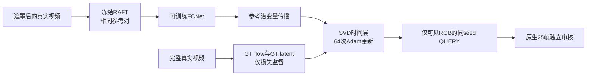

# P1：训练传播光流来源的单因素控制

task/run：`WS-V81-SEEN-TO-SCENE-P1-20261009/r1`。P1未通过，正式四指标未计算。failure_ledger_refs=[V77-F02]，failure_ledger_delta=none。本页是有界诊断，不替换正式论文训练协议。

重采样diffusion sigma/epsilon的64步仍未恢复训练片段的展翼动作。本控制检查训练使用完整RGB的RAFT条件、QUERY使用可见RGB的RAFT条件这一差异；结果见下文，不能把它判作唯一根因。

与已完成 `fixed_clip_resampled_diffusion_step500_64` 配对，两支都从正式500权重及Adam开始。同片段 `0fc958cde2/start2`、25帧256²、mask每侧.33、完整首帧CLIP、固定VAE后验与条件噪声、Adam lr1e-5/wd0、seed2026、每步LogNormal(.7,1.6) sigma与Gaussian epsilon、64更新；QUERY seed2036/25步/fps6不变。

唯一新因子：FCNet输入由缓存完整GT flow改为冻结RAFT对 `visible_rgb` 的估计。参考对不变、20 iter/chunk2；RAFT预计算置于CPU/CUDA RNG fork内。原 `cache.flow` 始终保存完整GT，供光流L1/warp监督；只额外保存 `flow_input`，不能把可见flow误当GT。teacher缓存不被修改，保持旧GT条件的固定单步测量；另报告使用visible-flow条件的teacher前后值，两个口径分开。

原训练mask、QUERY膨胀3×3 mask仍有差异，完整首帧CLIP/fps7训练与visible CLIP/fps6推理也未一起改动，因此本控制不是完全匹配推理的训练。visible-flow和resampled-noise终态各用独立格式，不能被正式P1恢复。QUERY-before必须与既有500原生全部25帧逐像素相同；逐步sigma也必须与已完成重采样分支一致。

CPU接线验证15项通过：输入与GT监督分离、teacher不污染、RNG前后相同、训练模块梯度、旧控制契约。

## 实测结果与独立全帧审核

`fixed_clip_visible_flow_step500_64/run.json` 记录实际64/64次更新，514个Adam状态参数均推进64步；训练传播的visible flow与缓存GT flow确实不同，前后向平均绝对差分别为1.624679、1.690966，GT flow监督保持。`optimizer_update_verification.json` 记录两支逐次训练σ共64项一致；旧GT-flow支没有保存每步ε，所以不能声称ε逐值配对。`paired_query_verification.json` 记录两支QUERY-before原PNG全部25帧uint8完全一致；after平均绝对像素差0.057503只表明有响应，不衡量生成质量。

带噪GT单步BUILD有两个分开的口径：可见flow条件teacher加权latent MSE为0.191211→0.182725；固定GT-flow teacher基准为0.191143→0.182593。两者都不是纯Gaussian 25步QUERY，也不应用作生成画质结论。

独立助手逐帧读取本支QUERY-before/after与匹配GT-flow重采样支after的15张联系图，每张5帧、GT/visible/native/comp四行，覆盖各自完整f00–f24。两支原生预测都有树林和草地，但鸟仅是模糊浅褐块；GT在f07–f14展翼时，原生没有相应可辨的头、翼或主体动作。可见flow支相较GT-flow支有局部纹理和形状差异，却没有明确的结构、时序跟随或边界收益。合成图中的清晰鸟及正确动作来自真实中心硬写回；两侧直线接缝仍明显，不计原生能力。未见主导性单帧全局闪烁，主要问题是原生主体近静止和边界不连贯。完整审核位于仓库外同步媒体目录`outputs/v81-paper-p1/fixed_clip_visible_flow_step500_64/assistant_review.json`；正式四指标未计算，`human_verdict=null`。

本64步、单训练片段、单QUERY seed的阴性结果，只说明该预算下改训练flow输入未显出独立视觉收益；不证明容量充分、visible flow本身无效或论文方法失败。正式论文协议已经从500步断点续到总计1000步，**仅新增500次更新**，不加载这项诊断权重；截至`2026-10-09T21:43:19Z`同步快照记录513步，1000步结果尚未产生。到点仍按原固定三例×两倍率共六窗、全帧原生视频和质量门审核，不能以teacher下降或本控制代替正式结论。failure_ledger_delta=none。
