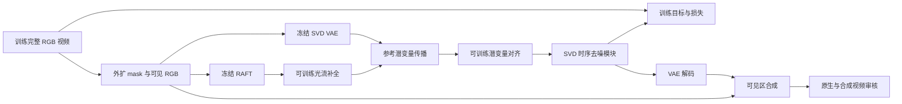

# v8.1：独立建立传播—生成训练体系

日期：2026-10-09。task：`WS-V81-SEEN-TO-SCENE-20261009`；准备 run：`r0`。

分支 `research/worldsim-v8.1-seen-to-scene` 继承 v7.7 的 `000ad1f0`。研究问题仍是驾驶场景删除后的残影、薄膜及被遮挡实体恢复；本轮按用户要求放下 DriveEditor，先掌握可训练的传播—生成基础设施。v7.7 的原始结果、评分、失败卡与关键模型保留，不能将新训练体系的工程通过当成 DELETE 收益。

## 四阶段及准入

| 阶段 | 实际工作 | 进入下一阶段前的证据 |
|---|---|---|
| P0 | 预训练 SVD + RAFT + ProPainter 光流补全；建立数据、潜变量传播、扩散训练、推理、断点 | 一次真实 forward/backward/optimizer step、保存与恢复、短片推理；梯度/数值/冻结范围正常。CPU 张量测试不替代此验收 |
| P1 | YouTube-VOS 训练；DAVIS / YouTube-VOS 外扩评测，明确论文 mask 协议 | 生成、传播、时序达到可用水平；论文差距有解释，不要求所有数字一致才进入 P2 |
| P2 | nuScenes 遮挡—真实显露数据；内部删除任务 | 建立并冻结正式驾驶 DELETE 基线；原生生成与写回分别审核，独立场景有效 |
| P3 | 编辑感知的内容传输 | 相同数据、主干、训练预算和输入证据下，比冻结 P2 有独立收益 |

P0/P1 不加入实例记忆、编辑感知传输、BEV Adapter 等创新。P2 基线固定后才开启 P3。第一阶段初始化使用原始 SVD、RAFT 和 ProPainter 组件权重，不依赖 Seen-to-Scene 训练后的 checkpoint。

## Architecture components

训练时 RAFT 可读取完整视频产生监督光流，必须标明为 BUILD 真值角色。模型的条件编码、传播和推理光流只读取合法可见输入；不能把完整训练视频的隐藏 RGB 或监督光流直接接进条件。

## 一手资料与复现分歧

- [论文](https://arxiv.org/html/2604.14648)：传播、参考选择、潜变量对齐、时序扩散与长视频协议。
- [官方代码](https://github.com/InSeokJeon/Seen_to_Scene)，本次核对版本 `2a9dfc9888e44c7fd00b08af41ef967ae46b6323`。第三方代码单独 checkout 到仓库外，保留其 license，不将全部源码与附件 vendor 到本仓库。
- [训练入口](https://github.com/InSeokJeon/Seen_to_Scene/blob/2a9dfc9888e44c7fd00b08af41ef967ae46b6323/train.py)、[传播模块](https://github.com/InSeokJeon/Seen_to_Scene/blob/2a9dfc9888e44c7fd00b08af41ef967ae46b6323/models/latent_warping.py)、[损失](https://github.com/InSeokJeon/Seen_to_Scene/blob/2a9dfc9888e44c7fd00b08af41ef967ae46b6323/utils/loss.py)。

当前核对发现：

| 项目 | 论文／公开代码情况 | P0 处理 |
|---|---|---|
| 传播调用 | `train.py` 传 `orig_lats`，模块 `forward` 不接受该参数 | 先核对原意，再统一接口；不得为消除报错把隐藏 GT 混入条件 |
| 参考选择 | 论文有 SSIM 结构选择；公开训练脚本与默认推理未一致启用 | 显式记录协议；完整接入后再称论文式传播 |
| 损失 | 论文文字与源码不完全一致；源码加扩散、flow L1 与 ternary warp | 明确使用的公式、权重及监督角色，禁止默认静默改成一种 |
| 对齐／融合 | 论文与源码对融合卷积和显式 flow 使用不完全一致 | 做论文／代码差异表，保留选定实现的依据 |
| 推理 | 公开代码含 inversion；可见像素依赖最终合成保留 | 原生输出单列，不用合成后的保真掩盖模型问题 |
| mask 比例 | 论文、README 的数字与“单侧／总宽”定义不一致 | 保存实际左右边界与 mask 图，不仅记录 ratio 字符串 |

这些是待解决的复现工程差异，不是已经证伪论文。当前未运行官方真实训练，不将静态审查写成实测失败。

## P0 已实施的 CPU 起步代码

`motion_proj/worldsim_v81/` 是本项目拥有的独立代码入口。当前范围仅为：

1. `data.py`：明确 split 的 RGB 清单、中心裁切与归一化、25 帧起步读取；完整 target 和 masked condition 分开。
2. `masks.py`：显式左右外扩区，`1=hole`，归一化条件洞内填 0。
3. `propagation.py`：flow 尺度变换、target→source 反向取样、参考有效性融合，保留已知 target latent。
4. `scripts/worldsim_v81/build_manifest.py`：从真实 RGB 建清单，少帧目录拒绝，结果写仓库外。
5. `scripts/worldsim_v81/preflight.py`：列出模型文件、RGB、依赖与 GPU 的实际缺口；不把依赖检查当模型执行。

这些基础算子不是完整 Seen-to-Scene 重实现。参考 SSIM 选择、ProPainter FCNet 与 refinement 接入、SVD 训练／推理入口尚待实现；不能用合成张量或玩具网络宣称 P0 完成。

训练起步配置：[p0.json](../../configs/worldsim_v81/p0.json)。25 帧、256²、左右各 0.33 的训练 mask 来自公开代码的起步设置，边界定义显式。当前数据读取为每视频一个确定性 clip 的验收入口，正式随机 100K clip 采样未实施。

## P0 后续短循环

1. 在目标主机盘点 YouTube-VOS/DAVIS RGB、原始 SVD、RAFT、ProPainter 权重，复用可用依赖；缺项列清单。第三方版本与环境单独固定，不覆盖旧 v7.7 环境。
2. 一个真实 25 帧 clip：遮蔽 RGB→双向补全 flow→合法源 latent→对齐；中间导出少量审核图到 runs。
3. 首次真实优化步：检查 FCNet、refinement、SVD temporal 的梯度与参数变化；确认 VAE/CLIP/RAFT/spatial 冻结。修复数值或接口错误后最多两步恢复自测，不直接开始 100K。
4. 保存 checkpoint、优化器、scheduler、随机状态及配置，恢复后验证下一步。
5. 同一短片 25 步推理，保留原生与可见区合成。以上通过才进入 P1 小规模训练。

配置中的 100K 是论文参考预算，不是本次已启动作业。论文报告双 A6000；当前机器的显存、吞吐和 wall time 必须由一次真实优化步测得，不能沿用 DriveEditor 显存估算。

## P1 协议

下载入口：[YouTube-VOS 2019 train.tar](https://drive.google.com/file/d/1lU9jCX-H0ntwh87tt2cA0xEPeWOJzD6S/view?usp=sharing)、[DAVIS 2017 TrainVal 480p](https://data.vision.ee.ethz.ch/csergi/share/davis/DAVIS-2017-trainval-480p.zip)。原始 [SVD XT 1.1](https://huggingface.co/stabilityai/stable-video-diffusion-img2vid-xt-1-1) 在远端现有凭据下返回 403，需要申请访问；不会拿 DriveEditor 合并 checkpoint 冒充原始权重。

数据使用 [YouTube-VOS 官方数据](https://youtube-vos.org/dataset/vos/)与 [DAVIS 2017](https://davischallenge.org/davis2017/code.html)。外扩任务的训练 mask 是合成边界遮蔽，不把数据集实例分割标注误称原论文 mask。

先做可解释的小规模复现：固定 train/validation clip 名单和 mask 边界，记录 PSNR、SSIM、LPIPS、FVD，以及人工生成与时序质量。原生／合成、全图／缺失区、样本数分别报告。CPU 校验已纠正边界取整及 resize→crop 顺序；256² 的训练 mask 左右各 84 像素，中央 88 像素。

正式对齐论文的 DAVIS 90 段和 YouTube-VOS 附录 60 段名单时，再说明数据版本和 mask 的差别。若协议未能确定则分别命名，不能混报论文数字。

## P2 数据：前景遮挡—真实显露

P2 重新定义监督对，不能只替换 mask：

- 用真实 clean query RGB 作 Y，人工只制造 A 的遮挡；Y 中保留真实 B、道路和边界。
- 用 nuScenes 轨迹、相机、LiDAR 约束 A 的连续位置、尺度、yaw 和深度顺序；mask 使用 SAM3 实例轮廓。没有可信轮廓或支撑视角的例拒绝。
- 同一 A 干预必须作用到全部参与条件的邻帧和相机，之后才编码。删除 A 后可使用的 B 片段必须来自未被 A 遮住的真实观测。
- 分开“其他帧真实见过、当前帧被挡”和“全部来源都没见过”；未知部分不伪装成确定监督证据。
- query 隐藏 RGB 只进入监督和离线 QA，不进入匹配、flow condition、特征缓存或来源纹理。
- 动态 B 在实体局部坐标中关联，静态背景在世界坐标中关联；只有被实际观测的部分参与，不先生成完整 B 资产。
- 按 scene/log 划分开发、训练、独立验证；旧 A/R badcase 作为 DEV，不重新声称 final test。

首先选一个证据完整的显露事件验证配方，再小批量扩展。历史矩形道路 proxy 与硬拼接伪标签仍退役；失败生成图可用于分类，不能当真实 Y。

## P3 与循环依赖

正式 P2 基线固定后研究编辑感知传输：普通 flow 描述原始可见场景；删除 A 后，需要将仍存在的 B 的局部观测送到新显露的 query 位置，同时剔除 A 的信息。模块输入为不完整真实观测、身份、来源位置、几何与可信度；输出为生成条件，最终去噪共同恢复 B 与背景。这样无需在模型输入前完成 B 的补全。

P3 的消融保持相同来源、可见性过滤、数据、主干和预算；至少对比冻结 P2、相同预算继续训练 P2、编辑感知传输。单帧拟合成功不足以证明身份利用或时序收益。可用先验增加和创新模块收益分开。

## 仓库与资源

只提交自有源码、配置、简短报告和轻量索引。数据、环境、模型、第三方 checkout、完整 logs、视频和运行产物放到 `/root/autodl-tmp` 仓库外；本地也放在 checkout 外。源代码 ZIP 上限是 100,000,000 bytes。

`.gitattributes` 在源码归档中排除 `docs/autoresearch`；此目录仍保留在 Git/GitHub，继承历史不重写、不强推、不删原证据。ZIP 中的历史附件链接需在 GitHub 浏览完整材料。`scripts/check_source_archive.py` 可重复验证归档大小；交付还需检查实际 GitHub 下载 ZIP。

当前输入缺口：原始SVD现有凭据403；官方YouTube-VOS下载受动态配额影响，未获得可用25帧片段。网络探针不提交到代码库；这些是输入／访问问题，不是训练或方法失败。

本轮没有新增研究失败，`failure_ledger_delta=none`；历史边界继续引用 [V77-F02](../research_failures/entries/V77-F02.md)。当前进度和阻塞只写 [RESEARCH_STATUS](../RESEARCH_STATUS.md)。
