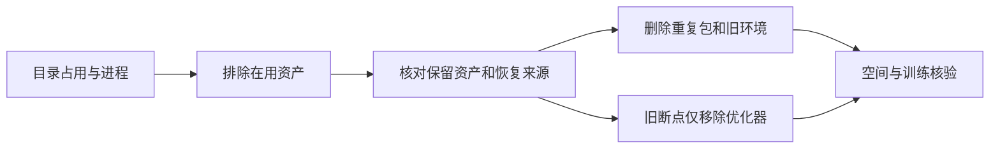

# v8.1 数据盘清理

2026-10-10；SSH `wm-3090-1009`；task/run `WS-V81-STORAGE-20261010/r1`。用户明确授权清理不用的文件，释放100–200GB。独立 `gpt-6-sol/xhigh` subagent只读复核候选与在用依赖；主agent执行清理。单位GB均为十进制。

数据盘实际释放 **105.95GB**，可用空间 **2.21→108.16GB**。当前训练继续运行，未修改训练数据、模型结构或预算。

| 操作 | 释放空间 | 保留内容与限制 |
|---|---:|---|
| 删除6个已解压归档 | 18.53GB | RGB、标注保留；tar/zip逐成员文件大小核对，valid全帧507视频/67987帧逐视频计数一致；归档需按固定来源revision重下 |
| 删除5个未使用旧环境 | 31.61GB | adgs、drivestudio、worldsim-v75、splatad-impact、sparsedrive-impact；conda/pip安装配方保留，历史流程重跑需重装；motionproj、DriveEditor、worldsim-v81环境保留 |
| 删除26个旧v77文件 | 26.82GB | 25个已完成/隔离实验的优化器，加r52 best1未入选step32模型；最终权重、输入、评分与失败媒体保留；无法按旧优化器精确续训 |
| 精简9个已停止的P1诊断断点 | 29.00GB | 仅移除optimizer，保存前后所有models张量dtype/shape/值相同，原推理格式保留；明确resumable=false，不用于正式恢复 |

九份精简断点来自旧all-frames、旧reference-m4、两步工程预检和三个已结束的64步容量/条件探针。当前paper-bidirectional-m4正式100/500/1000/2000完整断点、512 models-only末态、SVD/RAFT/ProPainter基座未动。Ω背景世界、原始RGB、标注、人工/助手评分、failure媒体均保留。

清理前每项检查真实进程命令、内存映射、打开文件及cwd；v77采用预审26条精确路径集合、文件链接数/分配大小和保留权重/证据存在检查。末次快照UTC05:29:26：父18955/训练19021仍运行，训练从清理期间4002继续至4116步；全部已记录梯度有限，冻结梯度为0，唯一GPU进程19021。系统盘仍余6.50GB，计划5000完整断点仍按原路径保存；之后可选择使用释放的数据盘，但本次未更改在途作业。

完整逐项删除/精简记录、环境配方、固定下载来源保存在 `/root/autodl-tmp/cleanup_manifests/WS-V81-STORAGE-20261010/r1/`；同份轻量记录已同步本地 `work/v81-storage-cleanup/r1/`。这不是被删除优化器的备份，不能声称能恢复已删除Adam历史。run根增加 `storage_cleanup_pointer.json`，保留历史下载完成事实，不重复下载已解压数据。

[轻量实测](STORAGE_CLEANUP_20261010.json)。`failure_ledger_delta=none`：资源清理不新增科学失败结论。Git仅存报告与轻量结果，完整环境、数据、权重及媒体不入Git。
