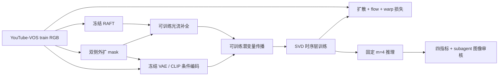

# Seen-to-Scene P1：公开方法训练与论文评测

task/run：`WS-V81-SEEN-TO-SCENE-P1-20261009/r1`。主机 `wm-3090-1009`，分支 `research/worldsim-v8.1-seen-to-scene`。本轮目标是完成 YouTube-VOS 原协议训练、DAVIS/YouTube-VOS 四指标评测，排查实际复现差距。用户授权全过程由助手及独立 subagent 审核，不设置人工准入；助手判断写 `assistant_verdict`，不代填 `human_verdict`。

初始化仅用原始 SVD XT 1.1、RAFT 和 ProPainter 光流补全权重。P0 两步权重及作者编辑成品权重不作为 P1 初始权重。P1 不加入驾驶创新、实例条件或新的注意力机制。

## 数据和预算

三个 YouTube-VOS 2019 包改用用户指定的 [HF 镜像](https://huggingface.co/datasets/yinloonga/YouTube_VOS_2019/tree/main)，HF-Mirror 直连，固定 revision `7a0eb80c729b0dbbceaea15950e86ed606ab21ed`。断点、完整包大小、LFS SHA-256、ZIP CRC/安全提取与来源记录放在仓库外的 run/downloads；Google 的失败证据和已有部分保留。

训练使用全部符合公开 loader 的 train 视频：每段严格多于 25 帧，均匀选择视频后随机取连续 25 帧，缩放并中心裁剪到 256×256，双侧各 `int(256*.33)=84` 像素洞。公开的 100K samples 是 dataset 虚拟长度，不是 100K 个独立视频。lr=1e-5、batch=1、constant LR、seed=123，论文总目标100K，当前按短预算执行；历史公开协议AdamW/wd=.01，新paper-bidirectional-m4按论文文字Adam/wd=0，禁止断点混用；每 1000 步保存和固定验证，保留最新两个可恢复断点。RTX 3090 单卡使用 bf16 去噪 autocast、float32 参数、冻结编码器在反向传播前 CPU 卸载，作为显存/精度适配明示。

P1 训练按公开 train.py 使用完整 RGB 的 RAFT flow 和首帧 CLIP 条件，masked RGB 进入条件 VAE；完整 RGB 的 VAE latent 和 flow 用于监督。此训练路径与 P0 的严格可见条件不同，不能混报。QUERY 推理仅接受可见区域 RGB、mask；隐藏真值只供保存和评测，不进入条件、参考选择或光流输入。

验证例在看生成图前，以 valid 中 ≥25 帧视频排除论文附录60个测试ID，再按名称取首、中、尾，固定不变。正式评测为 DAVIS 2017 官方 train+val 共 90 序列和论文 Appendix E 列出的 YouTube-VOS 60 序列，两种倍率分别运行，共300段完整视频；当前短窗只供诊断。附录60/60 ID实际位于镜像2019 valid而非test；论文split命名与原包不一致。现有valid稀疏帧中29/60不足25帧，另下载同revision的 `valid_all_frames.7z.001/.002` 原始全帧，不替换ID、不重复帧。两侧 mask ratio `.125/.33` 对应总宽 `.25/.66`。初始短窗固定起点 0、25 帧，长度不足必须显式记录并解决。

## 推理与验收

固定官方源码 `2a9dfc9888e44c7fd00b08af41ef967ae46b6323`，m=4 结构相似度参考链、25 去噪步、CFG 1→3、seed=2026。分别保留可见输入、隐藏真值、原生生成与可见区硬合成；不只评合成后容易变好的指标。

| 数据集 | PSNR ≥ | LPIPS ≤ | SSIM ≥ | FVD ≤ |
|---|---:|---:|---:|---:|
| DAVIS | 21.95 | .141 | .783 | 218.8 |
| YouTube-VOS | 21.89 | .143 | .783 | 242.8 |

这些是论文 Table 1 目标，不是本轮已取得的结果。指标使用固定 [FollowYourCanvas 官方实现](https://github.com/mayuelala/FollowYourCanvas/tree/main/video_metrics)，前 16 帧、LPIPS AlexNet 和其 I3D TorchScript FVD；倍率分别计算再报告平均。I3D、LPIPS 缺失或样本缺失不能宣称完成四指标。独立 subagent 检查结构、边界和视频时序；单帧只判断单帧结构，不推导时序通过。

公开材料存在明确边界：[论文](https://arxiv.org/html/2604.14648)写 Adam、纯 Gaussian feed-forward；[公开源码](https://github.com/InSeokJeon/Seen_to_Scene)采用 AdamW，并在高斯初始噪声上额外执行反向 timestep U-Net 遍历，再去噪。主运行明确标作公开代码模式，不称为输入视频反演。论文没有公开自己的四指标脚本及 pred/comp、视频编码、FVD 倍率合并全部细节，因此 `protocol_verified=false`；接近或超过数字仍需连同这些边界报告，不能伪称逐项完全一致。

用户最新要求下增加1000、5000步assistant质量门，未通过不自动继续长训；三固定valid×两倍率和1000同断点feedforward诊断均与正式测试分开。独立审计还确认当前训练走全帧顺序传播而非论文参考链；公开inverse的CFG批配对及输出参数化存在风险。[详细对照与部署证据](P1_PROGRESS_AUDIT_R1.md)。新增门槛不修改当前在途训练数据、seed或预算，不要求人工审核。

完整证据：`/root/autodl-tmp/runs/worldsim_v81/WS-V81-SEEN-TO-SCENE-P1-20261009/r1`。源码、配置、轻量结果与报告可提交；模型、数据、第三方源码、视频和完整断点不进入 Git。源码 ZIP 上限 100,000,000 bytes。当前失败台账 `failure_ledger_refs=[V77-F02]`、`failure_ledger_delta=none`；数据下载和复现工程错误进入本 run，不当作新方法失败。

启动实测：六份下载全部完整校验/提取；固定基准150序列，训练池1951序列。两步loss4.22769/3.68054（三组件梯度有限且非零，冻结梯度0，峰值allocated21.26GiB），不同片段的loss不能解释为收敛。首次公开推理因嵌套FP16/BF16 autocast冲突退出，失败日志保留；统一公开模式外层FP16、关闭外层缓存后完成25帧，源算法不改。独立subagent检查全部25帧：原生色彩/结构强失真，尚非可用基线；可见带及洞内写回逐像素契约通过。已从第2步断点恢复正式训练，初测5.7–6秒/更新，100K约7天，另加验证/保存。CPU33项通过，首次源码ZIP检查34,218,524 bytes。最终四指标待100K与正式测试，不能用预检代替复现验收。

## 双向候选、显存适配与全视频入口

2026-10-10新子阶段 `paper_bidirectional_m4` 已从原始SVD/RAFT/ProPainter完成两步训练与固定一窗推理。第一次第1步通过，第2步在ternary loss因额外Adam状态及42对flow激活超3090容量而OOM；保留原栈、第一步断点后，FCNet完整序列采用非重入激活重算，ternary按mask像素数等价分块重算。从第1步恢复成功，第2步峰值allocated18.402GiB，三组件梯度有限、冻结梯度0。固定官方FlowLoss的分块与整批数值/梯度CPU对照通过。

独立6-sol/xhigh无fast审核旧参考1000六窗、literal诊断、新双向step2及旧step2对照，四模态全部25帧。旧路径hold；新两步色块仅代表初始质量，不能否定方法。新阶段只续到100步固定验证，自动1000/100K关闭；恢复同一RNG、数据/seed/预算角色不变。两步关键断点硬链接保留在 `preflight_checkpoints`，失败栈与状态在同阶段 `oom_before_memory_fix.json` 和 `logs/train_to_000002.oom_original.log`。

正式推理控制器现传 `--full-video`，整段可见RGB选择m4参考，VAE分块编码，25帧窗口/stride16每个去噪步平均预测，再单次更新全局latent；分块解码至CPU。正式manifest记录 `source_dir`，评测入口要求源/GT/pred/comp帧数相同，显式 `--generation-protocol full-video` 后按FYC前16帧评分。默认25帧入口保留历史诊断，输出路径分开，不能被正式缓存误用。CPU全套75 passed；长序列RAFT/FCNet/传播峰值及GPU窗口实现仍须短预检，不承诺已完成正式300视频。

原视频到256²的bicubic/中心裁剪是明确实施假设，作者未公开完整前处理。FYC源码确认前三指标平均两倍率，FVD源码分项输出，FVD平均是实施推定。上述未知仍保持 `protocol_verified=false`，正式四指标未算。对齐Adam与双向传播同时改变配置，因此不是仅改变传播方向的因果消融。
