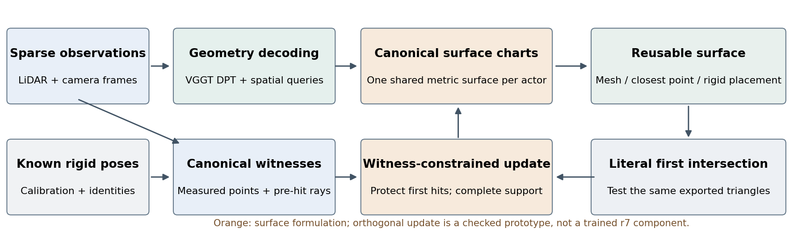

# 可查询规范刚体表面：论文修订与方法判断

这版把研究任务收束为：**从稀疏多时刻观测恢复一个可复用、可查询的规范刚体表面。** 已知刚体轨迹只负责放置物体；射线查询检验同一份表面，不要求我们同时完成激光雷达强度、丢包、外观、运动预测或闭环仿真。

## 当前证据真正支持什么

r7 已完成 30 轮、11,130 次更新。相对匹配的 r6，五日志配对结果是：

| 指标 | r7−r6 | 95% 日志配对区间 | 可以怎样解释 |
|---|---:|---:|---|
| 正确首交点 | +10.536 pp | [+6.462, +14.621] | 五日志全部改善，有明确开发集增量 |
| 提前命中 | −1.523 pp | [−5.779, +2.751] | 改善/保持尚未确定 |
| 漏检 | −4.379 pp | [−9.395, −0.292] | 有明确下降 |
| free intrusion | +0.04202 m | [−0.00049, +0.06974] | 四日志恶化，不能宣称物理保持 |
| target→surface 距离 | −0.07940 m | [−0.18738, −0.00933] | 有明确下降 |
| recall@0.2m | +8.429 pp | [−0.707, +23.980] | 仍不确定 |

比较检验的是 native 种子、DPT 特征和辅助 build-depth 监督的整条联合通路，不能单独归因为某一层特征。五日志是开发数据；20 个 AV2 日志的固定确认由原研究任务执行，本稿不提前写入未完成结果。

## 多余表面到底是什么

新增取证读取全部 75 个开发 Actor、11,886 条 owned heldout 束。先分析 AdaPoinTr、VGGT native fusion、窄片 R8、开放 r3、吸引 r4、首面 r6，再以同协议独立追加完成后的 r7。

- **不是当前这组细长三角形。** 使用形状指数 `q = Σ edge² / (4√3 area)`，等边三角形为 1，规则直角网格面为 1.155。预设严重细长阈值 q>10；七种方法的所有 early-hit 面都没达到，最大仅 1.367。这里应排除的是“用 sliver 正则解释这些失败”，不是否定所有形状正则。
- **也不能直接当成无支持浮片。** 将“连通片距至少一个 build 端点 ≤0.2m”定义为有支持后，r4/r6/r7 的 early 贡献分别约 94.7%/91.0%/90.3% 来自有支持的片。这个定义不认证整片每个位置：一个局部有支持的片，仍可能向外错误延伸。
- **可见的几何症状是规则片的错误延伸和首面竞争。** Blender 使用保存的真实三角面；精确切片用包含原始射线的平面与原面相交。没有重建一辆好看的替代汽车。AdaPoinTr 的图明确包括其点云到 PCA 曲面的转换，不能把转换后全部错误归罪于原模型。
- **“空气残影”仍是未经证明的时间来源假设。** 仅凭这些几何图不能认定是运动补偿或相机污染，需逐时刻 provenance 证据。

Oracle 阶梯进一步区分“已有正确面被遮挡”和“根本缺少正确沿束支持”：

| 方法 | 正确首面 | 任意正确交点 Oracle | 端点附近有面 |
|---|---:|---:|---:|
| AdaPoinTr + PCA | 14.29% | 15.43% | 84.60% |
| r4 | 36.07% | 58.32% | 73.46% |
| r6 | 39.07% | 55.03% | 72.44% |
| r7 | 49.60% | 61.97% | 80.87% |

后两级是使用 heldout 端点的诊断放松，不是可部署输出。端点靠近一个面，不意味着原射线能在正确深度穿过它。

简单连通域剪枝存在代价：r7 的 missing 从 16.18% 增至 25.11%；AdaPoinTr 从 54.24% 增至 80.21%。即使使用 heldout 标出所有 early 首面并删除一次，r4 的 hit 也只有 48.76%，达不到逐射线 Any-hit Oracle 的 58.32%。一张共享表面会耦合不同射线，不能各自挑后面的“好面”。

## 已写入 paper 方法部分的三项主张

### 1. 输出改为带观测依据的规范刚体曲面

`R_i = ({embedding ψ_k, support domain Ω_k}, witness index W_i)`，实际表面为 `S_i = ∪ ψ_k(Ω_k)`。同一表面支持最近点、网格导出、刚体放置和字面首交点查询。

这迁移的是 DVGT 重新定义输出以服务任务的思想。规范坐标、AtlasNet 式 chart、SE(3) 变换本身都不是新发明。方法价值要落在共享表面、支持域、观测约束和统一查询的结合，并接受独立评测。

### 2. 将“位置/形状”和“支持边界”分开建模

现有 r7 的 chart 是规则方片；新的候选显式学习二维 chart 域边界 `Ω_k={u:b_k(u)≥0}`。它改变导出的真实几何边界，不是调 opacity，不是按评价射线删面，也不制造有厚度的占据层。

这个自由度针对规则方片错误延伸：与其把整片移动或拉成瘦长形状，可以改变它真正存在的范围。正观测与已有正确首面必须保留；否则收缩域会再次钻“删掉困难表面就减少 free loss”的漏洞。论文给出了正支持约束、未知空间边界，以及共享边零交点的精确导数。

**状态：数学与接口提案；尚未实现并训练完整边界模型。** 这不是 r7 已 work 的组件。任意加一个 boundary head 仍不足以支撑顶会主张；必须证明它在保留支持的同时解决了上述表面竞争。

### 3. 首面见证的正交几何更新与稀疏自定义算子

实际第一命中三角形上，

`δt = Σ_j β_j nᵀδv_j / (nᵀd)`。

令 `B_r=(nᵀd)A_r`，就得到不含近切面分母的局部约束。补全更新为 `(I−B†B)g`；沿束校正为 `B†c`。二者分别位于零空间和行空间，数学上正交。

它保护的是逐观测、共享顶点的首面约束，比对两个平均 loss 做一次梯度夹角判断更具体。但零空间投影是经典工具，论文已引用相关工作；不能仅凭这个线性代数公式声称全新理论。

**状态：已实现 CPU 原型和实际网格数值检查；尚未接入训练。** 自定义首面 backward、稀疏 `Bu/Bᵀz` 和矩阵无关求解器均已落地。60 个真实内部交点的有限差分相对误差为 6.68e−10，伴随误差 1.78e−15；保存反向张量 5,820 字节。1mm 范数的试步中，受保护深度变化为 8.87e−9m，逐次减半步长呈约二阶缩减。

这些数值验证固定可见关系下的局部算子，不是重建指标提升。新三角形进入射线、轮廓切换、相交顺序交换和不一致观测仍未解决；CUDA 峰值、训练成本和最终泛化也尚未测量。论文分别写明了这些限制。

## 应当剪掉和保留的 story

保留：**视觉几何 + 稀疏观测 → 可查询规范刚体表面**；聚焦表面支持、真实首面以及它们的矛盾。r7 的正结果支持继续保留视觉几何通路。

剪掉：完整 WorldSim/传感器/外观/规划链路背书；“更大 backbone 就是方法创新”；把所有 early 都归因于 sliver/浮片/空气残影；把平均 coverage 改善当成物理成功；把区间跨零当成保持等效；把后方真值交点拿来替换实际首面。

LiDAR-RT 提供的是 representation 与 renderer 联合设计的标准；FoundationGeo 提供的是诊断 Oracle 后再做职责分解的写法；DVGT 提供的是任务与输出共同重构的思路。我们借鉴这些研究方式，而不宣称复现了它们全部能力。

paper 已把以上创新放在任务、方法、推导和实验段落中，并通过状态矩阵区分“训练完成”“原型通过”“仍待验证”。这是一份有实证支撑、明确待证主张的研究稿，不是已经完成全部方法验证的投稿版本。
