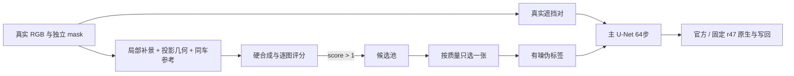

# R001 单例原生主干微调（已关闭的诊断实验）

本轮矩形道路proxy和硬拼接伪标签均已退役，禁止继续训练；历史分数保留以复核失败，score>1不再代表这些旧数据可入训。新mask入口见相邻iteration20。

唯一实验 `WS-V77-TARGET-PROTECTED-20260929/r52`。保持 DriveEditor 架构；不使用 LoRA。`finetune_scope.selected` 选择官方主 SVD U-Net 的 1647 张量、1,809,579,626 参数，遵循 `_3d`、`time_embed.`、`label_emb.` 冻结范围。VAE、CLIP、SV3D 与 r47 step320 分支不训练。

- `prepare_clip.py`：真实10帧原视频 Y + 平移固定矩形洞；它是合成恢复 proxy，非真实 R001 去车 GT。
- `prepare_batch_packs.py`：R001 f00–f09 的局部 RGB、独立 mask、投影 O/N/U 与真实同车参考。未知不等于背景；f00–f03 缺当前 B hull 时不伪造。
- 内置 imagegen 每帧1次，原候选/提示词/调用记录均在 run 下保存；Qwen 既有失败保留但不扩测。`qwen_candidate.py` 仅供复现已授权的官方 API 调用，凭证只从隐藏提示读取，不落盘。
- `compose_roi_candidate.py`：只用洞外特征估计小配准；保留未配准与配准版本，独立 mask 不扩大，洞外严格原像素。
- `prepare_scored_pairs.py`：`score>1` 只表示准入候选池；`--select` 与独立取舍记录共同决定唯一入训项。校验候选 ID、来源帧、评分与硬合成版本，保留全部候选和拒选理由。选中的单帧重复成静态10帧窗，不能冒充连续真值视频。旧版全10张轮转只作为已完成探索保留，不继续使用。
- `train_one.py` / `train_scored.py`：320×576、10帧、64步、seed6201起、lr1e-5、AdamW8bit、BF16前向/FP32可训练权重、梯度检查点、原 EDM loss。8bit仅优化器状态；完整主干实测反传可行。
- `evaluate_one.py`：同一主干 checkpoint 分别接官方与 r47；10帧、seed42、25采样步。真实输入576×1024；`--proxy-only --size 320 576` 是同尺度容量控制。`--static-source-frame` 仅用于静态结构，不评时序。
- `build_review.py`：本地 HTML 的逐图分数、原生/写回图和视频。生成内容始终标为伪标签，人工 verdict 留空。

两条监督路线独立从官方主干开始；数据本身不同，不能把两者差值当作严格的单变量因果消融。单例已用于训练/方法选择，不属于独立测试。训练产物与详细证据留在远端 run，报告见 `docs/v77/SINGLE_CASE_FINETUNE_R52.md`。
