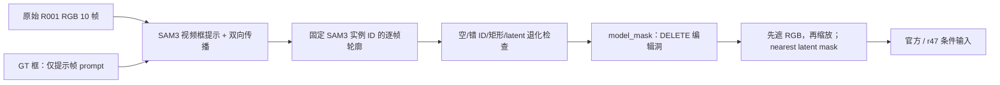

# R001 SAM3 真轮廓入口（CPU 准备，尚未执行模型）

## 结论与证据

1. R001 旧矩形是**后处理造出来的**。`scripts/worldsim_v77/target_protected/iteration17/gpu.py:35-56` 用 SAM2 生成 `raw[i]`，传给 `scripts/worldsim_v77/delete_audit/mask_contract.py:6-16`；后者保留真实轮廓为 `core`，但把膨胀后的轮廓外接范围通过 NumPy 切片全部置为 `model_mask=True`。R001 f04 的旧 `model_mask` 恰好是 `[206,277,407,441)`，面积 32,964 = 框面积；同一帧 `mask_result.json` 记载 SAM 目标面积 17,537。换 SAM3 模型而继续调用该函数仍会得到矩形。
2. 旧推理 `iteration17/gpu.py:88-89` 读 `model_mask` 为 DELETE 洞；`iteration19/evaluate_one.py:73-75` 也读它。`iteration14/engine.py:41-42` 把洞送给原生 `Engine.masks` 与先遮后 RGB；`scripts/worldsim_v77/repair_drive.py:23-30` 清零洞内 RGB，并以 nearest 降到 1/8 作为 `mask_concat`。旧伪标签打包 `iteration19/prepare_batch_packs.py:126-143` 复制矩形 `model_mask_full.png`。训练 `iteration19/train_one.py:69-80` 读 pair 的 `hole`，`iteration7/train_control.py:32-40` 先遮洞再缩放、nearest 缩放 mask。r47 的 `iteration14/interface.py:43` 另读 `priors['hole']`，换新洞时该 prior 也必须同步更新；不能让旧矩形留在分支里。
3. 此入口从官方 SAM3 视频 API 取得 `out_obj_ids` 与逐帧 `out_binary_masks`，只保存提示帧唯一实例 ID 在其余帧的布尔轮廓。GT 框只转为归一化 `[xmin,ymin,width,height]` 提示；不栅格化成 mask，不用它构造洞或 Y。`sam3_instance/` 是分割结果，`model_mask/` 是编辑洞，目前逐值相同但语义独立。空实例、ID 丢失、满外接矩形、原图或 320×576/对应 latent 尺度轮廓退化均报错，绝不回退到矩形。身份仍需人工审核，形状通过不代表找对车。

官方接口核对：视频 `start_session` 可读 JPEG 文件夹，`add_prompt` 的 `bounding_boxes` 是归一化 XYWH，`bounding_box_labels=[1]`；返回 `out_obj_ids` 和原图大小的布尔 `out_binary_masks`。`handle_stream_request(type='propagate_in_video', propagation_direction='both')` 在前后方向逐帧返回同样字段。注意 SAM3.0 的**框提示分支不消费调用方传入的 `obj_id`**，所以本脚本取首帧实际返回 ID，后续逐帧核对。视频点提示可在已有 ID 上用 `points`、`point_labels` 交互细化；图像交互接口 `SAM3InteractiveImagePredictor.predict(box=像素XYXY, point_coords=像素XY, point_labels=1/0)` 返回 C×H×W mask 与质量分数；另一 `Sam3Processor.add_geometric_prompt` 接收归一化中心式 CXCYWH。见 [官方 README](https://github.com/facebookresearch/sam3#readme)、[视频请求与传播](https://github.com/facebookresearch/sam3/blob/main/sam3/model/sam3_base_predictor.py)、[视频框语义/输出](https://github.com/facebookresearch/sam3/blob/main/sam3/model/sam3_video_inference.py)、[图像交互接口](https://github.com/facebookresearch/sam3/blob/main/sam3/model/sam1_task_predictor.py)。

## 后续运行门槛

官方 README 要求 Python ≥3.12、PyTorch ≥2.7、CUDA ≥12.6。按用户指定改从 [ModelScope facebook/sam3](https://modelscope.cn/models/facebook/sam3) 下载 `sam3.pt`（3,450,062,241 字节），保存于 `/root/autodl-tmp/models/worldsim_v77_sam3/`；CPU 权重解析通过，未启动 GPU。独立环境 `/root/autodl-tmp/envs/worldsim-v77-sam3` 复用 v75 的 Python 3.12/Torch 包，CPU 导入记录另存 `r53/cpu_validation.json`，实际 GPU 驱动与显存尚未验证。运行入口**必须**给已有本地 `sam3.pt`；未传时不会调用官方 builder 的默认联网下载。SAM3.1 是另一模型/权重，不可直接把 `sam3.1_multiplex.pt` 当作这里的 SAM3.0 权重。SAM3 仓库 commit 与 checkpoint 来源、文件路径与大小保存在 provenance（不新增哈希登记），先做一次逐帧身份可视审核。

准备好的 CPU 检查：`python work/v77_target_protected/iteration20/sam3_real_mask.py --self-test`。真正 R001 作业要从 r50 manifest 的 `prompt_frame=0` 取该帧 GT `box_xyxy=[155.28,286.08,396.37,440.58]`，显式传 `--rgb-dir`、`--prompt-frame 0`、`--gt-box 155.28 286.08 396.37 440.58`、`--checkpoint /path/to/sam3.pt`、`--output /new/empty/path`；此命令会调用 GPU，须由主流程安排。输出 `mask_contract.json` 标为 `identity_review: pending`，不得直接作为训练准入。

接入删除请求时，用 `load_sam3_handoff(sam3_output, priors, frame_indices)` 一次取得 `(edit_mask, alpha, aligned_priors)`，再构造 `DeletionRequest(rgb, edit_mask, alpha, aligned_priors, refs)`。调用方先把 r47 先验切到相同帧数；`frame_indices` 是实际 SAM3 源帧顺序，静态诊断可重复同一索引。函数逐值核对 `sam3_instance/` 和 `model_mask/`，重验轮廓，按 r47 原有 `INTER_AREA > 0` 的 4×4 覆盖规则生成 144×256 `aligned_priors['hole']`，并用原图二值洞生成新的 0/1 alpha。不得复用旧 r50 alpha、旧 r51 `priors['hole']` 或旧评估生成图；此入口不产生伪 Y，也不支持矩形 fallback。
